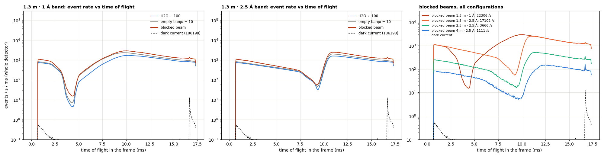
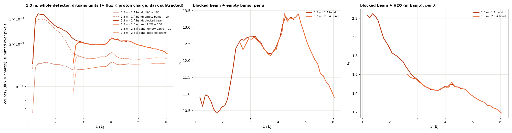
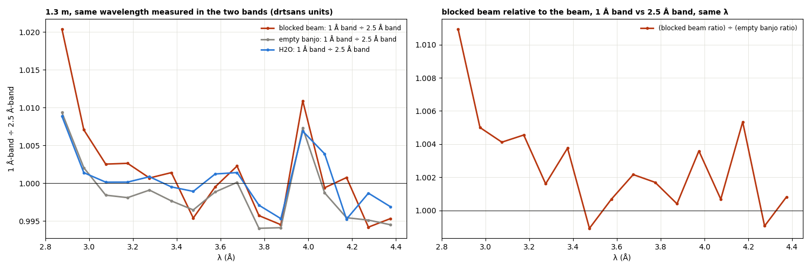
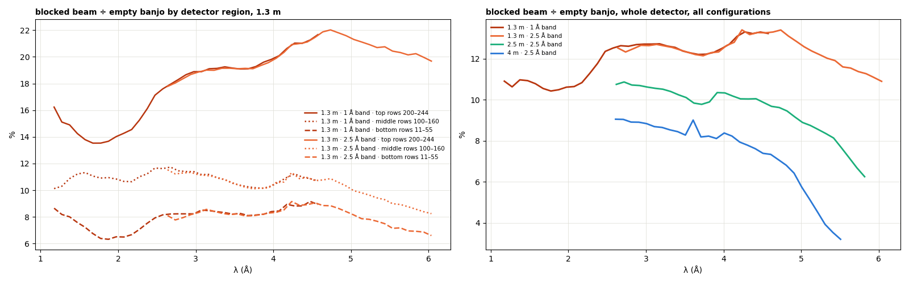
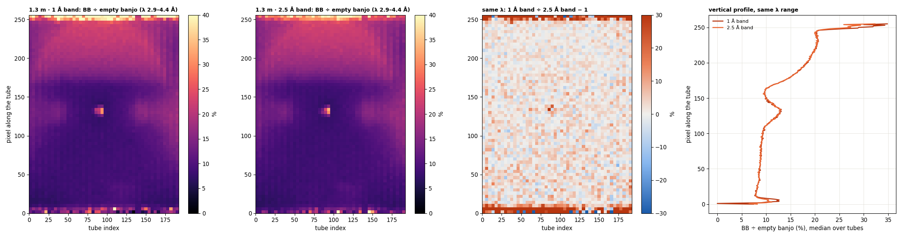

# Blocked beam — what it is, and does it depend on wavelength?

**Date:** 2026-09-25 · **drtsans:** stable `1.34.0` · **data:** the 2026-09-23 calibration
block (IPTS-37618). Blocked beam `S-blockedbeam`, H2O 1 mm in the banjo, and the empty banjo,
at four configurations, plus the dark current 186198:

| configuration | blocked beam | H2O | empty banjo |
|---|---|---|---|
| 1.3 m · 1 Å band | 188968 | 188966 | 188962 |
| 1.3 m · 2.5 Å band | 188984 | 188982 | 188978 |
| 2.5 m · 2.5 Å | 189000 | 188998 | 188994 |
| 4 m · 2.5 Å | 189016 | 189014 | 189010 |

All runs are ~718 s, with the same proton charge. **Scripts:**
`2026B_mp/reduction/water3/blockedbeam/`:
- `bb_tof.py`: raw event times;
- `bb_load.py`: drtsans's own loader, dark subtraction and flux normalisation;
- `bb_analysis.py`.

**Question.** Is the blocked beam at 1.3 m different in the 1 Å and 2.5 Å bands, and does it
depend on wavelength? (For example, does the 1 Å band see more high-energy neutrons?)

**Short answer.**
- **The blocked beam is beam neutrons, not a steady background.** In time of flight it has
  exactly the band structure of the beam (H2O, empty banjo), including the gap where the
  choppers are closed. The time-independent part (the dark current, or a flat fast-neutron
  floor) is negligible, at most ~1.5 % of it.
- **It depends on wavelength, like the beam.** In drtsans's units (÷ flux × proton charge, the
  quantity drtsans subtracts per pixel and per λ bin) it is **10.4–13.4 % of the empty banjo**
  at 1.3 m over 1.2–6 Å, and 1.2–2.2 % of H2O. It varies smoothly with λ, with features near
  4.05 and 4.7 Å.
- **At the same wavelength it is the same in both bands.** Over the overlap (2.7–4.4 Å) the
  1 Å-band ÷ 2.5 Å-band ratio is **1.001** (blocked beam), 0.998 (empty banjo) and 1.000
  (H2O); on the detector map, within +0.3 to +0.6 %. So the 1 Å band does **not** see extra
  high-energy background. Its higher raw rate (22 300 vs 17 100 counts/s) is simply more beam.
- **Why it still has to be measured in the same band as the data:** drtsans subtracts it **per
  wavelength bin**, and each band covers a different λ range (1 Å band 1.1–4.6 Å, 2.5 Å band
  2.6–6.1 Å). A blocked beam from one band has nothing for the other band's wavelengths.
- **Where:** strongly **top-heavy** at 1.3 m: 13–22 % of the empty banjo in the top rows
  (rising with λ), ~11 % in the middle, 6–9 % at the bottom. It is weaker and flatter at longer
  distances: 10 % (2.5 m) and 8 % (4 m) of the empty banjo, falling toward long λ.

---

## 1. Raw: event rate vs time of flight

Whole detector, events per second per ms of the 60 Hz frame. For clarity, H2O is ÷ 100 and the
empty banjo ÷ 10.

- **The blocked beam (red) follows the beam's time structure exactly** in both bands, including
  the deep minimum where the choppers close. It is **beam neutrons in the band**: halo or
  scattering from components near the sample position that the blocker does not stop.
- **The dark current (dashed) is flat and tiny** (~0.1–0.5 counts/s/ms, plus a spike at the
  frame end). A time-independent floor in the blocked beam could be at most the level in the
  chopper gap, **≤ ~1.5 %** of the blocked-beam counts.
- **Rates:**

  | configuration | blocked beam | as a fraction of the empty banjo, raw |
  |---|---|---|
  | 1.3 m · 1 Å | 22 300 counts/s | 12.2 % |
  | 1.3 m · 2.5 Å | 17 100 counts/s | 12.5 % |
  | 2.5 m · 2.5 Å | 3 700 counts/s | – |
  | 4 m · 2.5 Å | 1 100 counts/s | – |

  The rate falls faster than 1/L² with distance (×4.7 from 1.3 to 2.5 m, where 1/L² gives ×3.7),
  which points to a source near the sample position.

## 2. In drtsans's units, per wavelength

drtsans's `subtract_blocked_beam` loads the blocked-beam run in the **sample's** wavelength band
(0.1 Å bins), subtracts the dark current, normalises by flux × proton charge, and subtracts it
from the sample **per pixel and per λ bin**. The same was done here with drtsans's own functions
(`load_events_and_histogram`, `subtract_dark_current`, `normalize_by_flux`), for the blocked
beam, H2O and the empty banjo.

- **Blocked beam ÷ empty banjo: 10.4–13.4 %** over 1.2–6 Å. It is lowest near 1.8 Å (10.4 %),
  about 12.7 % at 3 Å and 13.3 % at 4.3–4.7 Å, then falls to 10.9 % at 6 Å. The steps near
  4.05 and 4.7 Å coincide with the aluminium Bragg edges ((200) and (111)): a hint that part of
  it is scattering from aluminium near the sample position (windows, holder). Not tested.
- **Blocked beam ÷ H2O: 2.2 % at 1.2 Å falling to 1.2 % at 6 Å.** The H2O signal grows with λ
  (its inelastic cross-section).
- **The two bands lie on top of each other** wherever they overlap.

## 3. Same wavelength, two bands

| 1.3 m, λ 2.7–4.4 Å, drtsans units | 1 Å band ÷ 2.5 Å band (median) |
|---|---|
| blocked beam | **1.001** |
| empty banjo | 0.998 |
| H2O | 1.000 |
| blocked beam relative to the empty banjo | 1.002 |

**At a given wavelength the blocked beam does not care which band it was measured in.** The
1 Å band has no extra high-energy background. What differs between the bands is only which
wavelengths they cover.

## 4. Where on the detector, and at which distance

| blocked beam ÷ empty banjo (median over λ) | top rows 200–244 | middle rows 100–160 | bottom rows 11–55 | whole detector |
|---|---|---|---|---|
| 1.3 m · 1 Å | 18.7 % | 10.9 % | 8.2 % | 12.4 % |
| 1.3 m · 2.5 Å | 20.1 % | 10.6 % | 8.2 % | 12.5 % |
| 2.5 m · 2.5 Å | 14.8 % | 8.9 % | 8.1 % | 9.9 % |
| 4 m · 2.5 Å | 8.9 % | 7.9 % | 7.9 % | 8.1 % |

- **Top-heavy at 1.3 m, and the top part grows with λ:** 13.5 % at 1.8 Å → 22 % at 4.7 Å in
  the top rows. The middle stays at 10–11.5 % and the bottom at 6–9 %. There is also a band at
  beam height and a spot next to the beamstop.
- **The 1 Å ÷ 2.5 Å map at the same λ is flat** (noise only). The pattern is the same in both
  bands.
- **At 2.5 m and 4 m it is flatter and falls with λ** (to ~6 % and ~3 % of the empty banjo at
  the long end).

## 5. What this means

- **Subtract the blocked beam, measured in the same band as the run.** Not because the band
  changes the blocked beam at a given λ (it does not), but because drtsans subtracts it per λ
  bin, and it has to cover the run's wavelengths.
- **It is a beam-related background, ~12 % of the empty banjo at 1.3 m.** It is top-heavy and
  its spatial pattern changes with λ, so a single scale factor or a λ-integrated image would
  not do. Per-pixel, per-λ subtraction, as drtsans does, is the right treatment.
- **For the water flood and the samples:** subtract it in both, consistently (Water 3 §9). Left
  in, it puts ~1 % of the water signal extra at the top of the detector. A flood that contains
  it (e.g. the PMMA flood, which the preparer cannot correct) reads ~2 % high at the top.
- **To find the source (optional):**
  - the aluminium-edge features suggest scattering from aluminium near the sample position;
  - the top-heavy pattern suggests something above the beam;
  - a blocked beam with the sample-environment windows removed, or with a different blocker,
    would tell.

**Provenance.** 2026-09-25, drtsans `1.34.0`, `2026B_mp/reduction/water3/blockedbeam/`:
- `bb_tof.py` → `bb_tof.png/.json` (raw `event_time_offset`, 50 µs bins).
- `bb_load.py` → `bb_<cfg>.npz`. drtsans `load_events_and_histogram` with the reduction
  geometry and 0.1 Å bins in the H2O run's band; dark current loaded as drtsans does (without
  the sample band) and subtracted with `subtract_dark_current`; `normalize_by_flux(...,
  "proton charge")` with `bl6_flux_2026B_aug_rebinned.txt`.
- `bb_analysis.py` → `bb_spectra.png`, `bb_bands.png`, `bb_regions.png`, `bb_maps.png`,
  `bb_analysis.json`. The two bands' bins are offset by 0.04 Å; the 2.5 Å band is
  interpolated onto the 1 Å band's wavelengths for the same-λ comparison.
