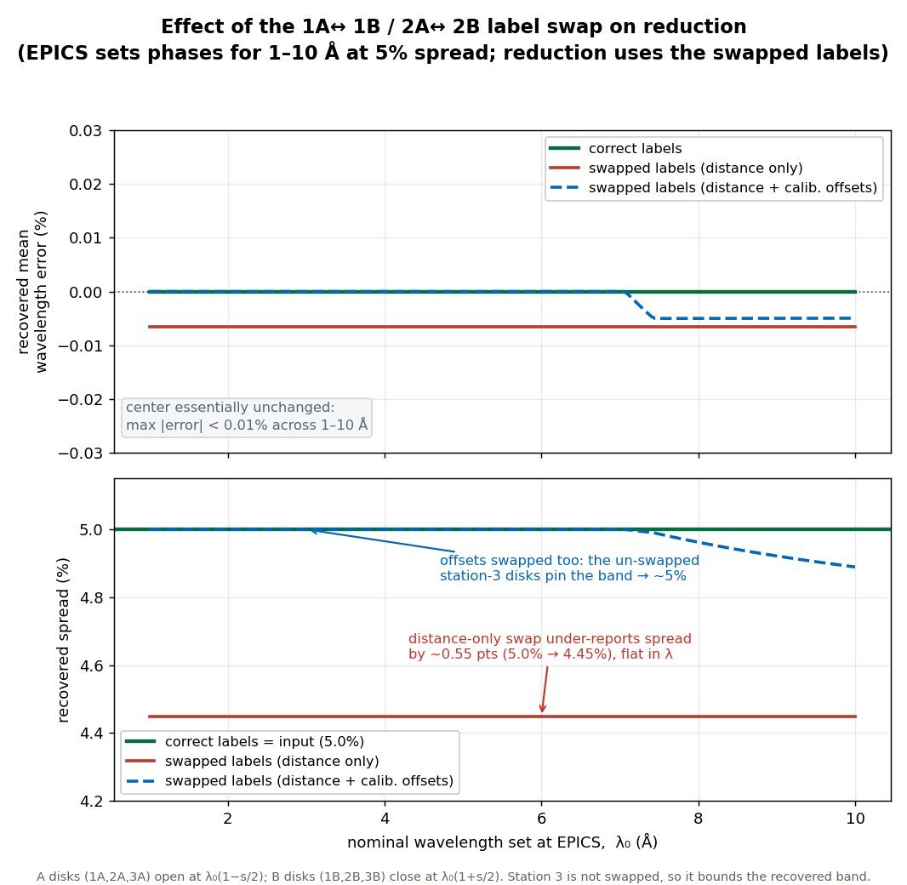

# EQSANS chopper system — 6-chopper upgrade (2026B)

## Overview

Starting in the **2026B** cycle (IPTS-37618), EQSANS was upgraded from a
**4-chopper** to a **6-chopper** system. The two added disks (the "A" disks at
stations 1 and 2) let each of the three chopper stations define **both** edges
of the transmitted wavelength band, which enables a new **monochromatic beam**
mode in addition to the standard bandwidth (white-beam / TOF) mode.

Both the instrument geometry (each disk's distance to the moderator) and the
per-disk **phase offsets** changed with the upgrade. The disk **opening angles**
did not change.

## Chopper reference (effective 2026B onward)

The six disks in the order used by the control software and by
`EQSANS_chopper_configurations.json` (array indices 0–5). The disk labels are
the ones used throughout the IOC code (`hexaSub.c`) and reduction — index 0 is
`1A`, index 4 is `1B`, and so on:

| idx | Disk | Distance to source (m) | Opening angle (°) | Phase offset, 60 Hz / mono (µs) | Phase offset, 30 Hz skip (µs) |
|----:|:----:|-----------------------:|------------------:|--------------------------------:|------------------------------:|
| 0 | **1A** | 5.6757668 | 129.605 | 14954.46 | 29908.92 |
| 1 | **2A** | 7.7757668 | 179.989 | 14805.40 | 29610.80 |
| 2 | **3A** | 9.4978    | 230.010 | 14726.06 | 29452.12 |
| 3 | **3B** | 9.5078    | 230.007 | 14565.60 | 29131.20 |
| 4 | **1B** | 5.6601247 | 129.605 | 15072.89 | 30145.78 |
| 5 | **2B** | 7.7601247 | 179.989 | 14834.04 | 29668.04 |

- Stations pair up as **1A + 1B** (indices 0, 4), **2A + 2B** (1, 5) and
  **3A + 3B** (2, 3).
- **Distances** are the measured values confirmed by B. McHargue (2026-08-10)
  and are the values compiled into the IOC (`CHOPPER_LOCATION` in `hexaSub.c`).
- **Opening angle** is the disk's open-aperture angle in degrees (the config
  file rounds these to `129.600, 180.000, 230.010, 230.007, 129.600, 180.000`).
- **Phase offset** is the per-disk experimental calibration constant added to
  the computed phase (`CHOPPER_PHASE_OFFSET` / config `offsets`): the 60 Hz set
  is used for both bandwidth and monochromatic modes; the 30 Hz set is used for
  frame-skip. These are the values compiled into the IOC and match the
  `daystamp 20260101` entry of `EQSANS_chopper_configurations.json`.

### Label discrepancy: 1A↔1B and 2A↔2B (open item)

The station-1 and station-2 disks are named with the **opposite A/B sense** in
the two places they appear. Station 3 agrees. **The distances per array index
are the same physical positions in both** — only the name differs:

| Distance to source (m) | Position | EPICS code / config / reduction | Engineer (McHargue) |
|-----------------------:|:---------|:-------------------------------:|:-------------------:|
| 5.6601247 | station 1, upstream (new disk) | **1B** | **1A** |
| 5.6757668 | station 1, downstream          | **1A** | **1B** |
| 7.7601247 | station 2, upstream (new disk) | **2B** | **2A** |
| 7.7757668 | station 2, downstream          | **2A** | **2B** |
| 9.4978    | station 3                      | 3A | 3A |
| 9.5078    | station 3                      | 3B | 3B |

The physical anchor is McHargue's 2026-03-10 statement that **"1A is 15.6421 mm
upstream of 1B"** and that **1A is the newly added disk**. Upstream = smaller
distance-to-source, so the new/upstream disk is at 5.6601247 m — which the
engineer calls **1A** but `hexaSub.c`, the config file and reduction call
**1B** (`5.6757668 − 5.6601247 = 0.0156421 m = 15.6421 mm`, the exact spacing he
quotes). The same swap applies at station 2.

What this affects:

- **Distances and phases per array index are unaffected** — index 0 is the
  5.6757668 m disk in every source, so the numbers reduction uses are the same
  physical positions regardless of the name.
- **Only the A/B name is reversed.** The hazard is cross-referencing: "1A" in a
  hardware/engineering document is a *different physical disk* than "1A" in the
  config/reduction. Worth **confirming the EPICS PV → physical-disk wiring**
  (so a disk is not phased for its 15.6 mm-away partner), and always stating
  which convention you mean. Still open — flagged in the naming-confusion
  thread.

### Estimated impact on reduction (simulation)

If EPICS sets the phases correctly (using the true distance of each physical
disk) but reduction inverts them with the **swapped** station-1/2 labels, how
far off are the recovered wavelength and spread? Simulated over λ₀ = 1–10 Å at
a 5 % set spread, in the monochromatic 60 Hz mode of `hexaSub.c`:



| λ₀ set (Å) | center error (distance swap) | recovered spread, distance swap | recovered spread, distance + offsets swap |
|-----------:|:----------------------------:|:-------------------------------:|:-----------------------------------------:|
| 1 – 10 | −0.007 % (flat) | **4.45 %** (from 5 %) | 5.0 % → 4.9 % |

Takeaways:

- **The mean wavelength is essentially unaffected** — the recovered center is
  within 0.01 % of λ₀ across the whole range, because the swapped disks are only
  15.6 mm apart out of ~5.7 m.
- **The recovered spread is at most slightly under-reported** — 5 % reads as
  ~4.45 % if only the distances are swapped, and stays ~5 % if the per-disk
  calibration offsets are swapped along with the labels (because the **un-swapped
  station-3 disks bound the band**, so the recovered band is always a subset of
  the true `[wl1, wl2]` — the swap can narrow it a little but cannot shift or
  widen it).
- **So the label swap is *not* the cause of the large monochromatic reduction
  failures** — those come from the separate `20260304`-vs-`20260101` phase-offset
  mismatch (below), whose ~100 µs differences move edges by ~0.08 Å.

Reproduce with `analysis/chopper_label_swap.py` (numpy + matplotlib). This is an
estimate of the label-swap effect in isolation, not a full drtsans run.

## Physical geometry (B. McHargue, 2026-03-10)

Convention-independent facts about the disks:

- Each of **stations 1 and 2** gained a second disk; the two disks of a station
  are **15.6421 mm** apart. Relative to the single previous chopper at that
  station, one disk sits **42.6753 mm** and the other **27.0332 mm** upstream.
- **Station 3**'s two disks are **14.0468 mm** apart and remain in their
  previous physical locations.
- One disk at station 1 and one at station 3 are monitored by **infrared
  thermocouples (IR TC)**.

See *Label discrepancy* above for the A/B naming caveat at stations 1 and 2.

## Operation algorithm

The chopper phases are computed by the beamline IOC **`bl6-SkfChopper`**, in the
EPICS aSub routines in `bl6-SkfChopperApp/src/hexaSub.c` — `calc6Phases`
(forward: wavelength → phases) and `calc6Wavelengths` (inverse: phases →
transmitted band). Both are C ports of `calcChopperByStartingWavelength()` and
`calcBandWidth()` from `eqsans_scans.py`; the monochromatic branch was added
**2026-03-07**.

### Neutron kinematics

Time-of-flight to a disk at distance `L` (mm) for wavelength `λ` (Å):

```
TOF [s] = L * λ / 3.956e6            # 3.9560346 mm·Å/µs  (= h / m_n)
```

The band that fits in one 60 Hz frame at the detector:

```
bandwidth_60Hz [Å] = 3.956e6 / detector_location / 60
```

where `detector_location` is the moderator-to-detector flight path in mm
(≈ moderator distance + SDD), including a small `sqrt(SDD² + 0.707²)`
corner-pixel path correction.

### Building each disk phase

For a disk, the phase is the TOF at which the chosen band edge reaches it,
shifted to the **center** of the disk opening and adjusted by calibration and
(optionally) beam-cross-section / pulse-width terms, wrapped into one frame:

```
phase  = L * λ_edge / 3.956e6                 # TOF to the disk for the edge wavelength
phase ±= (opening_angle / 360) / speed / 2    # move from the edge to the aperture center
phase  = 1e6 * phase + phase_offset[disk]     # to µs, add the disk's calibration offset
phase  = phase mod (1e6 / speed)              # wrap into one frame (frame_width µs)
```

`+` (open edge) is used for disks that set the **short-λ** edge; `−` (close
edge) for disks that set the **long-λ** edge.

### Bandwidth (white-beam) mode — 60 Hz

`wl1 = start_λ`, `wl2 = wl1 + bandwidth_60Hz`. Choppers 1A/1B open on the short
edge and 2A/2B close on the long edge (with a `λ > 13 Å` vs `≤ 13 Å` branch that
swaps which pair opens/closes to suppress leakage); 3A closes at `wl2`, 3B opens
at `wl1`. A small correction is applied to 1A/1B when the detector is close
enough that those disks are "not opened enough."

### Monochromatic mode — 60 Hz (new, 2026-03-07)

The requested band is centered on `mono_wavelength` with a fractional
`wave_spread` (e.g. 0.10 = 10 %):

```
wl1 = mono_λ * (1 - wave_spread/2)      # lower edge
wl2 = mono_λ * (1 + wave_spread/2)      # upper edge
require  wave_spread * mono_λ ≤ bandwidth_60Hz   # else the band exceeds the frame → error
```

Each station brackets the band: the **A disks (1A, 2A, 3A)** are aligned to the
**opening** edge at `wl1`, and the **B disks (1B, 2B, 3B)** to the **closing**
edge at `wl2`. There is no `λ > 13 Å` special-casing, and monochromatic mode is
**60 Hz only** (no frame-skip).

### Frame-skip mode — 30 Hz

`tmp_frame_width` doubles to 33.3 ms and two bands are passed per skipped
pulse; disks are aligned across the frames and the 30 Hz phase-offset column is
used. **Frame-skip requires SDD ≤ 5 m** (the code refuses otherwise).

### Inverse — recovering the band from the set phases

`calc6Wavelengths` does the reverse: from the six set phases and the speed it
subtracts the calibration offsets, converts each disk's open/close edges back to
wavelength (`λ = 3.9560346 · x / L`), and takes the **largest opening-edge λ** as
the band minimum and the **smallest closing-edge λ** as the band maximum (rolling
whole frames when needed). This is the calculation that yields the transmitted
wavelength **center and spread** — the quantity reduction needs.

### Why this matters for reduction

The IOC computes and inverts phases using the distances and offsets in the
table above (the `20260101` set). To recover the correct wavelength center and
spread, **reduction must use the same distances and offsets**. Using a
mismatched set (e.g. the `20260304` offsets) makes drtsans return unreliable
values — see *Open issues* — which is consistent with the observed monochromatic
autoreduction failures.

## Configuration snapshots

`EQSANS_chopper_configurations.json` carries dated entries (array order = the
table above; `aperture` is the opening angle in degrees):

**daystamp 20260101** — matches the constants compiled into the IOC
```
aperture:  [129.600, 180.000, 230.010, 230.007, 129.600, 180.000]
to_source: [5.6757668, 7.7757668, 9.4978, 9.5078, 5.6601247, 7.7601247]
not_skip:  [14954.46, 14805.4, 14726.06, 14565.69, 15072.89, 14834.04]
skip:      [29908.92, 29610.8, 29452.12, 29131.38, 30145.78, 29668.08]
```

**daystamp 20260304** — updated phase offsets; station-1/2 distances were interim estimates
```
aperture:  [129.600, 180.000, 230.010, 230.007, 129.600, 180.000]
to_source: [5.6978, 7.7978, 9.4978, 9.5078, 5.7078, 7.8078]
not_skip:  [14640.1, 14533.6, 14620.9, 14509.0, 14525.1, 14536.3]
skip:      [29280.2, 29067.2, 29241.8, 29018.0, 29050.2, 29072.6]
```

Only the chopper-to-moderator distances and the phase offsets differ between
entries; the opening angles are constant.

## Open issues — monochromatic-mode reduction

Seen on monochromatic runs **186204–186280** (autoreduction failures, reported
2026-08-07):

- With the **20260304** settings, drtsans computes unreliable wavelength
  center/spread; with the **20260101** settings (the ones the IOC actually uses)
  it reproduces the requested values, checked against processing variables
  **MCWL16** (center) and **MCWLSpread16** (spread).
- drtsans returns a slightly **smaller center wavelength** than MCWL16 —
  expected: it accounts for the moderator emission delay (neutrons must travel a
  little faster to reach the choppers on time).
- drtsans returns a slightly **wider spread** than the requested MCWLSpread16
  (no confirmed explanation yet).
- **TOF clipping must be disabled in monochromatic mode** — the default TOF
  clippings remove the entire wavelength band.
- **Interim workaround** for monochromatic reduction: use the 20260101 chopper
  settings, or override drtsans with the MCWL16 / MCWLSpread16 values.

## Sources

- IOC: `bl6-SkfChopper` — `bl6-SkfChopperApp/src/hexaSub.c`
  (`calc6Phases`, `calc6Wavelengths`), ported from `eqsans_scans.py`.
- Email threads *"Autoreduction errors"* (2026-08-07 → 2026-08-10) and
  *"potential chopper naming confusion"* (2026-03-10): B. McHargue (neutron
  choppers engineer), W. Heller, J. Borreguero, C. Do, Y. Shang, G. Nagy.
