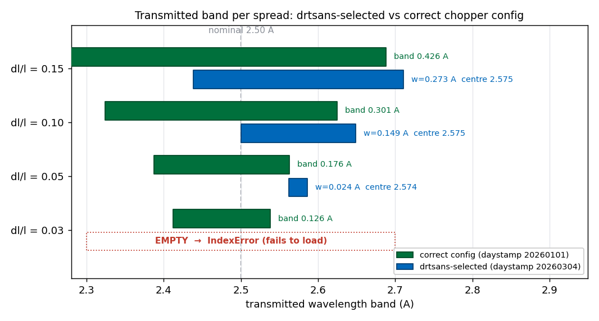
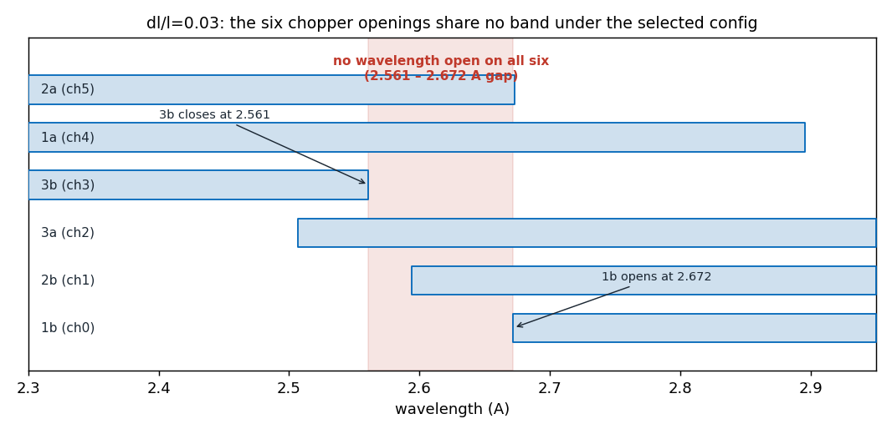
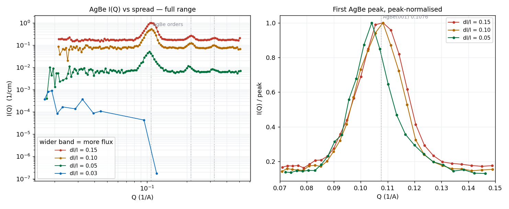

# Monochromatic-beam reduction

The 6-chopper upgrade (see the **Choppers** tab) lets EQSANS run a *monochromatic*
beam — a single narrow wavelength band instead of the broad TOF spectrum. In
2026B we measured a spread series at 4 m / 2.5 Å (runs 186204–186248), varying the
band width **dl/l = 0.03, 0.05, 0.10, 0.15** with everything else fixed.

**All 16 reductions initially failed and produced no usable data.** This page
documents why — three issues in how drtsans handles a monochromatic run, two of
which crash it outright — and shows a recipe that recovers the data, demonstrated
on AgBe.

## Symptoms

Every spread failed, but with three *different* errors, which was the first clue:

| spread | error raised by drtsans |
|---|---|
| dl/l = 0.03 | `IndexError: list index out of range` (at file load) |
| dl/l = 0.05 | `TransmissionNanError: Transmission at zero-angle is NaN` |
| dl/l = 0.10, 0.15 | `Levenberg-Marquardt … 1 data points, 2 fitting parameters` |

All three trace back to how drtsans reconstructs the transmitted wavelength band
from the chopper geometry, and how it then fits the sample transmission.

## Cause 1 — the reduction uses the wrong chopper phase

The transmitted wavelength band is set by the chopper phases. drtsans stores
several sets of EQSANS chopper phases (in `EQSANS_chopper_configurations.json`)
and picks one automatically per run. For these runs it picked a set whose phases
**do not match the chopper phase the instrument was actually running**, so the
reconstructed band comes out wrong.

Reproducing drtsans' own band math with each stored phase set (figure produced by
our own code — see *How the figures were made*):



Only one phase set is physically right: the **green** bars — bands centred
**exactly at 2.50 Å with width = (dl/l) × 2.50** for every spread, i.e. what the
instrument was set to. **This set agrees with the most recently known (correct)
chopper phase.** It happens to be indexed in the drtsans table under the date-tag
`20260101`; we don't know why it carries that date, and *the date is not the
point* — what matters is that these are the correct phases and drtsans is not
applying them. (The date is only how drtsans looks up a set.)

The set drtsans applied instead is the **blue** bars. For the three wider spreads
a band still forms but is **shifted off-centre to ~2.57 Å** (nominal 2.50) and is
narrower than the true spread — so those runs are reduced at the wrong wavelength
(and dl/l=0.05 is so narrow the transmission comes out NaN). For the narrowest
spread, **dl/l=0.03, no band forms at all** — that is the blue *"EMPTY"* row in
the figure above, and it is the `IndexError`.

Why dl/l=0.03 has no band: each chopper still transmits something, but with the
wrong phases the six openings share no common wavelength — chopper 3b closes at
2.561 Å *before* chopper 1b opens at 2.672 Å. The band is the intersection of all
six, and here it is empty. In the figure below the red-shaded strip is that
**gap between openings (2.561–2.672 Å) — it is not a band**; for this spread there
is simply no wavelength open on all six choppers:



**Fix:** make the reduction apply the correct chopper phases — the ones that
reproduce the 2.50 Å bands (green above). In drtsans that means the runs must pick
up the `20260101`-set values; add or correct a table entry so the current cycle's
runs do. This is an instrument-config change to coordinate with the SANS/drtsans
team, and it is **required just to load** the dl/l ≤ 0.05 runs (they `IndexError`
before any transmission or binning happens).

## Cause 2 — transmission is force-fit as wavelength-dependent

Even with the band fixed, drtsans computes the sample transmission by **fitting a
2-parameter line** `T(λ) = a·λ + b` across the band's wavelength bins
(`process_transmission` uses a hardcoded `LinearBackground`). A monochromatic band
spans only 0–2 wavelength bins, so the fit has too few points and dies:
`1 data points, 2 fitting parameters`.

A monochromatic transmission is **a single number**, not a function of
wavelength. drtsans already supports this — `calculate_transmission` with an empty
fit function returns the raw single value — but it is not exposed as a reduction
option. Two ways to get it:

- Pass a **fixed transmission value** per sample (a number ≤ 1, exactly like the
  blocked-beam 0.9 convention). Compute each sample's transmission once
  (drtsans prints `Average zero angle transmission = …`) and feed it back. No
  code change; works in the normal reduction path.
- Or force the empty fit function in `process_transmission` (an in-process patch).

## Cause 3 — the reduction should use a single wavelength bin

Monochromatic mode exists precisely to *avoid* combining wavelengths: with a
broad beam, the final I(Q) is built by normalising each wavelength slice (by the
wavelength-dependent flux and sensitivity) and then combining them — and any
imperfection in that normalisation, plus residual inelastic scattering, leaves a
wavelength-dependent intensity. A monochromatic run should therefore be reduced
as **one wavelength bin spanning the whole band**, so there is a single
normalisation and nothing is averaged across wavelength.

drtsans supports this directly: `convert_to_wavelength` has a **monochromatic
mode** that, when a run's `monochromatic` sample log is set, overrides the bin
width to `w_max − w_min` — one bin spanning the transmitted band — and a
downstream guard (`bypass_correction_for_single_wavelength_bin`) then skips the
elastic/inelastic wavelength corrections, which are meaningless for one bin. Our
runs simply **don't have that log set**, so drtsans binned them at the default
0.1 Å (2–3 bins across the band) and applied the per-wavelength machinery.

Equivalently, without the log, setting the reduction's **wavelength step equal to
the band width** produces the same single bin (verified: dl/l=0.10, band ≈0.25 Å
→ step ≥ 0.2 Å gives exactly one bin). What must be avoided is a step *much*
larger than the band (e.g. 2 Å): with `FullBinsOnly`, no full bin fits inside the
band, the frame comes out empty, and I(Q) binning dies with `zero-size array to
reduction operation minimum`. So the rule is *step ≈ band width*, not "as large
as possible."

## How we fixed it for this test (temporary)

`EQVar` / `reduceNow` only expose the parameters that go into the reduction JSON —
input files, detector/sample offsets, `wavelengthStep`, transmission *values*, and
so on. The three things that are wrong here are **not** JSON parameters, so they
cannot be set through `EQVar`:

- the **chopper phase set** is chosen by drtsans internally from the run's start
  date, not passed in;
- the **transmission fit** (`LinearBackground`) is hardcoded inside
  `process_transmission`; and
- **monochromatic single-bin mode** is triggered by a sample log, not a JSON key.

So the demonstration script reaches into the drtsans objects at runtime and
overrides them (monkeypatching) — a **temporary, in-memory workaround that touches
nothing on disk** in the shared drtsans install:

```python
# (1) correct chopper phase.  EQSANSDiskChopperSet is the drtsans class built from
#     a run's chopper logs; get_chopper_configuration(start_time) reads the phase
#     table and returns the set for that date.  Force it to the 20260101 set:
from drtsans.tof.eqsans.chopper import EQSANSDiskChopperSet
_orig = EQSANSDiskChopperSet.get_chopper_configuration
EQSANSDiskChopperSet.get_chopper_configuration = \
    lambda self, start_time: _orig(self, "2026-01-02T00:00:00Z")

# (2) single-value transmission.  rapi is drtsans.tof.eqsans.reduction_api, the
#     module that runs one configuration; its process_transmission() calls
#     calculate_transmission() with a hardcoded LinearBackground fit.  Default the
#     fit to "" so it returns the RAW transmission instead of fitting a*lam+b:
import drtsans.tof.eqsans.reduction_api as rapi
_orig_ct = rapi.calculate_transmission
def _ct(*a, **k):
    k.setdefault("fit_function", "")
    return _orig_ct(*a, **k)
rapi.calculate_transmission = _ct

# (3) single wavelength bin.  Tag every workspace 'monochromatic' just before
#     drtsans converts it to wavelength, so it makes ONE band-spanning bin:
import drtsans.tof.eqsans.correct_frame as cf
from drtsans.samplelogs import SampleLogs
_orig_cw = cf.convert_to_wavelength
def _cw(ws, bands=None, bin_width=0.1, events=True, output_workspace=None):
    SampleLogs(ws).insert("monochromatic", 1)
    return _orig_cw(ws, bands=bands, bin_width=bin_width, events=events,
                    output_workspace=output_workspace)
cf.convert_to_wavelength = _cw

reduceNow(eq, debug=True)   # debug=True runs IN-PROCESS so the patches take effect
```

The scripts: `reduce_mono_recipe.py` applies patches (1)+(2) at the default 0.1 Å
step (the first proof that data comes out); `reduce_agbe_mono.py` adds patch (3),
the single band-spanning bin, and is what produced the AgBe figure above.

Two details worth calling out:

- **`reduceNow` normally spawns a fresh `python3` subprocess**, which would not see
  any of these in-memory patches — the reduction would silently run unpatched.
  `debug=True` runs it in the *same* process, so the overrides apply. (This is why
  an earlier attempt appeared to "work" but hadn't actually used the patch.)
- These patches live only inside the script and vanish when it exits. They prove
  the cause and recover data now, but are **not** a setup to run production through
  — the real fixes belong upstream (next section).

### Does the wavelength step still matter if the transmission is a single number?

Yes — they are two separate things. Making the transmission single-valued (patch 2)
only stops drtsans from *fitting* transmission against wavelength; it does not
change how the **sample** data is binned. The sample events are independently
histogrammed in wavelength using `wavelengthStep`, and at the default **0.1 Å** a
wider band still spans 2–3 wavelength bins (dl/l=0.10, band ≈0.25 Å → bins at
≈2.37, 2.47, 2.57 Å — the same three values our computed transmission had there).
Each of those wavelength slices is normalised by its own flux and sensitivity and
then combined into the final I(Q) — which is exactly the wavelength-dependent
averaging that monochromatic mode is meant to avoid.

So the step still affects the result even with a single-value transmission. Only
when the step spans the whole band (patch 3, or `wavelengthStep` = band width) does
the sample collapse to one slice — and then the transmission is genuinely one
number too, because it is binned on the same wavelength axis. In short: **patch 2
stops the *crash*; patch 3 gives the physically correct single-wavelength
reduction.** At 0.1 Å the reduction runs, but it is still a 2–3-slice average, not a
true monochromatic result.

## Result — AgBe across the four spreads

AgBe (silver behenate) is the sharpest test of a monochromatic reduction: it has
evenly spaced diffraction rings (Q = 0.1076, 0.2153, 0.3229 Å⁻¹), so a correct
reduction must place peaks *exactly* there. Reducing all four spreads with the
recipe above — correct chopper phase, single-value transmission, and a single
band-spanning bin (drtsans monochromatic mode engaged) — gives:



- **dl/l = 0.10 and 0.15 are textbook AgBe** — three orders landing right on the
  reference positions (0.108 / 0.216 / 0.323 Å⁻¹, dotted lines). Peaks at the
  correct Q means the wavelength is correct: the chopper-phase fix worked.
- **Intensity scales with the band width.** A wider band passes more neutrons, so
  the pattern is stronger and cleaner — peak I(Q) ≈ 1.0, 0.52, 0.05 for
  dl/l = 0.15, 0.10, 0.05. This is the resolution-vs-flux trade the spread setting
  controls.
- **dl/l = 0.03 is flux-starved.** The razor-thin band passes so few neutrons that
  only a handful of Q points survive and the peak is lost in noise — the narrowest
  spread trades almost all intensity for resolution.
- The peak-normalised panel (right) shows the peaks are consistent in position and
  shape once there are enough counts; the extra sharpening from a narrower spread
  is modest here because at 4 m / 2.5 Å the detector geometry, not the wavelength
  spread, dominates the Q-resolution.

### Why dl/l = 0.03 is still not usable — it is flux, and steeply so

All four reductions used the **correct chopper phase**; dl/l=0.03 fails purely on
counting statistics. The AgBe *scattering* runs behind the plot:

| dl/l | scattering run | total detector counts | duration | count rate | band Δλ |
|---|---|---|---|---|---|
| 0.15 | 186246 | 1,672,096 | 6.8 min | 4118 /s | 0.375 Å |
| 0.10 | 186234 | 653,419 | 6.8 min | 1607 /s | 0.249 Å |
| 0.05 | 186223 | 440,797 | 54 min | 136 /s | 0.125 Å |
| 0.03 | 186212 | 113,532 | **2.9 h** | **10.9 /s** | 0.075 Å |

The count *rate* collapses far faster than the band narrows: the band is only 5×
narrower (0.375 → 0.075 Å) but the rate is **~380× lower** (4118 → 11 counts/s),
because tightening the monochromatic band throws away a rapidly growing fraction of
the beam. The measurement already tried to compensate — dl/l=0.03 was counted for
**2.9 hours** versus 6.8 minutes for dl/l=0.15 — yet it still collected ~15× *fewer*
total neutrons. After banjo-background subtraction and normalisation, too little
signal remains to resolve the peak, so the dl/l=0.03 curve is ~11 surviving Q
points of noise (its apparent "peak" at 0.095 Å⁻¹ is not the AgBe ring). This is a
source-flux limit, not a reduction problem: at dl/l=0.03 you would need
dramatically longer counting (or more source flux) for usable data.

(The same recipe also recovers porasil — a smooth SANS curve — for the wider
spreads; see `reduce_mono_recipe.py`.)

## Suggested permanent fixes for drtsans

The temporary patches above point to real drtsans issues that should be fixed
upstream so monochromatic data reduces on the normal path:

1. **Chopper phase (a config bug — fix required).** Make the current cycle's runs
   pick up the correct (`20260101`-style) chopper phases — add or correct an entry
   in `EQSANS_chopper_configurations.json` so the applied phases match the
   instrument. This is an instrument-configuration change to coordinate with the
   SANS/drtsans team; it is **required just to load** the dl/l ≤ 0.05 runs (there
   is no no-code workaround — the phases must be right before the run will load).

2. **Single wavelength bin (engage the built-in monochromatic mode).** drtsans
   already makes one band-spanning bin and bypasses the per-wavelength corrections
   when a run's `monochromatic` sample log is set — so the run must carry that log
   (from the DAS, or added during reduction). *Interim, no-code option:* set the
   reduction's wavelength step equal to the transmitted band width, which yields
   the same single bin.

3. **Transmission fitting (a behaviour gap — enhancement).** drtsans should use a
   single-value transmission for monochromatic runs instead of the 2-parameter
   `a·λ+b` fit — e.g. auto-detect the monochromatic case, or expose the existing
   empty-fit-function path as an option. *Interim, no-code option:* pass a
   **fixed transmission value** per sample (a number ≤ 1, like the blocked-beam
   0.9 convention), which already works on the normal path once the run loads.

## How the figures were made

The band figures are **our own code**, not drtsans output:
`2026B_mp/reduction/mono_diagnosis/diagnose_chopper.py` loads each run's logged
chopper speeds/phases and reproduces drtsans' own transmission-band math for each
stored phase set (writing `chopper_diagnosis.md`); those band numbers are drawn by
`doc/monowl_assets/make_monowl_plots.py`. The AgBe and I(Q) curves are read
directly from the reduced `_Iq.dat` files produced by `reduce_agbe_mono.py` /
`reduce_mono_recipe.py`.

Full diagnosis, scripts and proof:
`2026B_mp/reduction/mono_diagnosis/` (`diagnose_chopper.py`,
`chopper_diagnosis.md`, `reduce_agbe_mono.py`, `reduce_mono_recipe.py`,
`DIAGNOSIS.md`).
