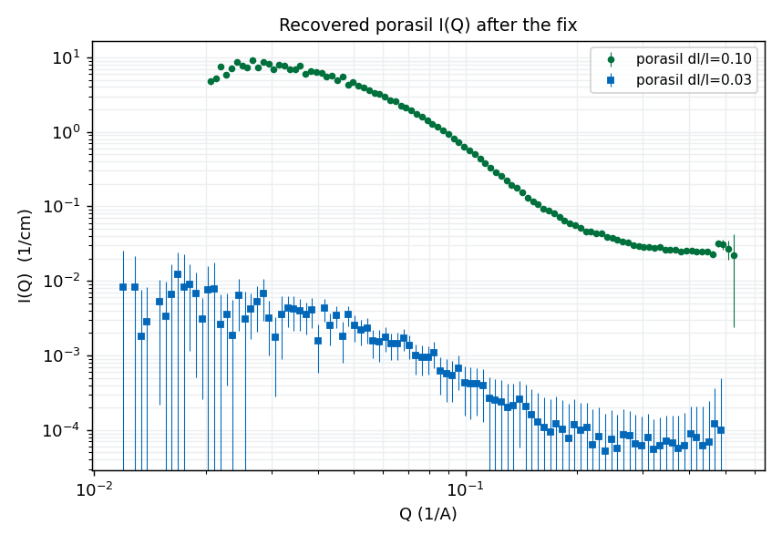

# Monochromatic-beam reduction

The 6-chopper upgrade (see the **Choppers** tab) lets EQSANS run a *monochromatic*
beam — a single narrow wavelength band instead of the broad TOF spectrum. In
2026B we measured a spread series at 4 m / 2.5 Å (runs 186204–186248), varying the
band width **dl/l = 0.03, 0.05, 0.10, 0.15** with everything else fixed.

**All 16 reductions initially failed and produced no usable data.** This page
documents why — two of the three causes are genuine drtsans issues — and shows a
recipe that recovers the data.

## Symptoms

Every spread failed, but with three *different* errors, which was the first clue:

| spread | error raised by drtsans |
|---|---|
| dl/l = 0.03 | `IndexError: list index out of range` (at file load) |
| dl/l = 0.05 | `TransmissionNanError: Transmission at zero-angle is NaN` |
| dl/l = 0.10, 0.15 | `Levenberg-Marquardt … 1 data points, 2 fitting parameters` |

All three trace back to how drtsans reconstructs the transmitted wavelength band
from the chopper geometry, and how it then fits the sample transmission.

## Cause 1 — drtsans selects the wrong chopper configuration (data bug)

drtsans reads the chopper geometry (apertures, source distances, phase offsets)
from a daystamp-keyed table, `EQSANS_chopper_configurations.json`, picking the
latest entry with `daystamp ≤ run start`. These runs are from August 2026, so
drtsans selects the **`20260304`** entry — whose phase offsets (~300 µs off) and
distances **do not match** how the choppers were actually phased for these runs.

Reproducing drtsans' own band math with each configuration:

The **correct `20260101` entry** (the "final answer" calibration on the Choppers
tab) reproduces bands centred **exactly at 2.50 Å** with width = (dl/l) × 2.50 for
every spread — physically what the instrument was set to. The
**drtsans-selected `20260304` entry** gives bands centred at ~2.57 Å, far too
narrow, and for the narrowest spread the six-chopper band intersection is
**empty** → the `IndexError`.

Why the intersection empties at dl/l = 0.03: each chopper transmits a set of
bands; the beam is their intersection. Under the selected config the six openings
share no common wavelength — chopper 3b closes at 2.561 Å before chopper 1b opens
at 2.672 Å:

**Proper fix:** add a dated entry to `EQSANS_chopper_configurations.json` for the
current cycle carrying the correct (`20260101`-style) offsets and distances, or
correct the `20260304` entry. This is a drtsans / instrument-config change to
report to the SANS/drtsans team — it is **required just to load** the dl/l ≤ 0.05
runs (they `IndexError` before any transmission or binning happens).

## Cause 2 — transmission is force-fit as wavelength-dependent

Even with the band fixed, drtsans computes the sample transmission by **fitting a
2-parameter line** `T(λ) = a·λ + b` across the band's wavelength bins
(`process_transmission` uses a hardcoded `LinearBackground`). A monochromatic band
spans only 0–2 wavelength bins, so the fit has too few points and dies:
`1 data points, 2 fitting parameters`.

A monochromatic transmission is **a single number**, not a function of
wavelength. drtsans already supports this — `calculate_transmission` with an empty
fit function returns the raw single value — but it is not exposed as a reduction
option. Two ways to get it:

- Pass a **fixed transmission value** per sample (a number ≤ 1, exactly like the
  blocked-beam 0.9 convention). Compute each sample's transmission once
  (drtsans prints `Average zero angle transmission = …`) and feed it back. No
  code change; works in the normal reduction path.
- Or force the empty fit function in `process_transmission` (an in-process patch).

## Not a cause — do **not** coarsen the wavelength step to force one bin

It is tempting to make the wavelength step larger than the spread so the whole
band is a single bin. In practice that makes drtsans' frame-based I(Q) binning
fail with `zero-size array to reduction operation minimum`. It is unnecessary:
once the transmission is a single value, the **normal 0.1 Å step works** — the
narrow band simply occupies 1–3 bins and I(Q) integrates them.

## How we fixed it for this test (temporary)

The fix used to prove recovery is a **temporary, local workaround — nothing in the
shared drtsans install or its configuration was modified.** In the diagnosis
script (`reduce_mono_recipe.py`) we, at runtime and in-memory only:

1. **Forced the correct chopper config** — monkeypatched
   `EQSANSDiskChopperSet.get_chopper_configuration` to return the `20260101`
   entry instead of the auto-selected `20260304` one.
2. **Forced single-value transmission** — monkeypatched `calculate_transmission`
   to use an empty fit function (raw single value, no `a·λ+b` fit).
3. Ran the reduction **in-process** (`reduceNow(..., debug=True)`) so the two
   patches actually apply (the default path spawns a fresh subprocess that would
   not see them).

These patches live only inside the diagnosis script and vanish when it exits.
They are enough to **prove the cause and recover data now**, but they are not a
setup anyone should run production reductions through.

## Result — the data is recoverable

With those temporary fixes (normal 0.1 Å step), the spreads that previously
crashed now reduce to real I(Q):

- **dl/l = 0.10** → clean porasil curve (102 Q-points), transmission bins centred
  on 2.50 Å, confirming the corrected config.
- **dl/l = 0.03** → reduces, but the transmission (1.17 ± 2.0) and I(Q) are noisy
  — the razor-thin band carries very few neutrons. For the narrowest spreads a
  **fixed, separately-measured transmission** is cleaner than the computed one.

## Suggested permanent fixes for drtsans

The temporary patches above point to two real drtsans issues that should be fixed
upstream so monochromatic data reduces on the normal path:

1. **Chopper config (a data bug — fix required).** Add a dated entry to
   `EQSANS_chopper_configurations.json` for the current cycle carrying the correct
   (`20260101`-style) offsets and source distances, or correct the `20260304`
   entry so it matches the hardware. This is an instrument-configuration change to
   coordinate with the SANS/drtsans team; it is **required just to load** the
   dl/l ≤ 0.05 runs. *Interim, no-code option:* none for loading — the config must
   be right before the run will load at all.

2. **Transmission fitting (a behaviour gap — enhancement).** drtsans should
   support a single-value (non-wavelength-dependent) transmission for
   monochromatic runs — e.g. auto-detect a monochromatic band, or expose the
   existing empty-fit-function path as a reduction option. *Interim, no-code
   option:* pass a **fixed transmission value** per sample (a number ≤ 1, like the
   blocked-beam 0.9 convention) — this already works on the normal reduction path
   once the config loads.

**Do not** change the wavelength step to force one bin — it breaks I(Q) binning
and is unnecessary.

Full diagnosis, scripts and proof:
`2026B_mp/reduction/mono_diagnosis/` (`diagnose_chopper.py`,
`chopper_diagnosis.md`, `reduce_mono_recipe.py`, `DIAGNOSIS.md`).
