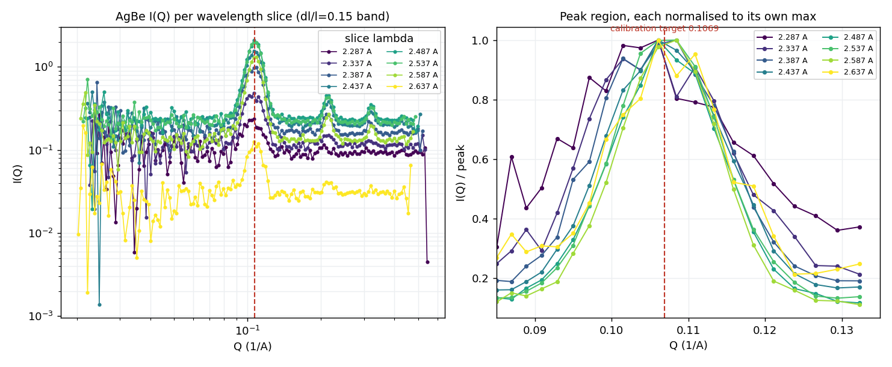

# Monochromatic reduction II — peak position, wavelength binning & Q

A follow-up to the **monoWL** tab. Once the monochromatic AgBe runs reduced, the
diffraction **peak position appeared to shift with the spread setting** — dl/l=0.05
gave Q≈0.104, dl/l=0.15 gave Q≈0.108. That should be impossible: AgBe has a fixed
d-spacing, so its ring must sit at the same Q at every spread — the EQSANS AgBe
calibration target **Q1 = 0.1069 Å⁻¹** (d(001) ≈ 58.8 Å; `TARGET_Q1` in the AgBe
calibration) — only the *resolution* (peak width) should change.

This page tracks that down. The short version: **nothing is wrong with the
wavelength conversion or the calibration.** The shift is entirely an artifact of
collapsing the band into a single wavelength bin, and it disappears when the band
is reduced wavelength-resolved (as broadband always is).

## The symptom

Gaussian fits of the AgBe (001) peak from the single-bin "monochromatic mode",
against the calibration target:

| reduction | dl/l=0.05 | dl/l=0.10 | dl/l=0.15 |
|---|---|---|---|
| single-bin (monochromatic mode) | 0.1039 | 0.1070 | 0.1079 |
| **AgBe calibration target (all spreads)** | **0.1069** | **0.1069** | **0.1069** |

The reference is the calibration target **Q1 = 0.1069 Å⁻¹**. The AgBe calibration's
own verification (Details tab) reaches it — q1 = 0.1069 at both 2.5 Å and 6 Å, and
0.1074 at 10 Å (so even the calibration scatters ~0.5% across configurations, from
the coarse log-Q grid, not from the physics). A Gaussian fit of the standard
broadband reductions lands at ≈0.1068 for every configuration — essentially the
target. And the transmitted **band centre is 2.475 Å for all four spreads** — the
spread setting widens the band but does not move its centre. So neither the
detector geometry nor the centre wavelength is shifting; the problem is downstream,
in how I(Q) is built.

## The mechanism — drtsans computes Q from the wavelength *bin centre*

When drtsans histograms events into wavelength bins, each (pixel, wavelength-bin)
cell gets its Q from the **bin-centre** wavelength and the pixel angle:

```
Q_computed = 4*pi*sin(theta) / lambda_bin-centre
           = Q_true * (lambda_true / lambda_bin-centre)
```

This equals the true Q1 **only when the bin centre matches the neutron's true
wavelength.** A neutron whose true wavelength differs from its assigned bin centre
is placed at the wrong Q, scaled by the ratio of the two.

This is *provable*: if drtsans used each event's true (time-of-flight) wavelength,
the bin width could not possibly matter — one bin would already give Q1. It does
matter (below), so drtsans is using bin centres.

## Single-bin collapses the band → a shift set by intensity weighting


*Figure: (left) fitted AgBe peak vs spread — single-bin (red) drifts away from the broadband calibration (grey), multi-bin at 0.1 Å (green) stays on it; (right) dl/l=0.05 climbs to Q1 as the band is split into more wavelength bins. Fits by scipy; reductions by reduce_agbe_mono.py / reduce_agbe_multibin.py / reduce_agbe_dl05_fine.py.*

In single-bin mode the whole transmitted band (0.13–0.43 Å wide) becomes **one**
bin, and every neutron is assigned the single band-centre wavelength. Neutrons of
different true wavelength — which diffract at different detector angles — are all
re-mapped with that one λ, so the sharp ring smears, and the **intensity-weighted
mean wavelength** of the band sets where the merged peak lands:

```
Q_peak(single-bin) = Q1 * <lambda>_intensity-weighted / lambda_bin-centre
```

That is the weighting effect: the peak moves because the flux is not flat across
the band, not because any wavelength is mis-measured.

**A clean demonstration — dl/l=0.05.** Here the band (0.176 Å) is narrow enough
that *both* the single-bin and the 0.1 Å "multi-bin" reductions ended up with
**exactly one wavelength bin** — but at different centres:

| reduction | wavelength bins | assigned λ | peak Q |
|---|---|---|---|
| single-bin (mono) | 1 | 2.475 Å (band centre) | 0.1039 |
| multi-bin (0.1 Å) | 1 | 2.437 Å (top of band dropped by `FullBinsOnly`) | 0.1058 |

With one bin each, "multi vs single" is a distinction without a difference — the
only thing that changed is the assigned wavelength. And Q ∝ 1/λ predicts the whole
shift: 0.1039 × (2.475 / 2.437) = **0.1055** ≈ the observed 0.1058. Direct proof
that a single bin's peak Q is set by its assigned wavelength.

## The proof — every wavelength slice peaks at the same Q1

The decisive test: reduce dl/l=0.15 at a fine 0.05 Å step (≈8 slices) and write
out I(Q) for each wavelength slice separately.


*Figure: eight wavelength slices across the dl/l=0.15 band. Left: raw I(Q) — the (001)/(002)/(003) rings of every slice line up on Q1 (red); slice intensities differ because that is the flux across the band. Right: peak region, each slice normalised to its own max — all slices peak on Q1 with no trend vs wavelength. Per-slice profiles written by drtsans (reduce_agbe_perslice.py).*

Every slice — 2.29, 2.34, … 2.64 Å — puts the AgBe peak at the **same Q1**. They
overlap; there is **no systematic shift with wavelength**. So:

- Each wavelength individually gives Q1. A monochromatic beam at 2.5 Å is just one
  of these slices — it sits at Q1.
- Different spread = summing a different *number* of these overlapping slices, each
  at Q1 → the sum stays at Q1; only the peak **width (resolution)** changes.
- The single-bin shift is therefore **not** in the physics — it is the weighting
  artifact of merging the slices under one wavelength.

## Why broadband at 0.1 Å is fine but single-bin is not

They sound like they should be identical — a monochromatic 2.5 ± 0.05 Å band is
just the [2.45, 2.55] slice of a broadband run. And they *are*: both give Q1. The
difference is only how many bins the ring's wavelength content is spread over:

- **Broadband** always chops into ~0.1 Å slices, so the AgBe ring is built from
  **many** slices, each at Q1 → sum at Q1. A 0.1 Å bin's residual smear is ±2% and
  symmetric, and averages out over the many bins.
- **Single-bin "monochromatic mode"** puts the ring's *entire* wavelength content
  into **one** bin as wide as the band (up to 0.43 Å) → large smear, weighted
  shift, no averaging.

So monochromatic data is not intrinsically "more sensitive to binning." A
monochromatic 0.1 Å band reduced in a 0.1 Å bin behaves exactly like a broadband
0.1 Å slice. The shift came only from collapsing a *wide* band into *one* bin —
something broadband never does. Split the band into several bins and the peak
converges to Q1 (right panel of the first figure: 1 bin → 0.1039, 2 → 0.1063,
8 → 0.1066, approaching the 0.1069 target).

## Recommendation

- **Use the same calibration for every spread.** You never need a different
  geometry for dl/l=0.05 vs 0.15 — the calibration is spread-independent (target
  0.1069; broadband and every per-slice above sit at ≈0.1068–0.1069).
- **Reduce wavelength-resolved — multiple bins across the band, not one.** A
  wavelength step that puts several bins across the transmitted band (roughly
  step ≤ band/5), or simply the standard broadband-style reduction. Every spread
  then gives the same peak position, differing only in resolution — exactly as
  expected.
- **You do not sacrifice the wavelength-dependent normalization.** Peak *position*
  does not depend on it at all (normalization scales intensity, not Q), and over a
  *narrow* monochromatic band the flux/sensitivity barely change, so the per-slice
  normalization is nearly uniform — the artifact that motivated collapsing to one
  bin is negligible precisely because the band is narrow. The aggressive
  wavelength-dependent *corrections* (inelastic/elastic) can simply be left off.
- **Do not use the single-bin "monochromatic mode" for quantitative Q.** It forces
  one wavelength into the Q calculation and silently shifts the peak; the narrower
  the resolution the more it collapses, until the run is flux-starved. It is the
  wrong lever.

This reverses the provisional recommendation on the monoWL tab (which framed
single-bin as *the* fix): the correct approach is a wavelength-resolved reduction
with the standard calibration.

## Scripts & data

All under `2026B_mp/reduction/mono_diagnosis/`:
`reduce_agbe_mono.py` (single-bin), `reduce_agbe_multibin.py` (0.1 Å),
`reduce_agbe_dl05_fine.py` (convergence), `reduce_agbe_perslice.py` (per-slice
profiles). Figures drawn by `doc/monowl_assets/make_monowl_plots.py`; peak fits
by scipy Gaussian + linear background over Q ∈ [0.085, 0.130].
