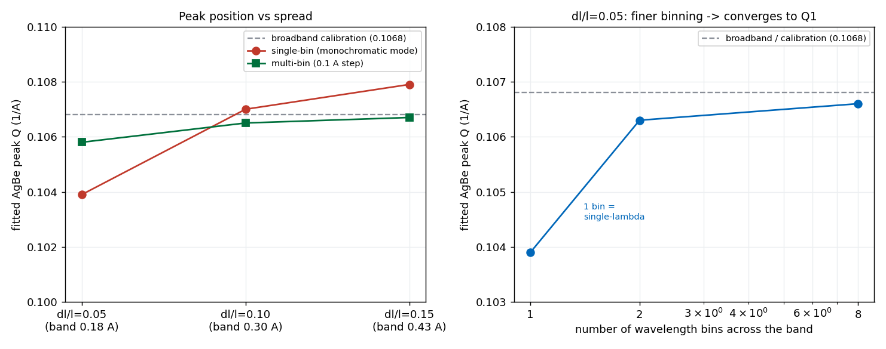
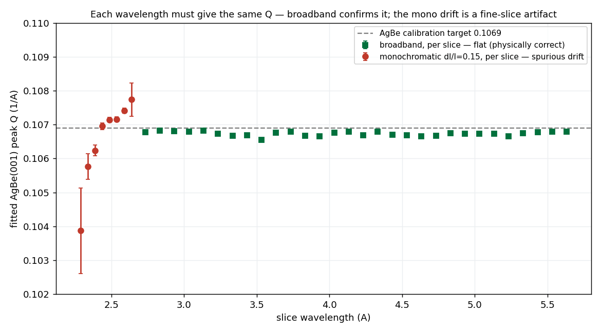
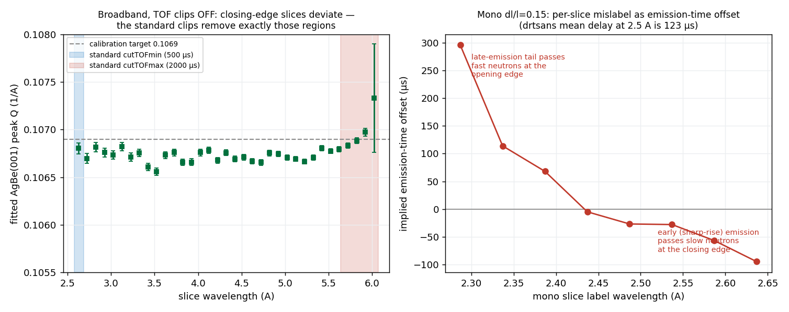
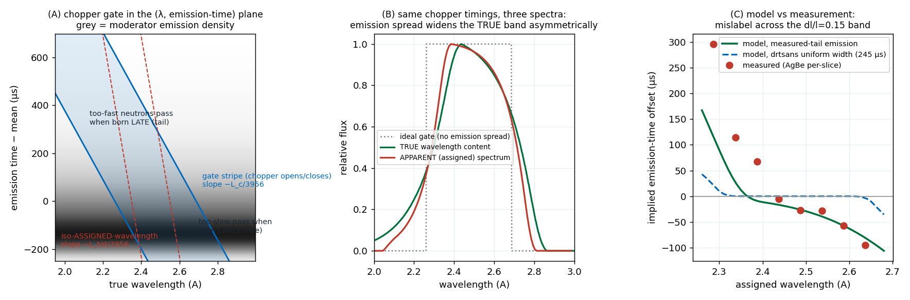

# Monochromatic reduction II — peak position, wavelength binning & Q

A follow-up to the **monoWL** tab. Once the monochromatic AgBe runs reduced, the
diffraction **peak position appeared to shift with the spread setting** — dl/l=0.05
gave Q≈0.104, dl/l=0.15 gave Q≈0.108. That should be impossible: AgBe has a fixed
d-spacing, so its ring must sit at the same Q at every spread — the EQSANS AgBe
calibration target **Q1 = 0.1069 Å⁻¹** (d(001) ≈ 58.8 Å; `TARGET_Q1` in the AgBe
calibration) — only the *resolution* (peak width) should change.

This page tracks that down (and was corrected several times as it did). The solid
result: the **single-bin reduction** shifts the peak by forcing one wavelength into
the Q calculation — fixed by a **wavelength-resolved** reduction. The chopper config
does **not** reassign individual event wavelengths. A small (~0.5 %)
monochromatic-vs-broadband peak offset remains as an open instrument-level item. The
bottom line is in *Final verdict* at the end; the reasoning is below.

## The symptom

Gaussian fits of the AgBe (001) peak from the single-bin "monochromatic mode",
against the calibration target:

| reduction | dl/l=0.05 | dl/l=0.10 | dl/l=0.15 |
|---|---|---|---|
| single-bin (monochromatic mode) | 0.1039 | 0.1070 | 0.1079 |
| **AgBe calibration target (all spreads)** | **0.1069** | **0.1069** | **0.1069** |

The reference is the calibration target **Q1 = 0.1069 Å⁻¹**. The AgBe calibration's
own verification (Details tab) reaches it — q1 = 0.1069 at both 2.5 Å and 6 Å, and
0.1074 at 10 Å (so even the calibration scatters ~0.5% across configurations, from
the coarse log-Q grid, not from the physics). A Gaussian fit of the standard
broadband reductions lands at ≈0.1068 for every configuration — essentially the
target. And the transmitted **band centre is 2.475 Å for all four spreads** — the
spread setting widens the band but does not move its centre. So neither the
detector geometry nor the centre wavelength is shifting; the problem is downstream,
in how I(Q) is built.

## The mechanism — drtsans computes Q from the wavelength *bin centre*

When drtsans histograms events into wavelength bins, each (pixel, wavelength-bin)
cell gets its Q from the **bin-centre** wavelength and the pixel angle:

```
Q_computed = 4*pi*sin(theta) / lambda_bin-centre
           = Q_true * (lambda_true / lambda_bin-centre)
```

This equals the true Q1 **only when the bin centre matches the neutron's true
wavelength.** A neutron whose true wavelength differs from its assigned bin centre
is placed at the wrong Q, scaled by the ratio of the two.

This is *provable*: if drtsans used each event's true (time-of-flight) wavelength,
the bin width could not possibly matter — one bin would already give Q1. It does
matter (below), so drtsans is using bin centres.

## Single-bin collapses the band → a shift set by intensity weighting


*Figure: (left) fitted AgBe peak vs spread — single-bin (red) drifts away from the broadband calibration (grey), multi-bin at 0.1 Å (green) stays on it; (right) dl/l=0.05 climbs to Q1 as the band is split into more wavelength bins. Fits by scipy; reductions by reduce_agbe_mono.py / reduce_agbe_multibin.py / reduce_agbe_dl05_fine.py.*

In single-bin mode the whole transmitted band (0.13–0.43 Å wide) becomes **one**
bin, and every neutron is assigned the single band-centre wavelength. Neutrons of
different true wavelength — which diffract at different detector angles — are all
re-mapped with that one λ, so the sharp ring smears, and the **intensity-weighted
mean wavelength** of the band sets where the merged peak lands:

```
Q_peak(single-bin) = Q1 * <lambda>_intensity-weighted / lambda_bin-centre
```

That is the weighting effect: the peak moves because the flux is not flat across
the band, not because any wavelength is mis-measured.

**A clean demonstration — dl/l=0.05.** Here the band (0.176 Å) is narrow enough
that *both* the single-bin and the 0.1 Å "multi-bin" reductions ended up with
**exactly one wavelength bin** — but at different centres:

| reduction | wavelength bins | assigned λ | peak Q |
|---|---|---|---|
| single-bin (mono) | 1 | 2.475 Å (band centre) | 0.1039 |
| multi-bin (0.1 Å) | 1 | 2.437 Å (top of band dropped by `FullBinsOnly`) | 0.1058 |

With one bin each, "multi vs single" is a distinction without a difference — the
only thing that changed is the assigned wavelength. And Q ∝ 1/λ predicts the whole
shift: 0.1039 × (2.475 / 2.437) = **0.1055** ≈ the observed 0.1058. Direct proof
that a single bin's peak Q is set by its assigned wavelength.

## The proof — every wavelength gives the same Q (broadband), and why the mono slices look like they don't

The physical requirement is that AgBe sits at the same Q at *every* wavelength — a
different wavelength diffracts at a different angle, but Q = 4π·sinθ/λ maps them all
to the same Q. Different wavelengths cannot reveal different structure. The decisive
test is to write out I(Q) for each wavelength slice separately and fit its peak.


*Figure: fitted AgBe(001) peak Q per wavelength slice. Broadband (green, run 186106, 2.7–5.6 Å) is dead flat on the calibration target — slope 0.4σ = zero — so every wavelength gives the same Q, as required (and it stays flat at a 0.05 Å step too). The monochromatic dl/l=0.15 band (red, 2.3–2.6 Å) drifts 7.2σ (0.104→0.108) — a real, mono-specific wavelength-axis distortion (see below), not flux and not slicing. Gaussian fits by scipy; per-slice profiles from reduce_agbe_perslice.py / reduce_agbe_bb_perslice.py / reduce_agbe_bb05_perslice.py.*

**Broadband is the clean answer:** across 2.7–5.6 Å every slice fits to
0.1067 ± 0.0001 — flat, on target (slope 0.4σ = zero). Different wavelengths give
the same Q, and a monochromatic beam at any one of those wavelengths sits there too.
This holds at 0.1 Å **and** at a fine 0.05 Å step (61 slices, slope 0.000016/Å,
negligible) — so fine slicing itself does *not* cause a drift.

**The monochromatic per-slice drift is a wavelength-axis distortion, not flux and
not slicing.** When the *narrow* dl/l=0.15 band is sliced at 0.05 Å, the fitted
peaks drift 7.2σ (0.104→0.108) — ~275× steeper than the broadband slope at the same
step. Since the broadband control at 0.05 Å is flat, this is neither counting
statistics (peak *position* does not depend on flux) nor a slicing/grid artifact.
It comes from the **wavelength assignment inside the narrow band**. Converting each
slice's measured ring angle back through Bragg gives the *true* wavelength that
produced it:

| slice **label** λ | true λ from ring angle |
|---|---|
| 2.287 | 2.223 |
| 2.437 | 2.438 |
| 2.487 | 2.494 |
| 2.587 | 2.599 |
| 2.637 | 2.658 |

**It is NOT the reduction config.** It is tempting to blame the `20260101` config we
forced for the mono reduction, but the data rules that out: re-reducing the *same*
mono run with the **default** config gives the **same q0 at every matched wavelength**
(≈0.1071–0.1074 near 2.5 Å with either config). The config changes only *which band
loads* (its edges), not the wavelength assigned to a given event — consistent with
the physics: `correct_tof_frame` only **frame-unwraps** slow neutrons (adds whole
pulse periods), and the fast 2.5 Å neutrons here do not wrap, so their wavelength is
config-independent. The apparent 7.2σ-vs-2σ difference between configs was only that
the forced config's *wider* band reaches down to ~2.29 Å, where q0 droops; the
default band starts at ~2.44 Å and never samples it.

**What is left is a run-level effect — explained in the next section.** Comparing
the reduced *runs* rather than the configs: where the monochromatic run (186246) and
the broadband run (186106) overlap in wavelength (~2.6 Å), the mono AgBe peak sits at
≈0.1074 while broadband sits at ≈0.1067 — a **~0.5 % offset** — and the mono run
droops further at short λ. Broadband is flat wherever its band interior is measured.
This pattern is a property of the physical measurements, present under either
reduction config — and it is explained by the **moderator emission-time selection**
mechanism below.

## The mechanism — chopper gating × moderator emission time

TOF wavelength assignment λ = (h/mₙ)·(t_arrival − t_emission)/L uses a measured
t_arrival but an **assumed** t_emission: every neutron of a given wavelength is
assumed to leave the moderator at one fixed mean time after the proton pulse
(drtsans corrects for that mean: 123 μs at 2.5 Å). In reality the coupled cold
moderator emits each wavelength over a **broad time distribution** — a sharp rise
~100 μs before the mean and a long tail ~300 μs after it.

A chopper gates in **time**, and at chopper 1 (5.7 m) 100 μs of emission spread is
equivalent to **0.07 Å** of wavelength. So near a gate edge the gate slices the
emission-time distribution:

- **Opening (short-λ) edge:** neutrons *faster* than the nominal cutoff still pass
  **if emitted late** (the long tail). Their arrival time is late for their speed →
  they are labelled with a **longer** wavelength than they truly have → Q too small.
- **Closing (long-λ) edge:** for wavelengths near the cutoff the gate **truncates
  the late-emission tail**; the surviving neutrons are early-emitted → labelled
  **shorter** than truth → Q too large.

The gate never changes any neutron's wavelength — it *selects correlated
(λ, t_emission) pairs*, and the one-emission-time assumption mislabels exactly those.
In a **wide broadband band** the interior wavelengths pass with their entire emission
distribution (no selection → clean); only the outer ~0.1–0.4 Å of the band edges are
affected. In a **narrow monochromatic band the whole band is edge** — every slice is
emission-selected, which is why the same 0.1 Å step is clean in broadband and skewed
in mono.

**Out-of-sample confirmation.** The mechanism predicts the *broadband* band edges
must show the same deviations once the standard TOF clips are turned off — and they
do:


*Figure left: broadband run 186106 per-slice with TOF clips OFF — interior flat at 0.1067, but the closing-edge slices rise over the last ~0.4 Å (0.10679→0.10733), exactly inside the region the standard `cutTOFmax = 2000 μs` clip (red shading) is sized to remove; the opening edge is nearly clean, as predicted from the sharp emission rise plus the fact that tail-passed fast neutrons are labelled below the band minimum and fall out of the histogram. Figure right: the mono dl/l=0.15 per-slice mislabel expressed as the implied emission-time offset — +296 μs (late tail) at the opening edge through ≈0 mid-band to −95 μs (early rise) at the closing edge — the moderator pulse shape read through the gate. Scripts: reduce_agbe_bbnoclip.py, reduce_agbe_perslice.py.*

Five independent features line up: the deviation direction at each edge, the
magnitude (30–300 μs vs the 123 μs mean delay of a coupled moderator), the
**asymmetry**, the config-independence (the selection happened in hardware at
measurement time), and the consistency with the **standard TOF clips
(500 μs low / 2000 μs high)** discussed next.

**Which edge needs which clip — two different mechanisms.** Care is needed here,
because the mono band and a broadband band have *opposite* contamination
asymmetries:

- **In-band truncation** (the only mechanism a wide band's interior edges feel):
  the *opening* (short-λ) edge excludes **early**-emitted neutrons → truncates only
  the sharp rise (~170 μs, small); the *closing* (long-λ) edge excludes
  **late**-emitted ones → truncates the long tail (~550 μs, large). So for
  broadband, small-clip-low / big-clip-high is the **correct** order. In detector-TOF
  units the reaches map through the lever arm L_tot/L_chopper ≈ 3.2: high edge
  ≈ 550×3.2 ≈ 1750 μs (↔ the 2000 μs clip), low edge ≈ max(170×3.2, tail's direct
  label displacement ≈ 550) ≈ 500–550 μs (↔ the 500 μs clip). Confirmed by the
  broadband no-clip data: long-edge slices biased *early* (−111 μs at 6.02 Å, same
  sign/scale as mono's closing edge), short edge clean.
- **Intruders** (sub-band fast neutrons riding the late tail through the opening):
  these are what give the mono band its big **+296 μs at the short side**. Broadband
  is structurally protected from them (labels fall below the histogram minimum →
  dropped; residue diluted by clean flux), so they do not set the broadband clip. In
  a narrow band they survive and dominate — which is why the **mono** cut asymmetry
  *flips* (≈800 μs low / 600 μs high in the recipe below) relative to broadband's
  500/2000.

A caveat for honesty: the historical 500/2000 clips serve several purposes at once —
they also guard against **frame overlap** at the long-λ end (the slowest neutrons of
one frame mixing with the fastest of the next; another reason the high clip is the
large one) and prompt-pulse/chopper-penumbra effects. The emission mechanism
reproduces their asymmetry and magnitudes strikingly well, but it is one of the
reasons, not the only one. We had to disable the clips for the monochromatic band,
thereby keeping only contaminated territory.

**A clip cannot cure a narrow band.** Re-reducing mono dl/l=0.15 with modest 300 μs
edge clips removes the worst extremes (0.1039 and 0.1077 disappear) but the
remaining core still drifts (0.1055→0.1073): clipping discards contaminated labels
but cannot re-label physically mislabeled events, and in a narrow band the
contamination reaches everywhere. This also explains why fine binning converged to
0.1066 rather than exactly 0.1069.

### Picturing the mechanism — and a quantitative check

Three wavelengths must be kept distinct (each neutron has all three):

- **λ_true** — the wavelength the neutron actually has; sets its speed and its
  Bragg angle. Never directly measured.
- **λ_assigned** — the wavelength **drtsans computes from arrival time**,
  λ = 3956·(t_arrival − t̄_emission)/L_total, using the assumed *mean* emission
  time. Pure per-event TOF bookkeeping during reduction — nothing to do with any
  peak position. It is the x-axis of every reduced spectrum and the λ used in
  Q = 4π·sinθ/λ. (The AgBe peak was only our diagnostic to measure, after the
  fact, how far λ_assigned deviates from λ_true.)
- **design band** — the range the chopper phases are *designed* to pass if every
  neutron were born exactly at the mean emission time.

The mislabel per neutron is simply

```
Δλ = λ_assigned − λ_true = (t_birth − t̄_assumed) · 3956 / L_total
```

— a pure function of the birth-time offset. **No chopper phase enters the
assignment** (verified: swapping the chopper config in the reduction leaves
λ_assigned unchanged at matched wavelengths). The phases only *select* which
(λ_true, birth-time) combinations reach the detector: a wide gate passes all birth
times for each wavelength, so the mislabels average to zero (symmetric resolution
broadening — why broadband is clean); a narrow gate keeps only one side of the
birth-time distribution near each edge, so the mislabels stop cancelling and become
a systematic shift. The narrow gate does not cause the mislabeling — it
**un-cancels** it. Even perfectly refined phases would show the same effect.


*Figure: (A) distance–time view — neutrons are straight lines from their birth point on the time axis to the detector, slope = speed. Three example neutrons all pass through the SAME open chopper window (blue strip at 5.7 m): the on-time 2.50 Å neutron (green), a truly-2.20 Å neutron born 380 μs late on the emission tail (red), and a truly-2.75 Å neutron born ~100 μs early on the rise (blue). The reduction assigns wavelength by drawing a line back to the ASSUMED birth time (dashed): the late-born fast neutron gets labelled 2.28 Å, the early-born slow one 2.73 Å — only the on-time neutron is labelled correctly. Inset: the moderator emission pulse with the three birth times marked. (B) the SAME chopper timings, two separate effects: dotted vs green = the gate ADMITS more than designed (green is the transmitted neutrons plotted at λ_true — extra truly-faster neutrons enter via the late tail, outside the design band); green vs red = those admitted neutrons are then MISLABELLED (red is the identical neutrons re-plotted at λ_assigned, pulled toward the band). Both green and red are model curves using the measured-tail emission distribution with its mean pinned to drtsans' 123 μs (drtsans' own tail-less width model appears only in panel C). (C) the mislabel predicted by two emission models overlaid on the eight AgBe-measured points: green = exponentially-modified Gaussian with the drtsans mean of 123 μs and a measured tail (rise ≈ −170 μs, tail ≈ +550 μs); blue dashed = drtsans' own moderator width model. Model in make_monowl_plots.py (fig_emission_model).*

In panel B the green and red curves describe the **same transmitted neutrons on two
different wavelength axes**: green plots each neutron at the wavelength it *actually
has* (what illuminates the sample and sets the Bragg angles); red plots the same
neutrons at the wavelength the TOF reduction *assigns* them. With no emission spread
both would equal the dotted rectangle; their disagreement **is** the mislabeling
(a true-2.1 Å tail-passed neutron appears in red near 2.2 Å, displaced toward the
band because the label shift is only L_chopper/L_total ≈ 31 % of the emission
offset). Panel B is thus the direct answer to "how can the same chopper timings give
a different beam?": the choppers define a window in *time*, and the emission spread
converts it into a **wider, asymmetric window in true wavelength**. Panel C is the
green↔red mismatch quantified bin by bin.

**Provenance — what comes from where.** Purely from drtsans code / instrument
config: the mean emission delay (123 μs, `emission_delay`), drtsans' emission width
(245 μs uniform, `moderator_time_uncertainty` — the blue dashed curve only), the
geometry (L_chopper = 5.7 m, L_total = 18.15 m), and the design band
[2.262, 2.688] Å (the dotted rectangle). From the AgBe measurement: the eight red
points in panel C (Gaussian fits of the AgBe ring per wavelength slice, with
λ_true = λ_assigned·q0/Q1), and the emission **shape** (rise ≈ −170 μs,
tail ≈ +550 μs) — **two free parameters fitted so the model reproduces those eight
points**, the mean staying pinned to drtsans' value. The green/red curves in panel B
are therefore *model predictions using the AgBe-fitted shape*, not measured spectra.

**Circularity caveat.** Because the shape was fitted to the same eight points, the
green curve's agreement in panel C is partly circular — it shows a simple
2-parameter asymmetric emission with the drtsans mean *can* reproduce the whole
mislabel curve, not that it was independently predicted. What is *not* circular:
the **blue dashed** curve (drtsans' own width, zero free parameters) **failing**
the points; the **broadband closing-edge rise**, measured before any model tuning;
and the clip-size consistency. A truly independent emission shape must come from
the SNS moderator emission tables (or a monitor-spectrum measurement) — the
outstanding refinement.

**Where the −170 / +550 μs numbers live (vs panel C's −100…+300 μs).** The
−170/+550 μs describe the **extent of the emission pulse itself** — the birth-time
distribution of *individual* neutrons, drawn (annotated) in the panel-A inset: the
pulse rises essentially at t = 0 (the proton pulse, ≈170 μs *before* the 123 μs
mean) and its tail stretches to ≈550 μs *past* the mean. Panel C's y-axis is a
different quantity: the **per-bin average** birth-time offset of the surviving
sub-population. Averages are always interior to the extremes — the worst bin mixes
tail neutrons of +200…+550 μs with milder ones and averages to +296 μs, and the
closing edge averages the rise side to −95 μs. So panel C spanning −100…+300 μs
while the pulse spans −170…+550 μs is exactly consistent.

**Reading the green→red deformation region by region (the sliding-window
picture).** For each true wavelength the gate is a **fixed-width window in birth
time** (614 μs = 1441 μs/Å × the 0.426 Å band) whose position slides **earlier** as
λ increases (1441 μs per Å) — while the emission pulse spans ~720 μs (−170…+550).
Since the window is narrower than the pulse, *no wavelength passes its complete
emission distribution*: the quantitative meaning of "a narrow band is all
penumbra". The transmitted mean birth offset ⟨τ⟩ therefore slides from very late
(+) at low λ to early (−) at high λ — **panel C's curve is literally this
sliding-window mean** (zero crossing ≈ 2.44, where the window is centred on the
pulse; measured −5 μs at 2.437). Region by region:

- **Below the band (green's short-λ tail → labelled longer):** a truly-2.15 Å
  neutron passes only if born ≥ +161 μs late (window entirely in the tail); its
  label 2.15 + τ/4589 is strictly longer. The displacement is only 31 %
  (L_chopper/L_total) of the offset the gate demanded, so these neutrons **pile up
  just below and at the low band edge** — red's steepened left flank.
- **Interior (red's peak shifts left of green's):** two flows converge — the
  relabelled sub-band population is *added* around 2.25–2.40, while upper-interior
  neutrons (window sliding off the tail, ⟨τ⟩ < 0) are labelled slightly shorter,
  moving weight leftward. Red gains on the left, loses on the right → apex moves
  left. (Green's own peak already sits at ~2.40, not the band centre 2.475: the
  window captures the most pulse probability there, since cutting the sparse far
  tail costs less flux than cutting the dense rise.)
- **High side (contraction):** in-band high λ has the window over the rise with
  the tail excluded (⟨τ⟩ ≈ −60 μs at 2.65) → labels pulled left, red deflates from
  ~2.6 up; truly-above-band neutrons (to ~2.81, passing only via early birth) are
  labelled strictly shorter (a 2.75 Å neutron → 2.71–2.73), so green's high tail
  contracts in red to ~2.73. This side is *small* because the rise is short
  (−170 μs) compared to the tail (+550 μs) — the spectrum-edge asymmetry is the
  pulse asymmetry.

**During which step does green become red — and which parameter is "wrong"?** The
mislabelling happens at **event loading**, in the per-event TOF→wavelength
conversion (`load_events` → `correct_emission_time` → `convert_to_wavelength`):
each event's wavelength is computed as λ = 3956·(t_arrival − t̄_emission(λ))/L,
where `ModeratorTzero` subtracts the **mean** emission delay. It happens before any
binning, any Q conversion, and any chopper-phase use. And strictly, **no drtsans
parameter is wrong**: the geometry is right, the mean delay is the correct *mean*,
and the phases never enter. The error is structural — the formula needs each
neutron's *actual* birth time, which is not measured, and substitutes the
*population mean*. That substitution is exact only for a neutron born exactly
on-mean; for everyone else the residual (t_birth − t̄) leaks into the wavelength.
Broadband hides this (the residuals average to zero in every bin); a narrow gate
selects one-sided residuals and exposes it.

**Why broadband's short edge is nearly immune while the mono band is hit at both
edges** — an asymmetry the mechanism predicts, for three stacked reasons: (1) the
short edge's in-band bias truncates only the **sharp early rise** (~100–170 μs →
small), while the long edge truncates the **long tail** (~300–550 μs → large, over
~0.4 Å); (2) the strong short-edge contamination is *sub-band* fast neutrons riding
the tail, whose labels land mostly **below the band minimum — outside the broadband
histogram window**, so broadband silently discards them; (3) whatever leaks into
broadband's first bin is **diluted** by the abundant correctly-labelled flux there,
whereas the mono band-edge bins sit on the transmission ramp where clean flux → 0,
so the tail-fed component dominates (+296 μs at the lowest mono slice; the
forced-config histogram extending below the physical gate edge made those bins
almost purely tail-fed).

**drtsans' own emission model — and its limitation.** drtsans does carry an
emission-time *width*, not just the mean: `moderator_time_uncertainty(λ)` in
`momentum_transfer.py`, used in the official dQ resolution. It is exactly **2× the
mean-delay polynomial** (245 μs at 2.5 Å vs the 123 μs mean) and enters dQ as
width²/12 — i.e. drtsans implicitly models emission as **uniform between 0 and
245 μs**. Panel C shows this model as the blue dashed curve: being tail-less, it
predicts almost no mislabel (±50 μs confined to the outermost bins) and **cannot
reproduce the measured +296 μs opening-edge point**. The real moderator pulse has a
long tail (reach ~+550 μs at 2.5 Å) that the uniform model truncates. Two
consequences worth reporting to the drtsans team: the resolution dQ slightly
underestimates the moderator term's tail, and any future monochromatic-mode support
should use a tailed emission model, not the uniform one.

## Why a TOF instrument sees this — and a reactor SANS never did

**A velocity selector selects the physical quantity itself; a chopper selects a
proxy.** At a reactor, the selector is a spinning helix: a neutron passes only if
its *actual speed* matches the helix during its transit. The selection acts directly
on velocity — no clock, no inference, and no second variable to correlate with
(the beam is continuous; "when the neutron was born" is not even defined).

At a pulsed source the wavelength is *inferred*: λ ∝ (t_arrival − t_birth)/L with
**t_birth assumed** (the mean emission time). A chopper gates on arrival time at
5.7 m, which is the combination t_birth + const·λ — it fundamentally cannot
distinguish *fast-born-late* from *slow-born-early* (panel A above). When the gate
window is wide (broadband) every interior wavelength passes with its full emission
distribution and the assumption holds; when the window is narrow (monochromatic
mode) the transmitted neutrons are correlated in exactly the two variables the
inference assumes independent.

Amusingly, reactors do carry the *other* half of the problem: a reactor SANS is the
single-bin case — every neutron is assigned the one nominal selector wavelength,
and the flux-weighted mean of the true transmitted spectrum is not exactly the
geometric nominal. Reactor instruments absorb that by **calibrating the selector's
effective wavelength — classically with AgBe**, the same Q1 = 0.1069 procedure used
here. It works because a reactor spectrum is stable, so λ_eff is a constant. TOF
instruments never needed that calibration because per-event timing resolves the
wavelength — until a narrow gate breaks the timing assumption.

**The principled fix — the chopper as the clock.** In the narrow-gate limit the
information is not lost: every transmitted neutron passed the chopper at a known
instant, so TOF can be re-referenced to the **chopper opening** using the
chopper→detector flight path (12.4 m): λ = 3956·(t_arrival − t_gate)/12.4. The
resolution is then set by the *gate duration* instead of the moderator emission
spread — for the dl/l = 0.03 gate (~110 μs opening) that is δλ ≈ 0.034 Å versus
0.07–0.09 Å from moderator-referencing, i.e. the narrow-gate data is genuinely
*better* analysed treating the chopper as the source (the "pulse-shaping chopper"
concept from high-resolution TOF spectrometers). drtsans always references the
moderator — optimal for broadband, suboptimal for narrow gates; a mono-aware
reduction would switch (or weight) the time reference as the gate narrows. This is
the principled long-term enhancement, beyond clips and the dl/l floor.

## Practical guidance — a reliable dl/l floor vs wavelength

The contaminated band-edge width is set by the *moderator*, not by the requested
spread: Δλ_contam ≈ (3956/L_chopper)·(rise+tail) ≈ **0.4 Å, nearly independent of
wavelength** (the drtsans mean-delay curve is almost flat from 2–13 Å). So the
*fractional* penalty falls as 1/λ, and monochromatic mode becomes progressively more
trustworthy at long wavelength:

Two versions of the floor are given: an optimistic one using **drtsans' own
moderator width** (`moderator_time_uncertainty`, a tail-less uniform model), and a
conservative one anchored to the **measured** AgBe mislabels (which include the real
tail). The truth sits between them, closer to the measured column:

| λ (Å) | Δλ_contam (drtsans width) | floor (drtsans) | Δλ_contam (measured) | floor (measured) | reliable dl/l (≥50 % clean) |
|---|---|---|---|---|---|
| 1.0 | 0.10 Å | 10 % | 0.21 Å | 21 % | 43 % |
| 2.0 | 0.17 Å | 8.5 % | 0.38 Å | 19 % | 38 % |
| 2.5 | 0.17 Å | 6.8 % | 0.38 Å | 15 % | 31 % |
| 4.0 | 0.17 Å | 4.4 % | 0.39 Å | 10 % | 20 % |
| 6.0 | 0.18 Å | 2.9 % | 0.40 Å | 6.6 % | 13 % |
| 10.0 | 0.18 Å | 1.8 % | 0.40 Å | 4.0 % | 8 % |
| 13.0 | 0.18 Å | 1.4 % | 0.41 Å | 3.1 % | 6 % |

Assumptions: measured column uses rise ≈ 200 μs + tail ≈ 350 μs (from the AgBe
mislabels at 2.5 Å) scaled with the drtsans width curve; blur evaluated at chopper 1
(5.7 m). *Floor* = spread at which the emission blur spans the whole band (no
wavelength in the band escapes selection). *Reliable* = spread with at least half
the band clean after clipping the fixed edges. The 2.5 Å row explains the whole
campaign: **every spread we measured (dl/l ≤ 0.15 at 2.5 Å) is below the measured
floor**, so all of it was emission-dominated. The same series at 10 Å (floor 4 %)
would have been mostly clean.

## Recommendation — how to actually use monochromatic mode

The two knobs — dl/l choice and TOF cuts — are **complementary, not alternatives**:
the dl/l (per wavelength) decides whether a clean core *exists*; the TOF cuts /
centre-bin selection then *harvest* it. Cuts cannot rescue a spread below the floor,
because there the contamination fills the entire band (verified: 300 μs clips on
dl/l = 0.15 at 2.5 Å removed the extremes but the core still drifted).

Concrete recipe:

1. **Pick the wavelength first.** Monochromatic mode is naturally a long-wavelength
   technique here: at 2.5 Å the measured floor is ~15 %, at 6 Å ~7 %, at 10 Å ~4 %.
   For narrow-spread physics (dl/l ≤ 5 %), work at λ ≳ 8–10 Å.
2. **Request a spread above the floor with margin for the cuts:**
   dl/l_request ≈ dl/l_wanted + Δλ_contam/λ (measured column). E.g. an effective 5 %
   at 10 Å → request ~9 %; an effective 5 % at 2.5 Å → request ~20 %.
3. **Reduce wavelength-resolved** (several bins across the band — never single-bin)
   with the standard calibration.
4. **Cut the band edges.** For the 2.5 Å band the measured contamination reach is
   ~0.17 Å on the low-label side and ~0.13 Å on the high side, i.e.
   `cutTOFmin ≈ 800 μs`, `cutTOFmax ≈ 600 μs` — note the asymmetry is *opposite* to
   the broadband defaults (500/2000), because in a narrow band the emission tail
   contaminates the low-label side. Equivalently: drop the edge wavelength bins and
   keep only the centre bins. Scale the cuts with the width curve at other
   wavelengths.
5. **Verify with AgBe each time:** reduce AgBe per-slice and check the fitted peak
   is flat at 0.1069 across the kept bins — the acceptance test that the core is
   clean (this page's method).
6. Below the floor (e.g. dl/l = 0.03 at 2.5 Å), no reduction choice helps —
   tightening the phases only trades flux for mislabeled neutrons. Either accept
   ~0.5–1 % Q-scale softness, or wait for a **chopper-as-clock** reduction
   (previous section), which is the principled fix for narrow gates.

**Practical impact is small:** the *combined* (multi-bin) mono peak still lands near
Q1 (0.1065–0.1067). The recommendation (wavelength-resolved reduction, standard
calibration) holds.

*(This page has been corrected repeatedly as the analysis sharpened: it first
claimed the mono slices "overlap at Q1" (argmax illusion), then blamed "flux-starved
edge slices", then "a forced-config wavelength distortion / calibration mismatch" —
all wrong. The verified facts: single-bin shifts the peak by band-centre weighting
(use wavelength-resolved instead); the reduction **config does not reassign
wavelengths**; and a small ~0.5 % monochromatic-vs-broadband peak offset remains, an
open instrument-level question.)*

## Why broadband at 0.1 Å is fine but single-bin is not

They sound like they should be identical — a monochromatic 2.5 ± 0.05 Å band is
just the [2.45, 2.55] slice of a broadband run. And they *are*: both give Q1. The
difference is only how many bins the ring's wavelength content is spread over:

- **Broadband** always chops into ~0.1 Å slices, so the AgBe ring is built from
  **many** slices, each at Q1 → sum at Q1. A 0.1 Å bin's residual smear is ±2% and
  symmetric, and averages out over the many bins.
- **Single-bin "monochromatic mode"** puts the ring's *entire* wavelength content
  into **one** bin as wide as the band (up to 0.43 Å) → large smear, weighted
  shift, no averaging.

So monochromatic data is not intrinsically "more sensitive to binning." A
monochromatic 0.1 Å band reduced in a 0.1 Å bin behaves exactly like a broadband
0.1 Å slice. The shift came only from collapsing a *wide* band into *one* bin —
something broadband never does. Split the band into several bins and the peak
converges to Q1 (right panel of the first figure: 1 bin → 0.1039, 2 → 0.1063,
8 → 0.1066, approaching the 0.1069 target).

## Recommendation

- **Use the same calibration for every spread.** You never need a different
  geometry for dl/l=0.05 vs 0.15 — the calibration is spread-independent (target
  0.1069; broadband and every per-slice above sit at ≈0.1068–0.1069).
- **Reduce wavelength-resolved — multiple bins across the band, not one.** A
  wavelength step that puts several bins across the transmitted band (roughly
  step ≤ band/5), or simply the standard broadband-style reduction. Every spread
  then gives the same peak position, differing only in resolution — exactly as
  expected.
- **You do not sacrifice the wavelength-dependent normalization.** Peak *position*
  does not depend on it at all (normalization scales intensity, not Q), and over a
  *narrow* monochromatic band the flux/sensitivity barely change, so the per-slice
  normalization is nearly uniform — the artifact that motivated collapsing to one
  bin is negligible precisely because the band is narrow. The aggressive
  wavelength-dependent *corrections* (inelastic/elastic) can simply be left off.
- **Do not use the single-bin "monochromatic mode" for quantitative Q.** It forces
  one wavelength into the Q calculation and silently shifts the peak; the narrower
  the resolution the more it collapses, until the run is flux-starved. It is the
  wrong lever.

This reverses the provisional recommendation on the monoWL tab (which framed
single-bin as *the* fix): the correct approach is a wavelength-resolved reduction
with the standard calibration.

## Final verdict — what is solid, and what is still open

This investigation was corrected several times as the analysis sharpened. The
verified conclusions:

**1. Single-bin reduction shifts the peak (real; fixable).** Collapsing the whole
band into one wavelength bin forces a single λ into Q = 4π·sinθ/λ, so the merged peak
lands at the intensity-weighted mean wavelength and shifts with spread. **Fix:**
reduce wavelength-resolved (multiple bins across the band), with the standard
calibration. Then every spread gives the same peak position, differing only in
resolution.

**2. The reduction config does NOT reassign individual wavelengths.** At a pulsed
source the recorded time is relative to the proton pulse and ambiguous by whole pulse
periods; `correct_tof_frame` only **frame-unwraps** slow neutrons (adds pulse
periods). The fast 2.5 Å monochromatic neutrons do not wrap, so their wavelength is
independent of the chopper config — confirmed by re-reducing the same mono run with
two different configs and getting the **same q0 at every matched wavelength**. The
chopper phase sets *which* wavelengths pass (the band), not each event's wavelength.
*(An earlier version of this page claimed a config-driven "wavelength distortion /
calibration mismatch" — that was wrong and has been retracted.)*

**3. The per-slice drift and the mono-vs-broadband offset are moderator
emission-time selection** (section above). The chopper gates in time while the
moderator emits each wavelength over a ~100–300 μs distribution; near gate edges the
transmitted neutrons are emission-time-selected and the one-emission-time TOF→λ
assignment mislabels them. Confirmed out-of-sample: the broadband band edges show
the same deviations once the standard TOF clips are off, and those clips
(500/2000 μs) are consistent in size and asymmetry with the two in-band
contaminated regions (though the clips also serve frame-overlap and prompt-pulse
protection); note the mono band's cut asymmetry *flips* (bigger cut on the low
side) because the tail-riding intruders survive there. A
narrow monochromatic band is *all* edge — hence the drift across the whole band, the
~0.5 % offset at 2.6 Å (mono near its closing edge vs broadband plateau), and the
failure of fine binning to fully converge. Practical consequence: monochromatic
mode at 2.5 Å has a **dl/l floor of ~15 %** below which no wavelength in the band
escapes selection; the floor falls as 1/λ (≈4 % at 10 Å) — see the guidance table.

## Note on calibration

All 2026B machine-physics calibration (dark, sensitivity, flux, AgBe geometry) was
done under the default `20260304` config, without forcing. Because the detector
**geometry** calibration (`detoffset`, `samoffset`) constrains scattering *angle*,
which is wavelength-independent, it transfers across configs — so a config change at
reduction time does not, by itself, invalidate the geometry calibration. The 6-chopper
config still needs to be corrected upstream for other reasons (it gives empty/
mis-centred bands for narrow monochromatic spreads — see the **monoWL** tab), and the
~0.5 % monochromatic offset above should be understood; if the correct chopper
configuration changes the *band definition* materially, it is prudent to re-verify the
AgBe calibration under it. But the strong "recalibrate everything because the config
distorts wavelengths" claim from an earlier version of this page is **withdrawn** — the
config does not distort the per-event wavelengths.

## Scripts & data

All under `2026B_mp/reduction/mono_diagnosis/`:
`reduce_agbe_mono.py` (single-bin), `reduce_agbe_multibin.py` (0.1 Å),
`reduce_agbe_dl05_fine.py` (convergence), `reduce_agbe_perslice.py` (mono per-slice
profiles), `reduce_agbe_bb_perslice.py` / `reduce_agbe_bb05_perslice.py` (broadband
per-slice controls), `reduce_agbe_dl15_default.py` (default-config isolation test),
`reduce_agbe_bbnoclip.py` (broadband with TOF clips off — the edge-prediction test),
`reduce_agbe_perslice_clip.py` (mono with 300 μs edge clips).
Figures drawn by `doc/monowl_assets/make_monowl_plots.py`; peak fits by scipy
Gaussian + linear background over Q ∈ [0.085, 0.130].
