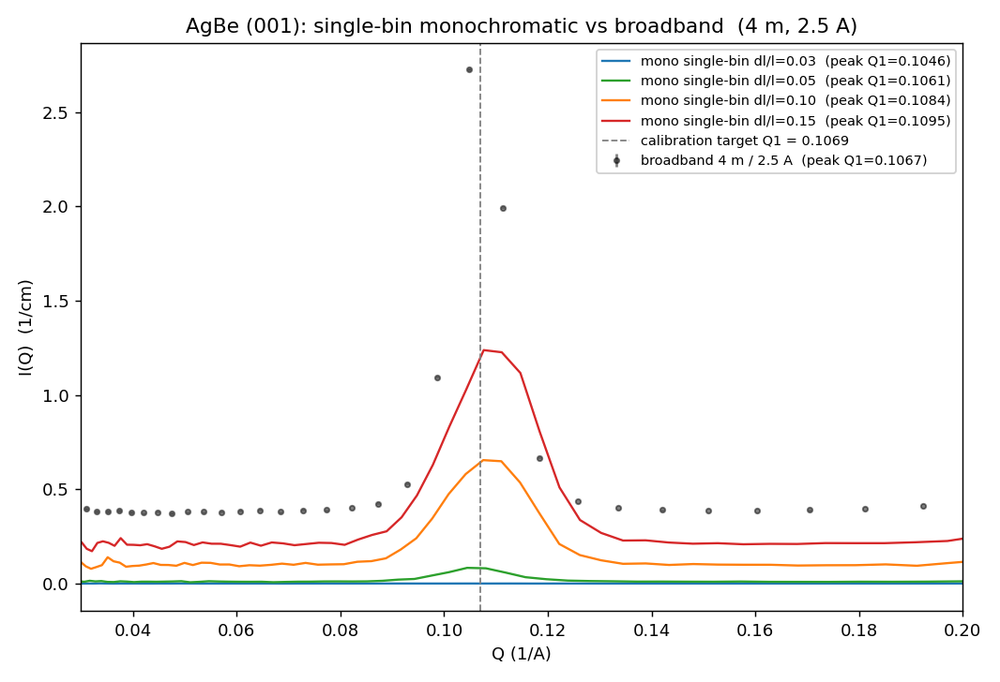
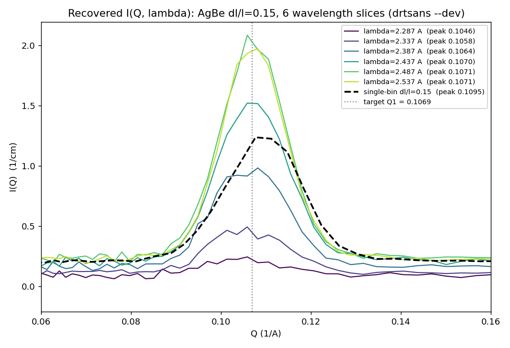

# Monochromatic reduction IV — the single-bin override, and how I(Q, λ) is recovered

**Date:** 2026-08-21 · **drtsans:** `--dev` build `1.34.0.dev20260819132424`
(Mantid 6.15) · **scripts:** `2026B_mp/reduction/reduce_varyspread_nohack.py`,
`reduce_agbe_iqlambda_dev.py`, `analyze_iqlambda.py`

This page answers two questions the drtsans team raised about monochromatic
reduction on the current dev build:

1. **They said the dev build now "uses a single bin" when it sees monochromatic
   data, so our temporary transmission hack should no longer be needed. Is that
   true?**
   Half true, and the useful half is the opposite of the hope: the dev build
   *does* force a single wavelength bin on its own — and that is exactly *why*
   the transmission hack is still required. Removing the hack makes the
   reduction **fail** for every sample that needs a measured transmission.
2. **How was I(Q, λ) obtained for monochromatic data at all, if it collapses to a
   single wavelength bin?** By explicitly switching that single-bin override off
   for the wavelength-binning step, so the narrow band is kept resolved into
   several fine wavelength slices — each slice is one I(Q), and the stack of them
   is I(Q, λ).

---

## 1. The dev build really does single-bin monochromatic data

The gate is `is_monochromatic()` in
`drtsans/tof/eqsans/correct_frame.py`. It reads a **sample-log process variable**;
when the run is flagged monochromatic, drtsans overrides the wavelength bin width
to the *entire transmitted band* — one bin — and logs it:

```
Python-[Notice] Monochromatic mode detected: overriding bin_width to
                0.2149038570198729 (single bin spanning [2.324…, 2.539…])
```

This fires **no matter what `wavelengthStep` you request** (we asked for 0.1 Å;
it still made one 0.215 Å bin). It also overrides the TOF clippings. So the drtsans
team is correct: monochromatic data is single-binned automatically. This is not
new to this test — the canonical 2026-08-18 re-reduction log shows the same
message 60 times; the single-bin behaviour was already active then.

## 2. …which is precisely why the transmission hack is still needed

A single wavelength bin means the **transmission workspace has one wavelength
point**. drtsans's default transmission model is a 2-parameter straight line
(`Formula = a*x + b`, a Mantid `LinearBackground`). One data point cannot
constrain two parameters, so the fit dies:

```
Fit-[Error] Levenberg-Marquardt minimizer failed to initialize.
Fit-[Error] 1 data points, 2 fitting parameters.
```

**The experiment** (`reduce_varyspread_nohack.py`, new output folder
`reduced_varyspread_nohack/`) removed our one remaining patch — the
`fit_function=""` override that tells drtsans to use the raw per-wavelength
transmission instead of fitting it — and ran all 16 vary-spread configurations
on the stock dev build:

| result | configs | which |
|---|---|---|
| **FAILED** | **12 / 16** | every `porasil`, `agbe`, `PMMA` (measured transmission → single bin → 2-parameter fit on 1 point) |
| ok | 4 / 16 | only the `blockedbeam` runs, which use a **fixed** transmission value (0.9) and so never fit |

So on the dev build, **the `fit_function=""` transmission hack is still required**
for any monochromatic sample whose transmission is measured from a run. This is a
*separate* drtsans limitation from the chopper phase (which the dev build did fix —
see the **monoWL** tab and the 2026-08-18 re-reduction, 16/16 with the hack). It
is worth reporting upstream: when monochromatic mode forces a single wavelength
bin, the transmission fit should fall back to a single-value (unfitted)
transmission automatically instead of attempting `a*x+b`.

## 3. The single-bin peak drifts with spread; broadband does not

With the single bin, drtsans computes Q for **every** event from that one
bin-centre wavelength: `Q = 4π·sinθ / λ_bin-centre`. A neutron whose true
wavelength differs from the band centre is placed at a scaled Q, so the AgBe (001)
peak lands at a spread-dependent position. Gaussian fits of the canonical
single-bin reductions (`reduced_varyspread/`), against the **broadband** AgBe at
the *same* geometry (4 m, 2.5 Å, `reduced/agbe_4m_2.5A`) and the calibration
target **Q1 = 0.1069 Å⁻¹**:

| reduction | peak Q1 (Å⁻¹) | Δ vs target |
|---|---|---|
| broadband 4 m / 2.5 A | **0.1067** | −0.0002 |
| mono single-bin dl/l = 0.03 | 0.1046 | −0.0023 |
| mono single-bin dl/l = 0.05 | 0.1061 | −0.0008 |
| mono single-bin dl/l = 0.10 | 0.1084 | +0.0015 |
| mono single-bin dl/l = 0.15 | 0.1095 | +0.0026 |

The broadband peak sits on the target; the single-bin peak sweeps across it as the
spread widens (−2 % to +2.5 %). That is the single-bin artefact, not a calibration
error — the broadband reduction of the very same detector/timing calibration hits
the target.



## 4. How I(Q, λ) is recovered on the dev build

**The mechanism.** To keep the band wavelength-*resolved*, the single-bin override
has to be switched off for the binning step. `reduce_agbe_iqlambda_dev.py` does
exactly one extra thing beyond a normal reduction: it patches
`correct_frame.is_monochromatic` to return `False`, so drtsans treats the narrow
band as ordinary polychromatic data and **honours a fine `wavelengthStep` (0.05 Å)**.
The band then falls into several 0.05 Å bins, and with
`outputWavelengthDependentProfile = True` drtsans writes one I(Q) per wavelength
slice:

```
reduced_iqlambda/agbe_dl0.15/info/inelastic_incoh/agbe_dl0.15/slice_0/frame_0/
    IQ_2.287_before_b_correction.dat
    IQ_2.337_before_b_correction.dat
    …
    IQ_2.537_before_b_correction.dat        (6 slices for dl/l = 0.15)
```

That stack **is** I(Q, λ). The transmission hack (`fit_function=""`) is kept — a
monochromatic transmission run is intrinsically narrow-band, and per-wavelength
transmission is what we want here anyway.

This is the same idea used in the earlier **monoWL2** peak-position study, which
ran on the **stable 1.33** build. That build had *no* single-bin auto-override, so
a fine `wavelengthStep` alone was enough. On the dev build the override now has to
be turned off explicitly — otherwise it collapses the band before the fine step
can take effect. Nothing about the chopper config reassigns individual event
wavelengths; only the binning changes.

**The result.** Each wavelength slice computes Q from *its own* bin centre, so each
sits where it should. The well-populated slices near and above the band centre land
right on the target; the single collapsed bin (dashed) is their intensity-weighted
blend, pushed off to 0.1095:

| dl/l = 0.15 slice | λ (Å) | peak Q1 (Å⁻¹) |
|---|---|---|
| 1 | 2.287 | 0.1046 |
| 2 | 2.337 | 0.1058 |
| 3 | 2.387 | 0.1064 |
| 4 | 2.437 | 0.1070 |
| 5 | 2.487 | **0.1071** |
| 6 | 2.537 | **0.1071** |
| single bin (all events, one λ) | 2.29–2.54 | 0.1095 |
| **calibration target** | — | **0.1069** |



---

## Final verdict

- **The dev build single-bins monochromatic data by design** (`is_monochromatic`
  → one bin spanning the whole band). The drtsans team's description is accurate.
- **The transmission hack is still required**, *because* of that single bin:
  stock drtsans tries a 2-parameter transmission fit on the resulting single
  wavelength point and fails. No-hack run = **4 / 16** (only fixed-transmission
  blockedbeam survived); the canonical hacked run = 16 / 16. → upstream ask:
  auto-fall-back to single-value transmission in monochromatic mode.
- **I(Q, λ) is obtained by switching the single-bin override off for binning**
  (patch `is_monochromatic` → False) plus a fine `wavelengthStep` and
  `outputWavelengthDependentProfile`. Each wavelength slice then peaks at its own
  correct Q; the well-populated slices hit the AgBe target 0.1069, confirming the
  monoWL2 conclusion that the single-bin peak drift is a binning artefact, not a
  calibration error.

**Provenance.** All numbers and figures on this page were produced 2026-08-21 with
drtsans `--dev` `1.34.0.dev20260819132424`:
`reduce_varyspread_nohack.py` → `reduced_varyspread_nohack/` (no-hack test),
`reduce_agbe_iqlambda_dev.py` → `reduced_iqlambda/` (I(Q, λ) recovery),
`analyze_iqlambda.py` → the two figures + `monowl4_peaks.json` (peak fits).
