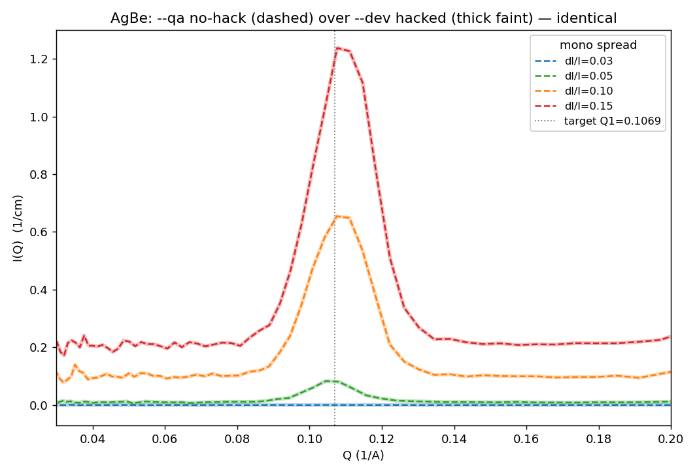

# Monochromatic reduction V — the transmission fix lands in `drtsans --qa`

**Date:** 2026-08-27 · **drtsans:** `--qa` release candidate **`1.34.0rc1`**
(updated 2026-08-26, Mantid 6.15) · **script:**
`2026B_mp/reduction/reduce_varyspread_qa.py` → `reduced_varyspread_qa/`

The **monoWL4** test concluded that on the dev build the monochromatic reduction
still needed our `fit_function=""` transmission hack: the dev build single-bins
monochromatic data, and stock drtsans then tried a 2-parameter transmission fit on
a single wavelength point and died (`1 data points, 2 fitting parameters`). The
drtsans team has now shipped the fix in the release candidate. **This page
re-runs the monochromatic series on `--qa` with no hacks at all and confirms it.**

---

## The fix (in the release candidate)

The `--qa` build carries a new `drtsans/tof/eqsans/transmission.py`. When the
transmission workspace has a **single valid wavelength point** — exactly the
monochromatic single-bin case — it preserves that raw transmission value instead
of fitting an underdetermined model, and says so:

```
Python-[Notice] Skipping transmission fit for single-point wavelength band
                [2.4118…, 2.4519…]
```

That is precisely what our `fit_function=""` monkeypatch did by hand, now built
into drtsans. So the hack is **obsolete on `--qa`**.

## The test — stock drtsans, zero monkeypatches

`reduce_varyspread_qa.py` is the clean successor to the earlier vary-spread
scripts. It carries **no chopper-config injection** (fixed earlier by the dev
chopper-phase update) and **no transmission override** (fixed now by the rc
single-point fallback) — it is stock `drtsans --qa`, run in-process the same way
as before:

```
drtsans --qa --classic reduce_varyspread_qa.py
```

**Result — 16 / 16 reduced ok, 0 failed.** Every `porasil`, `agbe`, `PMMA` and
`blockedbeam` at all four spreads reduced without help. Contrast the identical
run on the dev build with the hack removed (**monoWL4**), which managed only
4 / 16 (the fixed-transmission `blockedbeam` configs).

| build | transmission handling | vary-spread result |
|---|---|---|
| `--dev` `1.34.0.dev20260819` + `fit_function=""` hack | our monkeypatch | 16 / 16 |
| `--dev` `1.34.0.dev20260819`, **no** hack | stock 2-param fit → fails on 1 point | **4 / 16** |
| **`--qa` `1.34.0rc1`, no hack** | **built-in single-point fallback** | **16 / 16** |

## The no-hack `--qa` output equals the hacked `--dev` output

If the release-candidate fallback truly reproduces the hack, the two reductions
must give the same I(Q). They do — **exactly**. Across all 16 matched
configurations the largest per-point difference is **0.000 %**, and the AgBe (001)
peak positions are identical to the last digit:

| dl/l | AgBe peak Q1 — `--qa` no hack | AgBe peak Q1 — `--dev` + hack |
|---|---|---|
| 0.03 | 0.1046 | 0.1046 |
| 0.05 | 0.1061 | 0.1061 |
| 0.10 | 0.1084 | 0.1084 |
| 0.15 | 0.1095 | 0.1095 |

The dashed `--qa` curves lie exactly on top of the thick faint `--dev` curves:



## What this does and does not change

- **Does:** removes the last monochromatic monkeypatch. Once `1.34.0rc1` (or
  later) is the default `drtsans`, monochromatic samples reduce with the ordinary
  reduction path — no chopper injection, no transmission override. The canonical
  vary-spread deliverables can be regenerated from `reduce_varyspread_qa.py`.
- **Does not:** change the *physics* of a single-bin monochromatic reduction. The
  AgBe peak still **drifts with spread** (0.1046 → 0.1095 across dl/l = 0.03 →
  0.15) because a single wavelength bin assigns one λ to every event
  (`Q = 4π·sinθ / λ_bin-centre`). That is the binning artefact analysed on
  **monoWL2** / **monoWL4**, and it is unrelated to the transmission fix. For a
  spread-independent peak on the calibration target (0.1069), reduce
  **wavelength-resolved** — the I(Q, λ) recovery shown on **monoWL4**.

## Bottom line

The drtsans team's report is confirmed: **`drtsans --qa` (`1.34.0rc1`) handles
monochromatic transmission on its own**, via a single-point-band fallback in
`transmission.py`. The vary-spread series reduces **16 / 16 with no hacks**, and
the result is bit-for-bit identical to the previously hacked reduction. The
`fit_function=""` workaround can be retired once this build is promoted to the
default environment.

**Provenance.** 2026-08-27, `drtsans --qa` `1.34.0rc1`:
`reduce_varyspread_qa.py` → `reduced_varyspread_qa/` (16/16, no hacks);
`analyze_qa_vs_dev.py` → this figure + `monowl5_compare.json` (the 0.000 %
agreement and the peak table).
