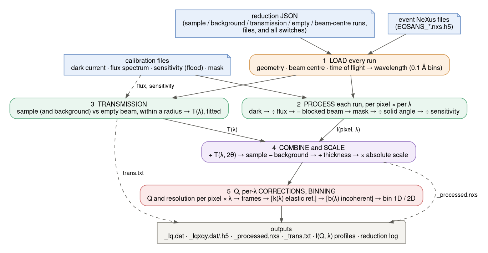
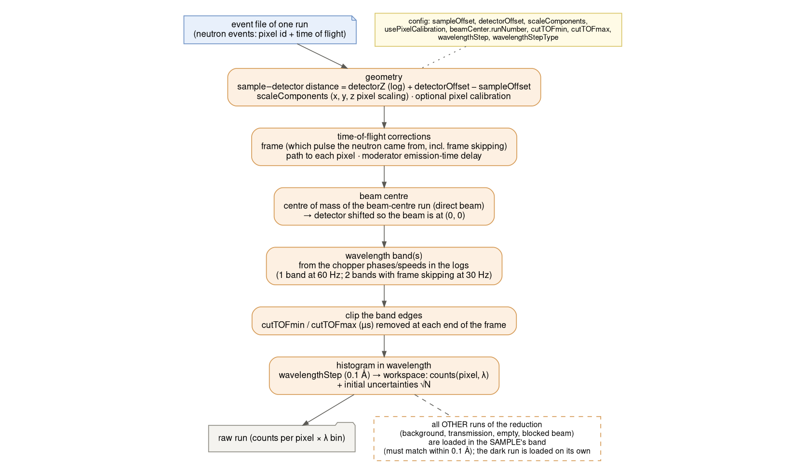
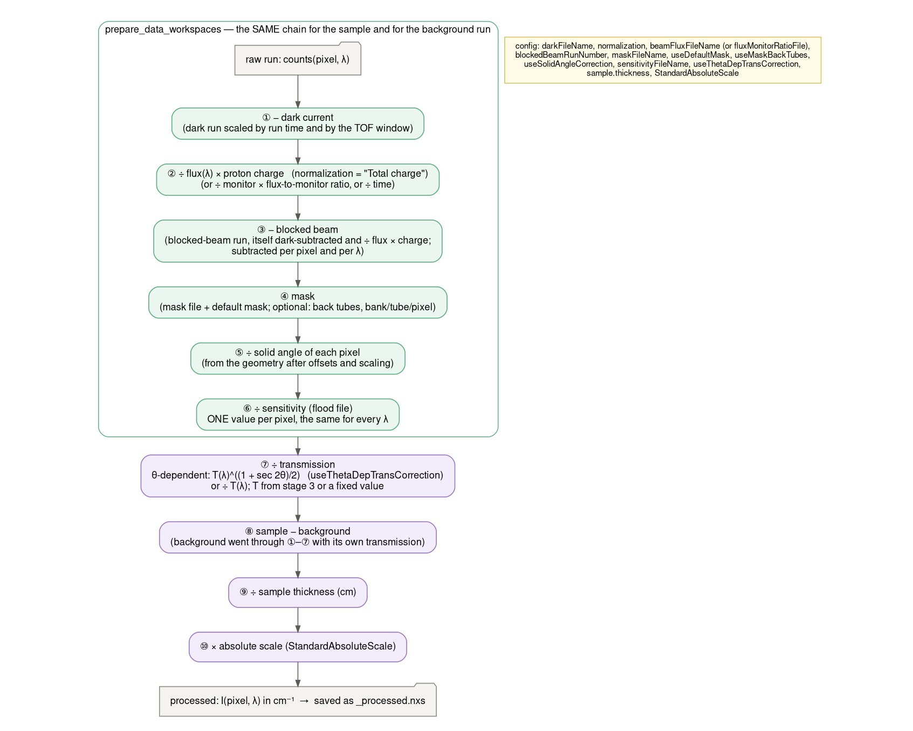
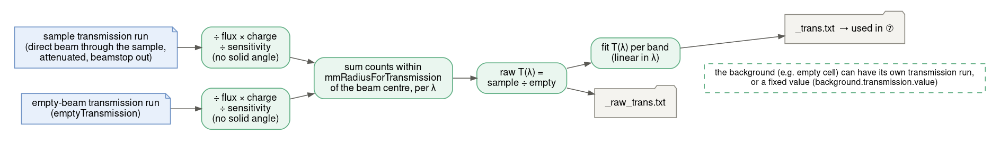
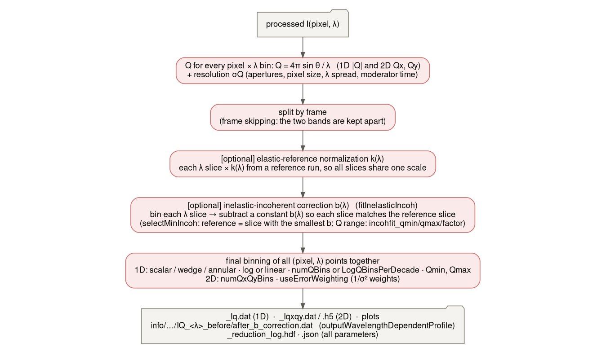
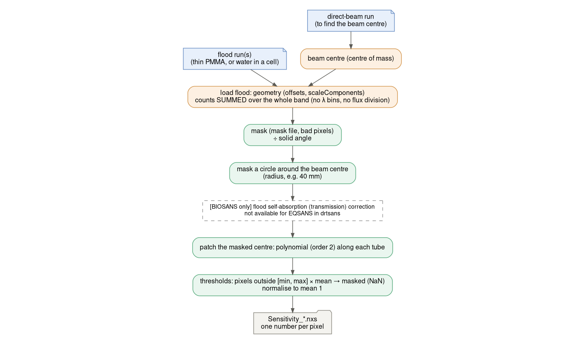

# Reduction flow — how drtsans reduces EQSANS data

**drtsans:** stable `1.34.0` (EQSANS: `drtsans/tof/eqsans/`: `api.py`, `reduction_api.py`,
`load.py`, `correct_frame.py`, `normalization.py`, `transmission.py`, `momentum_transfer.py`,
`elastic_correction.py`, `inelastic_correction.py`; the flood: `prepare_sensivities_correction.py`)
· **written:** 2026-09-26 from the code, and checked against our own reductions (the JSON
examples are from the 2026-09-23 1.3 m block)

This page explains, step by step, what happens between the event files and the `_Iq.dat`: in
which order, with which files, and which JSON switch controls each step. The last section lists
what the Water / Blocked-beam studies found about particular steps.

**In one sentence.** Every run is loaded and turned into counts per **pixel × wavelength bin**.
Each is cleaned up the same way (dark current, flux, blocked beam, mask, solid angle,
sensitivity). The sample is divided by its transmission and the background is subtracted, then
it is scaled to cm⁻¹. Finally every pixel × λ point gets its own Q, and they are binned into I(Q)
(with optional per-λ corrections).

---

## 0. What goes in

A reduction is described by one **JSON** file: the runs, the calibration files and all switches.
drtsans saves it next to the output as `<name>.json`. With the lab script
`eqsans_drtsans_script.py` (`EQVar` + `reduceNow`), every `eq._<key lower-case>` attribute
fills the JSON key of the same name, e.g. `eq._blockedbeamrunnumber` →
`configuration.blockedBeamRunNumber`.

| input | what it is | JSON key | example (H2O, 1.3 m, 2.5 Å) |
|---|---|---|---|
| sample scattering | the measurement | `sample.runNumber` | 188982 (S-H2O) |
| sample transmission | direct beam through the sample (attenuated, beamstop out) | `sample.transmission.runNumber` (or `.value`) | 188974 (T-H2O) |
| background scattering | e.g. empty cell / solvent | `background.runNumber` | 188978 (S-banjo) |
| background transmission | its transmission run, or a fixed value | `background.transmission.runNumber` / `.value` | value 1.0 |
| empty beam | reference for the transmissions | `emptyTransmission.runNumber` | 188970 (T-banjo) |
| beam centre | direct beam, to find the centre | `beamCenter.runNumber` | 188970 |
| dark current | long run with the beam off | `configuration.darkFileName` | EQSANS_186198 |
| blocked beam | beam on, blocked at the sample | `configuration.blockedBeamRunNumber` | 188984 (or none) |
| flux spectrum | beam flux vs λ at the sample | `configuration.beamFluxFileName` | bl6_flux_2026B_aug_rebinned.txt |
| sensitivity | the flood file (one number per pixel) | `configuration.sensitivityFileName` | Sensitivity_patched_thinPMMA_1o3m_186202.nxs |
| mask | pixels to ignore | `configuration.maskFileName` (+ `useDefaultMask`) | mask_4m.nxs |
| thickness | sample thickness (cm) | `sample.thickness` | 0.1 |

---

## 1. Load every run: geometry, beam centre, time of flight → wavelength

An event file is a list of neutrons: which pixel, and when (time of flight in the 60 Hz frame).
Loading turns that into a **2D table: counts(pixel, λ bin)**.

1. **Geometry.** The sample-to-detector distance is `detectorZ` (from the logs) +
   `detectorOffset` − `sampleOffset`. `scaleComponents` stretches the pixel positions (x, y, z);
   our AgBe calibration gives [1.004, 1.058, 1.0]. An optional per-pixel calibration exists
   (`usePixelCalibration`). **This geometry decides every pixel's scattering angle, solid angle
   and Q.**
2. **Time-of-flight corrections.** Which pulse the neutron came from (the frame, including
   frame skipping at 30 Hz), the path length to each pixel, and the moderator emission-time
   delay.
3. **Beam centre.** The centre of mass of the direct-beam run. The detector is shifted so the
   beam sits at (0, 0).
4. **Wavelength band.** Computed from the chopper phases and speeds in the logs: one band at
   60 Hz, two bands with frame skipping.
5. **Band-edge clipping.** `cutTOFmin` / `cutTOFmax` (µs) are removed at each end of the frame
   (default 500 / 2000).
6. **Histogram in λ.** Bins of `wavelengthStep` (0.1 Å); uncertainties start as √N.

All other runs (background, transmissions, empty beam, blocked beam) are loaded **in the
sample's band** and must agree with it within 0.1 Å. The dark current is loaded on its own:
its chopper settings are different, and it is rescaled later.

## 2–4. Process each run, transmission, combine and scale

Every scattering run (the sample **and** the background) goes through the **same chain**,
pixel by pixel and λ bin by λ bin. drtsans calls it `prepare_data_workspaces`.

| step | what it does | why | switch |
|---|---|---|---|
| ① − dark current | subtracts the beam-off counts, scaled to this run's time and TOF window | electronics / room background | `darkFileName` |
| ② ÷ flux × charge | divides every λ bin by the beam flux at that λ and by the proton charge | makes runs comparable, and gives the wavelength spectrum its proper weight | `normalization` = "Total charge", `beamFluxFileName` (or monitor, or time) |
| ③ − blocked beam | subtracts the blocked-beam run, itself dark-subtracted and ÷ flux × charge, **per pixel and per λ** | beam-related background that does not come through the sample position | `blockedBeamRunNumber` |
| ④ mask | removes masked pixels | beamstop, bad pixels, tube ends; optional: back tubes | `maskFileName`, `useDefaultMask`, `useMaskBackTubes` |
| ⑤ ÷ solid angle | each pixel ÷ the solid angle it covers (from the geometry of step 1) | pixels further out or tilted cover less solid angle | `useSolidAngleCorrection` |
| ⑥ ÷ sensitivity | each pixel ÷ its flood value: **one number per pixel, the same for every λ** | pixel-to-pixel efficiency | `sensitivityFileName` |

Then:

| step | what it does | switch |
|---|---|---|
| ⑦ ÷ transmission | ÷ T(λ) from stage 3 (or a fixed value). With `useThetaDepTransCorrection`, ÷ T(λ)^((1 + sec 2θ)/2), which accounts for the longer path out of the sample at larger angle | `useThetaDepTransCorrection` |
| ⑧ sample − background | the background went through ①–⑦ with **its own** transmission | `background.*` |
| ⑨ ÷ thickness | per cm of sample | `sample.thickness` |
| ⑩ × absolute scale | a factor, e.g. from a standard | `StandardAbsoluteScale` (`absoluteScaleMethod` = standard) |

The result is **I(pixel, λ) in cm⁻¹**, saved as `<name>_processed.nxs`. It is the last place
where each pixel and λ bin are still separate; the Water studies used it for per-pixel,
per-wavelength checks.

### 3. Transmission

1. **Prepare** the sample transmission run and the empty-beam run: ÷ flux × charge and ÷
   sensitivity, **without** the solid-angle correction.
2. **Sum** the counts within `mmRadiusForTransmission` (25 mm) of the beam centre, per λ.
3. **Divide:** raw T(λ) = sample ÷ empty, saved as `_raw_trans.txt`.
4. **Fit** T(λ) per band, linear in λ. The fitted values (`_trans.txt`) are used in step ⑦.

The background can have its own transmission run, or a fixed value
(`background.transmission.value`). For samples in the banjo we use the empty banjo as the
"empty" (T-banjo) and background T = 1, i.e. the transmission is relative to the cell.

## 5. Q, per-λ corrections, binning, outputs

1. **Q for every point.** Every pixel × λ bin gets **Q = 4π sin θ / λ** (and Qx, Qy for 2D), plus
   a resolution σQ (apertures `sourceApertureDiameter` / `sampleApertureSize`, pixel size, λ
   spread, moderator time). The same pixel appears at **many Q**, one per λ bin.
2. **Frames.** With frame skipping, the two bands are kept apart.
3. **[optional] elastic-reference normalization k(λ).** Each λ slice is multiplied by a factor
   from a reference run, so that all slices share one scale (`elasticReference`).
4. **[optional] inelastic-incoherent correction b(λ)** (`fitInelasticIncoh`). Each λ slice is
   binned in Q, and a constant b(λ) is subtracted so that it matches a **reference slice**.
   - With `selectMinIncoh` the reference is the slice with the smallest b.
   - The Q range used is set by `incohfit_qmin` / `incohfit_qmax` / `incohfit_factor`.
   - With `outputWavelengthDependentProfile`, each slice before and after is written to
     `info/inelastic_incoh/…/IQ_<λ>_before/after_b_correction.dat`. **These I(Q, λ) slices are
     the best diagnostic of a reduction:** for a flat sample every slice should be flat and they
     should agree.
5. **Final binning.** All (pixel, λ) points are binned together.
   - **1D:** `1DQbinType` scalar / wedge / annular; `QbinType` log or linear; `numQBins` or
     `LogQBinsPerDecade`; `Qmin`, `Qmax`.
   - **2D:** `numQxQyBins`.
   - **Weights:** `useErrorWeighting` weights each point by 1/σ².

   The combined I(Q) at a given Q is a weighted average over the λ slices that reach that Q.
   At the highest Q only the shortest λ contribute, so anything that differs between slices
   shows up there.
6. **Outputs:**
   - `_Iq.dat` (Q, I, σI, σQ);
   - `_Iqxqy.dat` / `.h5` (2D);
   - plots;
   - `_processed.nxs`;
   - `_trans.txt`, `_raw_trans.txt`;
   - `_reduction_log.hdf`;
   - the JSON with every parameter used.

---

## The sensitivity (flood) file is made separately

The flood file is made **before** the reductions, with drtsans's `PrepareSensitivityCorrection`
(our script: `tools/sensitivity/prepare_sensitivity.py`). Steps:
1. **Find the beam centre** from a direct-beam run.
2. **Load the flood**, summing the counts over the **whole band**: no λ bins, no flux division.
3. **Mask** (mask file, bad pixels) and ÷ solid angle.
4. **Mask a circle around the beam centre** and **patch** it with a polynomial along each tube.
5. **Threshold, then normalise** to a mean of 1.

The result is **one number per pixel**. drtsans has no background (e.g. cell) or blocked-beam
subtraction for the flood. For EQSANS it also has no flood self-absorption correction (only
BIOSANS). Our `prepare_sensitivity.py` adds the reduction geometry and the self-absorption
correction (Water 1–2).

---

## What our studies found about particular steps

| step | finding | page |
|---|---|---|
| geometry (1) + solid angle (⑤) + sensitivity (⑥) | The flood must be built with the **same geometry** as the reduction (offsets, `scaleComponents`). Otherwise the solid angle divided out of the flood and out of the sample do not cancel: +5 % at 20°, +11 % at 30° at 1.3 m. | Water (high-Q) |
| transmission (⑦) and the flood | The θ-dependent correction is applied to every sample but **not to the flood** (EQSANS). The flood's own self-absorption comes back as a rise at high angle. | Water 2 |
| blocked beam (③) | It is in-band beam background (~12 % of the empty banjo at 1.3 m), top-heavy, and depends on λ like the beam. Subtract it in the flood **and** the data, measured in the **same band** (it is subtracted per λ bin). | Water 3 §9, Blocked beam |
| flood sample (⑥) | Thin PMMA has structure near 1 Å⁻¹. A water flood needs the quartz cell (and the blocked beam) subtracted. | Water 3 |
| band edges (1: `cutTOFmin/max`) + b(λ) (5) | The first and last λ bins are bad. The b(λ) fit with `selectMinIncoh` then uses such a slice as its reference, which amplifies every slice's shape (up to 3×). At 1.3 m use 1650 / 3150 µs. | Water 4 |
| θ-dependent transmission (⑦) | It uses the incident-λ transmission for the path out of the sample. For water (inelastic) that is an approximation (not corrected: the outgoing energy isn't known). | Water 4 §5 |
| sensitivity (⑥) | **The pixel response depends on λ**: the front / back tube layers (3He shadowing) and the incidence angle (gas path length) are genuine wavelength effects. The **tube ends** (last ~20–25 px) depend on the **instantaneous count rate** (pile-up), which varies over the TOF frame. One number per pixel cannot follow either. Mask ~24 px at each end, or apply a rate-dependent tube-end correction. | Water 5, 6, 7 |
| binning (5) | Judge a reduction by its **single I(Q, λ) slices**. The combined I(Q)'s shape also carries the per-λ step (b or k) of the averaging. | Water 4–6 |

**Glossary.**
- **S / T runs:** scattering (beamstop in) / transmission (beamstop out, attenuated) runs.
- **Band:** the wavelength range the choppers let through (e.g. "1 Å band" ≈ 1.1–4.6 Å,
  "2.5 Å band" ≈ 2.6–6.1 Å at 1.3 m).
- **Frame skipping:** at 30 Hz two bands per frame, reduced separately.
- **Flood / sensitivity:** relative efficiency of each pixel.
- **Blocked beam:** a run with the beam blocked at the sample position.
- **b(λ), k(λ):** additive / multiplicative per-wavelength corrections applied before combining
  the slices.

**Provenance.** Diagrams: `doc/reductionflow_assets/make_diagrams.py` (Graphviz). The step order
was read from the drtsans 1.34.0 source (`prepare_data_workspaces`,
`pre_process_single_configuration`, `load_events_and_histogram` / `transform_to_wavelength`,
`calculate_transmission`, `bin_i_with_correction`, `PrepareSensitivityCorrection.execute`). The
JSON keys and the example values are from our reduction of H2O 188982.
