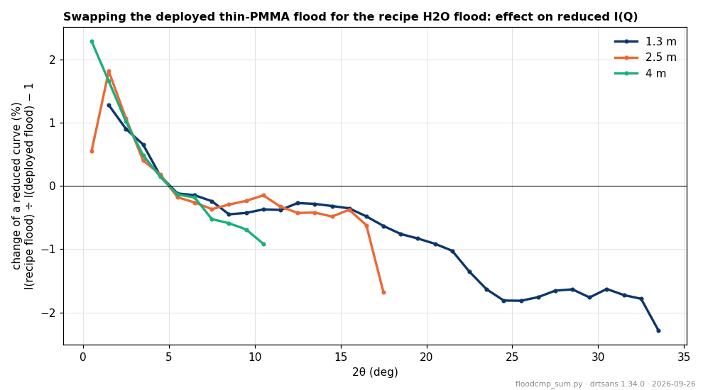
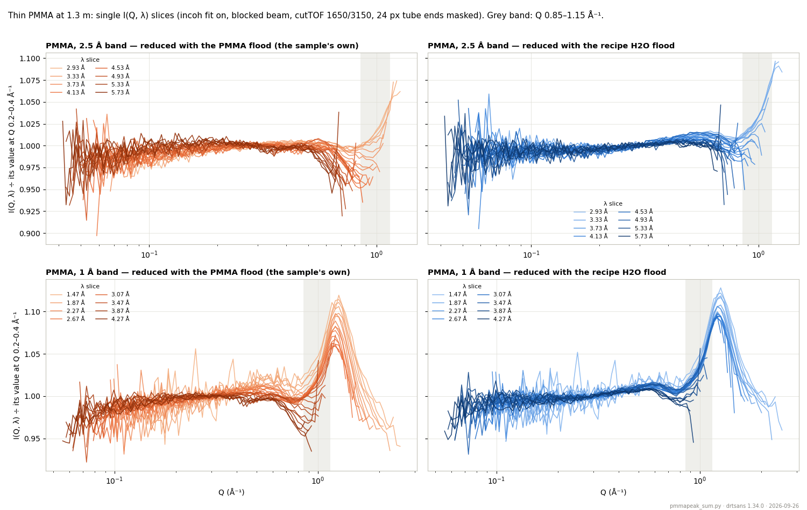
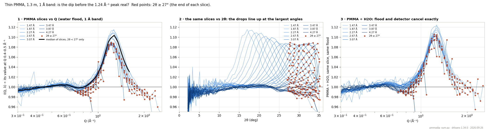
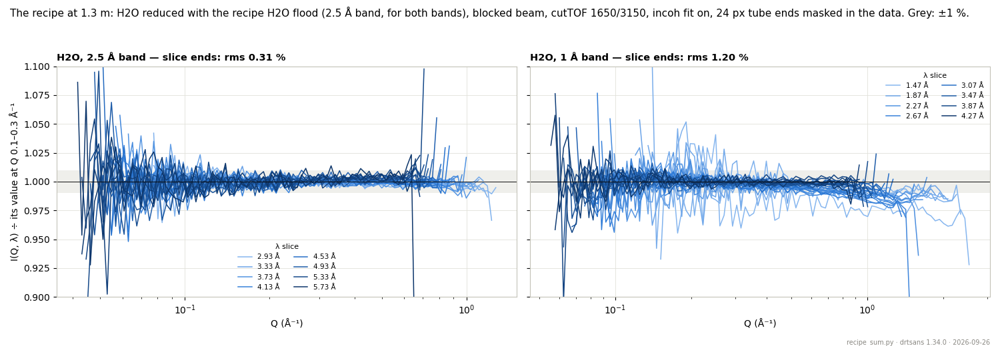

# Sensitivity summary — what we found, what is deployed, what to do next

**Date:** 2026-09-26 · **drtsans:** stable `1.34.0` · **data:** 2026B (IPTS-37618): thin-PMMA floods of
Aug 2026 and the 2026-09-23 block (H2O / D2O / PMMA / banjo / blocked beam, 1.3 / 2.5 / 4 m) ·
**scripts:** `prepare_sensitivity.py` (tools master = `2026B_mp/` copy),
`2026B_mp/reduction/water3/summary/` (`floodcmp_sum.py`, `pmmapeak_sum.py`, `recipe_sum.py`,
`pmmadip_sum.py`, `run_tail_sum.sh`), `reduce_w3.py` (flood sets `recipe` / `pmma`, `--winbkg`)

This page closes the flood study (Water 1–7, Blocked beam, Reduction flow). It says what we found
in plain terms, which sensitivity files are in use now, and how future floods should be made.

---

## 1. In one paragraph

A flood (sensitivity file) should hold **only the pixel-to-pixel differences** of the detector.
Everything else the flood run contains has to be removed the same way the reduction removes it
from a sample, or it ends up in every reduced curve. That includes the solid angle, the flood
sample's own absorption, the blocked-beam background, the sample cell and the sample's own
structure. We found five such leaks and fixed them all in `prepare_sensitivity.py`. What is left
is a **tube-end effect** that depends on count rate. We do **not** model it; users mask it. Water
works better as a flood sample than thin PMMA, because PMMA has its own peak at Q ≈ 1.2 Å⁻¹
(shown in §5).

---

## 2. What we found — the short list

| # | finding | size (1.3 m unless noted) | what we do about it | page |
|---|---|---|---|---|
| 1 | Flood built with a **different geometry** from the reduction: the computed solid angle does not cancel | +4.9 % at 2θ = 20°, +11 % at 30° | build the flood with the reduction's AgBe geometry | Water (high-Q) |
| 2 | The flood sample's **own absorption** is not corrected by drtsans (the samples' is) | +1.5 % at 20°, +3.6 % at 30° (PMMA, T 0.63) | same θ-dependent correction as the samples | Water 2 |
| 3 | **Thin PMMA has structure** (a peak near 1.2 Å⁻¹); a water flood in a cell also contains the **cell** | PMMA peak +10 % | water flood, empty cell subtracted | Water 3, §5 here |
| 4 | **Blocked beam** = real in-band neutrons, top-heavy, λ-dependent. At the same λ it is the same in the 1 Å and 2.5 Å bands | ≈ 12 % of the empty banjo (13–22 % in the top rows) | subtract it in the flood **and** in the data, measured in the same band as the run it corrects (so the λ range is covered) | Water 3 §9, Blocked beam |
| 5 | **Band-edge wavelengths** are unreliable, and the b(λ) fit uses the edge slice as its reference | edge slices off by several %, amplified up to 3.4× | TOF cuts 1650 / 3150 µs in the flood and the data | Water 4 |
| 6 | **Tube ends** (the last ~20 px at the bottom, ~25 at the top) respond differently. This follows the **instantaneous count rate** (likely pile-up in the charge-division readout), not λ itself | −1.1 % per 10 k counts/s per 8-pack; gone at low rate | small mask in the flood (15 px), **users mask 20–24 px** in their reduction mask; no model | Water 5–7 |
| 7 | **Front/back tube layers** differ with λ: real ³He shadowing of the back tubes | ±1.5–2 % between 1 Å and 2.5 Å floods | nothing: it cancels in azimuthal I(Q) | Water 7, §6 here |
| 8 | Exit path uses the incident λ (inelastic scattering changes it) | small, not quantifiable | not corrected (would be guesswork) | Water 4 |

**What is left after all fixes:** water reduced with a water flood made by the recipe gives
single I(Q, λ) slices that are **flat to about 0.3 %** at their high-angle ends (§6). That was
the goal of the study.

**What we decided not to do:** model the flood's λ- or rate-dependence (Water 6–7). The
tube-end term depends on the count rate of *each* measurement, so a model fitted to the flood
does not carry over to samples with a different rate. It would need assumptions we cannot check.
The basic recipe plus a tube-end mask does the job.

---

## 3. What is deployed now (2026B)

The files users get from `2026B_mp/` today:

| distance | file | built | flood sample |
|---|---|---|---|
| 4 m | `Sensitivity_patched_thinPMMA_4m_186200.nxs` | 2026-09-24 16:13 | thin PMMA sheet (bare), Aug 2026, 2.5 Å band |
| 2.5 m | `Sensitivity_patched_thinPMMA_2o5m_186201.nxs` | 2026-09-24 16:10 | same |
| 1.3 m | `Sensitivity_patched_thinPMMA_1o3m_186202.nxs` | 2026-09-24 16:12 | same |

What went into them, against the recipe:

| step | deployed (2026-09-24) | recipe |
|---|---|---|
| reduction geometry (AgBe) + solid angle | **yes** | yes |
| flood self-absorption (θ-dependent) | no | yes |
| blocked beam subtracted | no (none measured with the Aug floods) | yes, same band |
| cell / background subtracted | n/a (bare sheet) | yes (empty banjo) |
| TOF cuts | drtsans default 500 / 2000 µs | 1650 / 3150 µs |
| tube-end mask in the flood | 11 px (`1-11,246-256`) | 15 px (`1-15,242-256`) |
| flood sample | thin PMMA (has a 1.2 Å⁻¹ peak) | H2O 1 mm in banjo |

Other files in `2026B_mp/`, **none of them in use**:
- `*.OLD_nominal_geometry.nxs`: the original August builds, before the geometry fix.
- `Sensitivity_H2Obs_*`: water floods with the banjo subtracted, hand-built (Water 3).
- `sensitivity_selfabs/`: PMMA floods with the self-absorption fix, for review.
- `sensitivity_recipe/`: this page's floods, built by the new `prepare_sensitivity.py` from the
  Sept-23 runs (§4).

**The deployed files have not been swapped.** Swapping is a separate decision. Fig. 1 shows what
it would change.



*Fig. 1 — Swapping the deployed PMMA flood for the recipe water flood. This is the ratio of the
two floods averaged in 2θ rings (tube ends masked 24 px), normalised just outside the beam stop.
At 1.3 m, reduced curves come down by ≈ 0.3–0.5 % at 15° and 1.6–1.8 % at 25–32°. At 2.5 m and 4 m
the change is below 0.7 %. That drop is mostly the flood self-absorption and blocked beam that
the deployed floods lack. Pixel by pixel the two floods also differ by ≈ 2.7 % rms, of which ≈ 1 %
is counting noise. The rest is the λ-dependent layer term (§6), the tube ends measured at
different rates (+3.3 % in rows 215–231, just inside the 24 px mask), and ≈ 1.7 % of pixel pattern that changed
between August and September. So **a flood should be measured in the same cycle as the data.***

---

## 4. The recipe for future floods — and `prepare_sensitivity.py` now does it

**Measure** (per detector distance, same band for all runs of one distance):

| run | what | why |
|---|---|---|
| `S-H2O_1mm <dist>` | the flood | water: flat, strong incoherent scattering, no structure below ~1 Å⁻¹ at long λ |
| `S-banjo <dist>` | empty cell | subtracted (quartz has its own structure) |
| `S-blockedbeam <dist>` | blocked beam, **same band** | subtracted (it also takes the dark current with it) |
| `T-H2O`, `T-banjo` | transmissions | water T vs the empty banjo, for the self-absorption |
| `T-empty` (or window) | direct beam | beam centre |

- **Band:** long λ. 2.5 Å is fine at 2.5 m and 4 m. At 1.3 m, **6 Å** is better: it keeps the
  flood's Q below ~0.55 Å⁻¹ and its count rate low (tube ends!). It has not been measured yet.
- **Counting:** the Sept-23 water runs were 12 min each. That gives 0.8 % counting noise per
  pixel at 1.3 m, 1.4 % at 2.5 m and 2.4 % at 4 m, all worse than the PMMA floods (0.4–1 %).
  Aim for ≲ 0.5 %: about ≥ 30 min at 1.3 m, ≥ 2 h at 2.5 m and ≥ 5 h at 4 m. Banjo and blocked
  beam need about half that.
- **Every cycle**, close in time to the user runs (see Fig. 1).

**Build:**

```
cd <cycle>_mp
drtsans --classic prepare_sensitivity.py --list          # check the runs
drtsans --classic prepare_sensitivity.py 1o3m_h2o        # one distance per call
```

What the script does, per pixel, summed over wavelength (each run proton-charge normalised, ÷ the
computed solid angle in the reduction geometry):

  **F = (S − BB) / T^((1 + sec 2θ)/2) − (E − BB)**

This is exactly how drtsans reduces a sample against its empty cell. T is one flux-weighted value
over the cut band (0.58 for 1 mm H2O vs the empty banjo). That is exact to < 0.1 % because the
flood is summed over λ. Other settings:
- TOF cuts 1650 / 3150 µs;
- 15 px masked at each tube end;
- threshold 0.1–3.0;
- the beam-stop area patched as before.

The sidecar `<flood>.geometry.json` records every one of these (runs subtracted, T, cuts, mask,
geometry, script, drtsans, date). Each `CONFIGS` entry names its `flood`, `direct`, `background`,
`blocked_beam` and `transmission`:
- `<dist>` labels are the deployed PMMA configurations;
- `<dist>_h2o` labels are the water recipe (2026B: the Sept-23 runs).

**Check that it is right:** the preparer-built 1.3 m water flood agrees with the hand-built one
from the reduction (`H2Obsbbcut`, Water 4–5):
- ring averages to **0.01 %** out to 35°;
- pixel by pixel to 0.24 % (the hand-built one used T(λ), the preparer one value).

**In the reduction** (user side), in addition to the new flood:
- blocked beam of the same band;
- `cutTOFmin/max` 1650 / 3150;
- mask 20–24 px at the tube ends if the high-angle end matters. It is the user's call: the flood
  keeps 15 px.

Judge a reduction by its **single I(Q, λ) slices**. The combined I(Q) also carries the λ
averaging with b(λ) / k(λ).

---

## 5. The PMMA test: does thin PMMA have its own peak near 1 Å⁻¹?

We reduced the Sept-23 thin PMMA in both 1.3 m bands. PMMA is a bare sheet, so the Peltier
window run is its background, and its T is taken against the window (≈ 0.70). Settings: blocked
beam, cuts 1650/3150, incoh fit on, 24 px tube ends masked in the data. Two floods:
- **left:** the PMMA flood itself (the sample's own pattern);
- **right:** the recipe water flood.



*Fig. 2 — Single I(Q, λ) slices of thin PMMA, each normalised at Q 0.2–0.4 Å⁻¹.*

**Yes, and the water flood shows it cleanly.**
- **Recipe water flood, 1 Å band (bottom right):** every slice that reaches it shows a peak at
  **Q = 1.24 ± 0.02 Å⁻¹**, height **+10.3 ± 1.0 %** (13 slices, λ 1.5–2.7 Å). Each slice sees
  the peak at a different angle (17° to 31°), yet the peak sits at the same Q. So it is PMMA's own
  structure (the amorphous polymer halo), not a detector effect. The slices agree with each other
  to 0.31 % at Q 0.5–0.7 Å⁻¹.
- **PMMA flood (bottom left):** the flood already contains this peak, summed over its λ spread,
  so it is smeared across angles. Dividing by it removes part of the peak at the wrong places:
  - the peak comes out weaker and uneven (+6.5 to +11 %);
  - the long-λ slices bend down before Q ≈ 1;
  - the slices agree 2–3× worse (0.82 % at Q 0.5–0.7, 1.5 % at 0.7–0.9, against 0.31 % and
    0.67 %).
- **2.5 Å band (top):** these slices only reach Q ≈ 1.1. With the water flood they turn up
  together toward the peak. With the PMMA flood they bend down, each at a different place.

This is why a PMMA flood left structure in high-Q data, and why **water is the better flood
sample**. It also explains the earlier observation that banjo-subtracted water works better than
PMMA (Water 3).

A note on the longest-λ slices in both floods: they drop by a few % in their last few points (2θ
beyond ~25°). This is a sample-vs-flood difference at the largest angles. The likely candidate is
the exit-path / inelastic effect we chose not to model. It does not move the peak.

### 5b. Is the dip just before the peak real? — No

In Fig. 2 (bottom right), several slices go down near Q ≈ 0.8–0.95 Å⁻¹ and then up into the peak. Two
tests on the 1 Å band (script `pmmadip_sum.py`):



*Fig. 2b — The PMMA slices of Fig. 2 (water flood, 1 Å band, 24 px tube ends masked). Red points: 2θ ≥ 27°,
the end of each slice. **1:** vs Q; black = median of the slices using only 2θ < 27°. **2:** the same
slices vs 2θ. **3:** PMMA ÷ H2O, slice by slice: same flood, same pixels, same λ, so the flood and the
detector cancel exactly.*

- **The dip belongs to the angle, not to Q.** Only the long-λ slices (3.5–4.3 Å) go down. They go down
  only in their last points, at 2θ ≈ 27–35° (panel 2: every slice bends down at the same large angles).
  At Q 0.8–0.9 Å⁻¹:
  - points at 2θ ≥ 27° average **−0.7 %** (down to −3 % in single slices);
  - points below 27° average **+0.5 %**, already climbing toward the peak.

  A real structure would sit at the same Q in every slice, and it doesn't.
- **It is not the flood or the detector either.** In PMMA ÷ H2O (panel 3) the flood and detector
  cancel, yet the red points still drop (−1.0 % at Q 0.7–0.8). So it is a difference between the
  PMMA sheet and water at the largest angles: the same slice-end drop noted in §5. We are not
  modelling it.
- **PMMA's real shape** (black line, low- and mid-angle points only) is flat to within ±0.4 % from
  Q 0.4 to 0.85 Å⁻¹. It has a faint +0.4 % bump at 0.6 and −0.2 % at 0.77, which is at the ~0.3 %
  limit of the method and so not resolvable. From 0.85 it rises smoothly into the peak: **+10 % at
  Q ≈ 1.24 Å⁻¹**.
- **Practical point:** in any slice, the last few points at 2θ ≳ 27° are the least reliable, for PMMA
  more than for water. The 24 px tube-end mask does not remove them, because they are the detector
  corners, not the tube ends.

---

## 6. What the recipe gives for water



*Fig. 3 — H2O (1 mm, banjo background) at 1.3 m, reduced with the recipe water flood (2.5 Å band)
for **both** bands. Settings: blocked beam, cuts 1650/3150, incoh fit on, 24 px tube ends masked
in the data. Metric: rms over the slices of the high-angle end (top 15 % of log Q) minus 1.*

- **2.5 Å band:** slices flat to **0.31 %**. This is the recipe working as intended; the flood is
  from the same run type.
- **1 Å band, with the 2.5 Å-band flood:** 1.20 %. The shortest-λ slices (1.5 Å) are lowest,
  about −2 % at Q ~ 1. The same data with an own-band (1 Å) water flood and the same 24 px mask give 0.75 % (Water 6).
  But that flood is water at 1 Å too, so it divides out water's own high-Q behaviour along with
  any detector effect. We have not separated the two, and we don't model it.

  Practical rule: use the long-λ water flood for all bands. Expect the 1 Å slices at the largest
  angles to be good to 1–2 %, not 0.3 %.
- Between the two water floods (2.5 Å vs 1 Å band, same day), the only real pixel-level
  difference is the **front/back layer** shift, +1.5 % / −2.1 %. It cancels in azimuthal I(Q).
  What remains is counting noise.
- D2O is not a flatness test: its coherent structure rises toward 2 Å⁻¹.

---

## 7. Open items

- **1.3 m flood in the 6 Å band:** measure it next cycle (with banjo and blocked beam in the same
  band), then compare with the 2.5 Å flood the same way.
- **Longer water floods** (§4) for 2.5 m and 4 m. The 4 m water flood of Sept-23 has 2.4 %
  counting noise per pixel.
- **Swap the 2026B deployed floods?** Not done; it needs a decision (Fig. 1 shows the effect).
  The recipe floods for 2026B are in `2026B_mp/sensitivity_recipe/`.
- **Front-layer vertical gradient** (Water 7): still unexplained, small.
- **Tube-end rate effect:** a detector / electronics question (pile-up in the charge division),
  not a flood question. Mask it.
