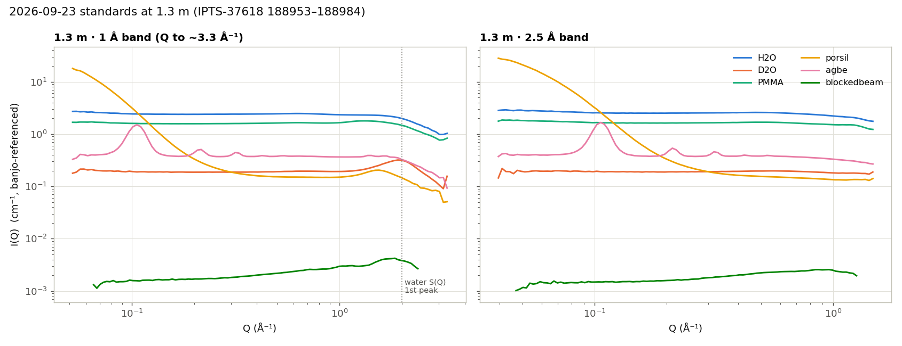
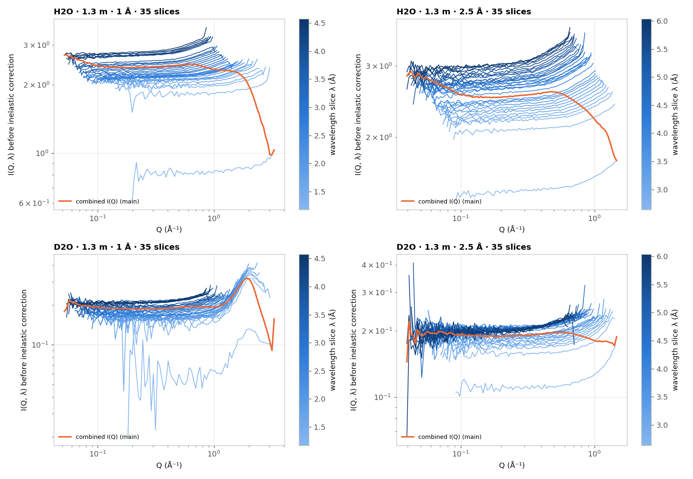
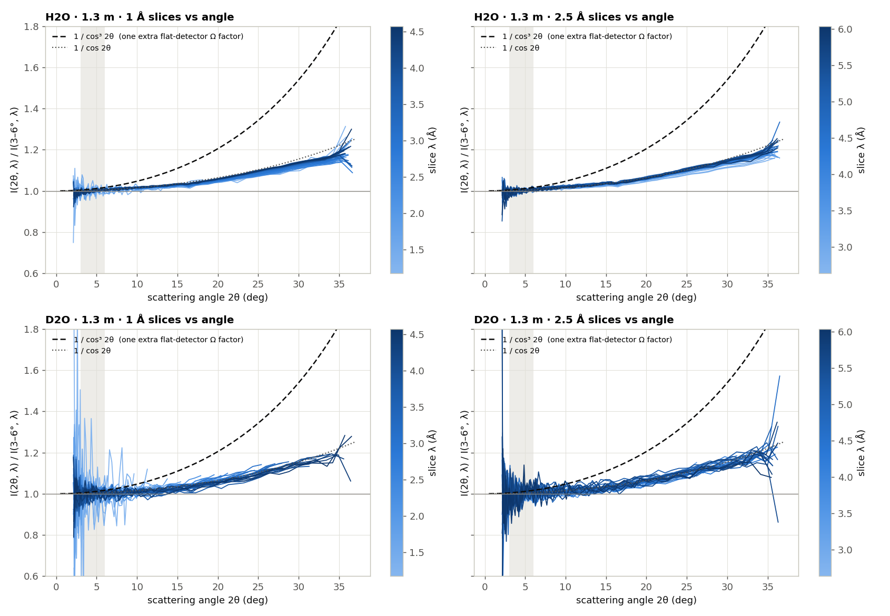
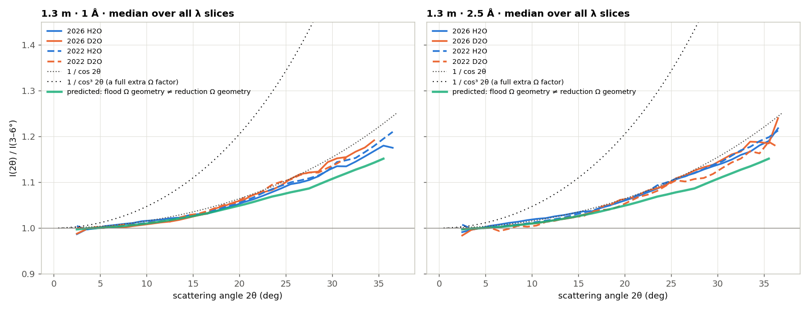
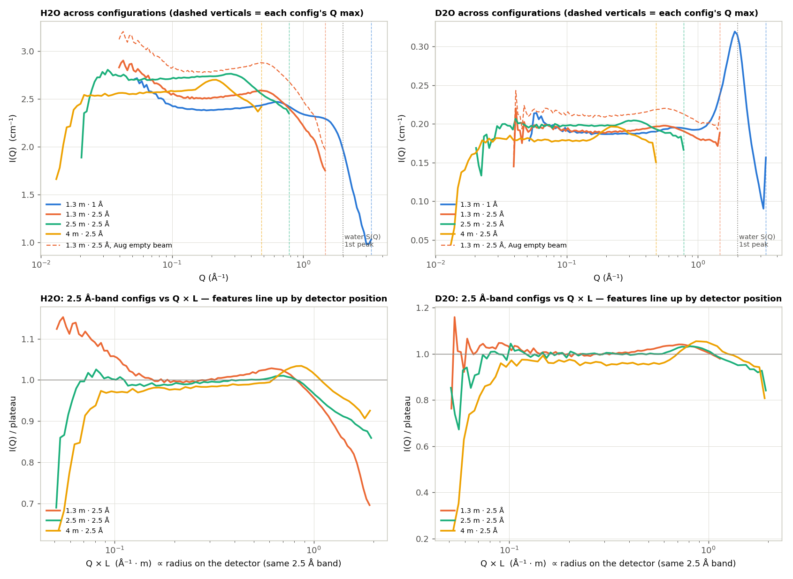
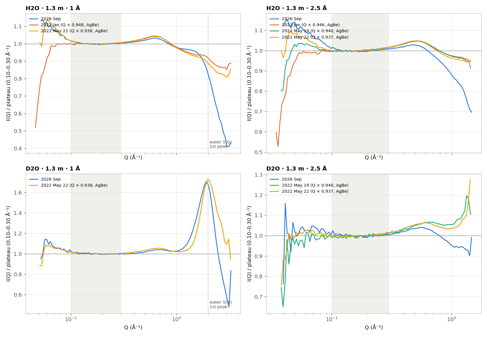
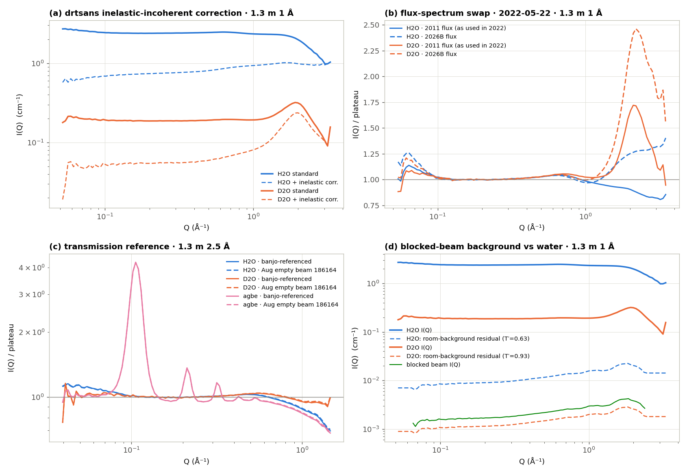
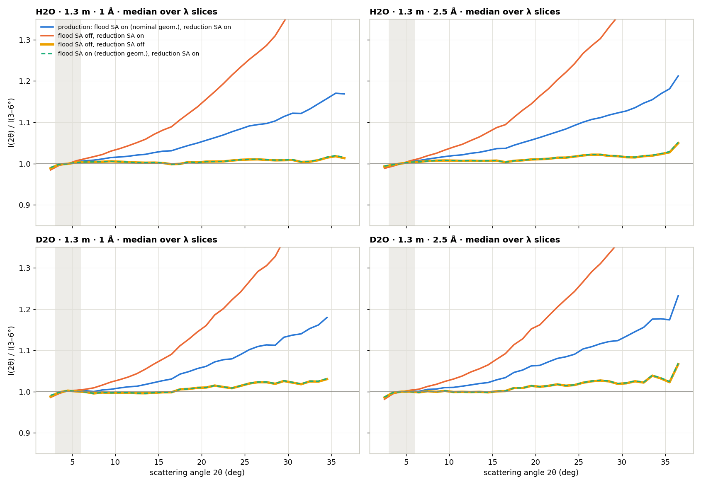
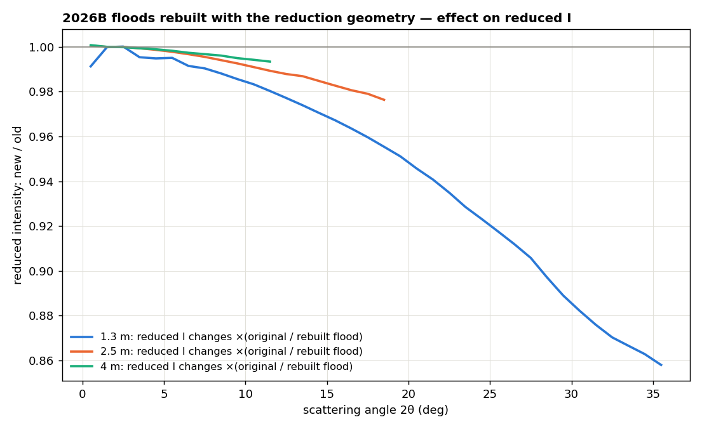

# Water (H2O / D2O) at 1.3 m — where the high-Q upturn comes from

**Date:** 2026-09-24 · **drtsans:** stable production `1.34.0` (no monkeypatches)
· **scripts:** `2026B_mp/reduction/reduce_water.py`,
`2022A_mp/reduction/reduce_water_2022.py`, `2026B_mp/reduction/analyze_water.py`,
`2026B_mp/reduction/flood_geometry_test/` (flood fix test), `2026B_mp/prepare_sensitivity.py`
(rebuilt floods, swapped into `2026B_mp/` on 2026-09-24)

**Short answer.** Flat-scattering water does show a high-Q upturn, but it is **not
water physics**. In every wavelength slice, the intensity rises with scattering
angle: +5–6 % at 20°, +13–15 % at 30°, ~+20 % in the detector corners. The rise is
the same for H2O and D2O, for the 1 Å and 2.5 Å bands, and for 2022 and 2026.
**drtsans does not apply the solid-angle correction twice** — an audit and an
on/off test show it is applied exactly once. What goes wrong is the **sensitivity
(flood) file**: it was built with the solid-angle correction computed for the
*nominal* geometry (pixels at z ≈ 1.29 m), while the reduction computes it for the
*calibrated* geometry (z ≈ 1.07 m, after the sample/detector offsets). The two do
not cancel. That predicts **+4.9 % at 20° and +11 % at 30°**. **Tested directly
(§7):** rebuilding the flood with the reduction geometry — or switching solid angle
off in *both* flood and reduction — flattens water to within **0.4–1.3 % at 20°**
and **0.8–2.5 % at 30°**. Switching it off in the flood alone makes the rise ~3×
worse. Every flood script since 2020B has this mismatch. **The 2026B floods have been rebuilt
with the reduction geometry and swapped into `2026B_mp/` (§8).** In the combined I(Q), two wavelength effects at the band edge partly
hide the rise, and can even turn it into a drop. The only genuine high-Q feature is
**liquid water's first structure-factor peak at Q ≈ 1.95–2.0 Å⁻¹**, which the 1 Å
band at 1.3 m reaches (strong in D2O).

---

## 1. Every water measurement in the calibration proposals

None of these water runs had ever been reduced in the machine-physics folders.
Water shows up there only as the *flood* for old sensitivity files (2013A, 2013B,
2014A, 2020A).

| IPTS | cycle | water runs | what | used here |
|---|---|---|---|---|
| **37618** | 2026B | **188953–189016** (2026-09-23) | broadband standards block: `H2O_1mm`, `D2O_1mm` + PeltierWindow, banjo, porsil, AgBe, PMMA, blocked beam at **1.3 m 1 Å**, **1.3 m 2.5 Å**, 2.5 m 2.5 Å, 4 m 2.5 Å (`MCON16 = 0`) | **all four configs reduced** |
| 37618 | 2026B | 187505–187584 (2026-08-29 → 31) | **monochromatic** (`MCON16 = 1`) H2O / D2O at **4 m only**: λ 0.5–10 Å, dλ/λ 5/10/15 %, room temp + 65 °C, transmission through attenuators (d25mm, d15mm, d5mm, d25Cd) | not reduced — no 1.3 m setting, and no empty-beam run was taken |
| 36254 | 2026A | — | no water (has a vanadium 2-hour series) | — |
| 34965 | 2025B | 160708, 160709 | `S-80sps_10k_5wt_d2o_100N_80C` — a user polymer in D2O (22 s, 777 s), not a water standard | excluded |
| 33626 | 2025A | — | no water | — |
| 31849 | 2023A | — | no water | — |
| 30047 | 2022B | — | no water (13 runs) | — |
| **28942** | 2022A | 72 runs, three campaigns | 2022-01-04 H2O only (4 m 2.5/10/12 Å, 2.5 m 2.5/1.5 Å, **1.3 m 2.5/1 Å**, 9 m 15 Å); 2022-05-19 H2O + D2O (4 m, 2.5 m, **1.3 m 2.5 Å**); 2022-05-20 → 22 H2O + D2O (4 m, 2.5 m, **1.3 m 2.5/1 Å**, 8 m, 9 m) | **the five 1.3 m sets reduced** |
| 27799 | 2021B | — | no water | — |

**No monochromatic 1.3 m water exists** — the only monochromatic water series is
at 4 m.

## 2. How it was reduced

- **Transmission is referenced to the empty banjo cell.** The 2026-09-23 block has
  no empty-beam run (neighbouring runs are other proposals), and the 1 Å band has
  no empty beam anywhere. So every set uses its own T-banjo as the "empty", with a
  banjo background at T = 1. This leaves curve **shapes** unchanged and lowers the
  absolute scale by the cell's transmission (~0.9). **Cross-check:** at 1.3 m 2.5 Å,
  the August empty beam 186164 has the same slits, chopper phases, detector Z and
  beamstop. Reducing against it gives an identical shape (diagnostics panel c).
- **2026:** 2026B dark (186198), flood (thinPMMA 1.3 m 186202), flux (2026B), mask
  and AgBe calibration (scalecomp [1.004124, 1.057996, 1], detoffset 66.714,
  samoffset 285).
- **2022:** the 2022 conventions and files — Jan/May dark (129142 / 134663) and
  1.3 m flood (129145 / 134666), 2022A 1.3 m beamstop mask, the 2011 default flux
  profile, sampleOffset 314.5, detectorOffset 0, no AgBe calibration. 2022 ran the
  **old 4-chopper system**; 2026 runs the 6-chopper system. Because 2022 geometry
  was uncalibrated, its Q-axis reads ~6 % high, so the 2022 curves below are
  rescaled by each set's own AgBe (001) peak to 0.1069 Å⁻¹ (Q × 0.937–0.948).
- Samples: H2O, D2O, AgBe and porsil in banjo cells (banjo background); PMMA and
  blocked beam without background. 2026: 32 reductions, 2022: 31 — all ok.

## 3. The 1.3 m data (2026-09-23)



H2O (~2.4–2.5 cm⁻¹) and D2O (~0.19 cm⁻¹) are flat from 0.1 to ~1 Å⁻¹. In the 1 Å
band, D2O rises into a strong peak at **Q = 1.95 Å⁻¹ (1.70× its plateau)**. That is
the first peak of liquid D2O's structure factor — real, and expected. H2O's
coherent peak is weak under its large incoherent level. The AgBe (001) peak sits at
0.1064 / 0.1059 Å⁻¹ (2.5 Å / 1 Å bands), within 1 % of 0.1069 — the 1.3 m Q-axis
is right.

## 4. The upturn is a function of **scattering angle**, not Q

Reducing with the per-wavelength profile output gives I(Q) for each 0.1 Å
wavelength slice (35 per band). Each slice rises toward its own high-Q end — which
is always the largest scattering angle.



Plot every slice against **2θ** instead, normalised to its own 3–6° level, and all
35 slices collapse onto **one curve** — a per-pixel factor, independent of
wavelength and Q:



| median over all slices | 2θ = 20° | 2θ = 30° |
|---|---|---|
| 2026 H2O · 1 Å / 2.5 Å | 1.053 / 1.060 | 1.130 / 1.138 |
| 2026 D2O · 1 Å / 2.5 Å | 1.059 / 1.063 | 1.148 / 1.144 |
| 2022 H2O · 1 Å / 2.5 Å | 1.056 / 1.061 | 1.135 / 1.142 |
| 2022 D2O · 1 Å / 2.5 Å | 1.060 / 1.053 | 1.136 / 1.125 |
| **predicted: flood solid-angle geometry ≠ reduction geometry (§6)** | **1.049** | **1.107** |
| 1 / cos 2θ (for scale) | 1.064 | 1.155 |
| 1 / cos³ 2θ (a full extra solid-angle factor) | 1.205 | 1.540 |



What this rules out, and what it points to:

- **Not the sample.** H2O (T′ ≈ 0.63) and D2O (T′ ≈ 0.93) rise identically, so
  self-absorption, the θ-dependent transmission and multiple scattering are not
  involved — all three scale with how strongly the sample attenuates.
- **Not wavelength.** 1.2 Å and 6 Å slices rise identically, so it is not detector
  efficiency (λ-dependent) or H2O's inelastic scattering.
- **Not one flood or one year.** 2022 (old flood, 4-chopper system, 2011 flux) and
  2026 give the same curve.
- **Not a double solid-angle correction** — that would be 1/cos³ 2θ, 3–4× too
  large, and the audit shows the correction is applied once (§6).
- **It is the flood's solid-angle geometry.** The green curve in the figure above is
  the predicted factor from §6, computed pixel by pixel with no free parameter. The
  direct test in §7 confirms it: with a geometry-matched flood the rise is gone.

The same factor appears in the combined I(Q) as a bump toward each
configuration's edge. For the three configurations sharing the 2.5 Å band, the
bump sits at the same Q × L — the same radius on the detector — not at the same Q:



## 5. Why the combined I(Q) often *drops* instead

In the combined curve, the highest Q of each configuration comes only from the
shortest wavelengths. Two wavelength effects work against the angular rise there:

1. **Band-edge slice.** The first (shortest-λ) slice of every band is normalised
   30–56 % too low. H2O 1 Å: 0.80 vs 1.81 for the next slice; H2O 2.5 Å: 1.47 vs
   2.08; D2O the same. This is the flux normalisation at the chopper-opening edge.
   That one slice dominates the last Q points, so each configuration's curve falls
   at its Q-max.
2. **Level rises with λ.** Across the 1 Å band, the plateau of **both** H2O and D2O
   climbs ×1.4 from 1.4 Å to 4.6 Å — mostly the flux-spectrum shape at short λ. In
   the 2.5 Å band, H2O climbs ×1.37 but D2O only ×1.17; the difference is H2O's
   inelastic incoherent scattering.

The flux file sets this balance. Reducing the same 2022 data with the 2026B flux
instead of the 2011 profile flips the H2O 1 Å high-Q end from a **drop (0.83×)**
to an **upturn (1.31×)**, and doubles the D2O edge (1.27× → 2.00×). The 2022 and
2026 curves agree closely from 0.1 to ~1 Å⁻¹ but part ways at the very high-Q end:





- **(a) drtsans inelastic-incoherent correction** (`fitInelasticIncoh`) removes
  most of the water signal and leaves a curve that **rises monotonically** with Q.
  The H2O edge goes 0.52 → 1.31, D2O 0.83 → 2.46. This correction assumes a
  flat incoherent background under a coherent signal; water *is* the incoherent
  signal, so applying it to water manufactures an upturn.
- **(b) flux swap** (above).
- **(c) transmission reference** — banjo-referenced and true empty beam give the
  same shape.
- **(d) room background** — the blocked-beam residual that survives background
  subtraction is ≤ 1.4 % of the water signal even at the highest Q. Negligible.

## 6. Does drtsans apply the solid-angle correction twice?

**No.** A code audit of drtsans 1.34.0 plus a direct test show the correction is
applied **exactly once** to every workspace that should get it.

| workspace | solid angle | where (drtsans 1.34.0) |
|---|---|---|
| sample, background (banjo) | once | `tof/eqsans/api.py` → `reduction_api.py:133` (`useSolidAngleCorrection: true`) |
| empty / transmission runs | no (a ratio — it would cancel) | `reduction_api.py:168` |
| dark current, blocked beam | no; subtracted from raw counts *before* the sample's correction — consistent | `reduction_api.py:112–123` |
| sensitivity *application* | no — a plain divide | `sensitivity.py:130` |
| sensitivity *preparation* (flood) | once, `SOLID_ANGLE_CORRECTION=True` | `prepare_sensivities_correction.py:561–569` |

The formula is Mantid `SolidAngle(Method="VerticalTube")`, the right one for
EQSANS's vertical tubes (0.878 at 20°, vs 0.851 for a flat plane).

**The on/off test** (run 188966, H2O 1.3 m 1 Å): the reduction's own
`prepare_data_workspaces` call, with solid angle on vs off. (off/on) matches the
vertical-tube formula to machine precision, and its square is off by 10 % — so it
is applied once. The saved `H2O_1p3m_1A_processed.nxs` equals the solid-angle-on
workspace to ±0.7 % at every angle, so nothing later in the chain applies it again.

**The actual error is a geometry mismatch between flood and reduction.** The
flood divides out the solid angle computed with the *nominal* geometry (sample at
the nominal position, **pixels at z = 1.27–1.30 m**, no offsets, no
`scaleComponents`). The reduction divides out the solid angle computed with the
*calibrated* geometry (samoffset 285 mm, detoffset 66.7 mm, scaleComponents →
**pixels at z = 1.05–1.09 m**). With the same geometry the two cancel, as the
sensitivity scheme intends. With different geometry, the same pixel sits at
different angles in the two calculations, so each pixel keeps a factor
SA_flood / SA_sample. That factor is +0.6 % at 8°, +2.4 % at 14°, **+4.9 % at 20°**,
+6.8 % at 23° and **+11 % at 30°**; about +0.9 % of the 20° value comes from
`scaleComponents` alone. The cause is in
`prepare_sensitivity.py` → drtsans `prepare_sensitivities_correction`, which passes
only the beam centre and flux to the loader, so the offsets default to 0 and scale
components are never set.

Smaller angle effects checked:
- θ-dependent transmission correction: ~+1 % expected at 20°; after banjo
  subtraction the net is ≈ 0.
- The flood was taken in the 2.5 Å band and is also used for the 1 Å band. Back
  tubes come out ~7.6 % high relative to front tubes, nearly flat in angle (≤ +1 %).
- Dark current: ~2 × 10⁻⁶ of the water rate.

The fix is tested in §7.

Audit script and numbers: `2026B_mp/reduction/solid_angle_audit/sa_test.py`,
`sa_test_results.txt`; predicted curve `sa_flood_mismatch.csv`.

## 7. Testing the fix — the same flood built four ways

**Why the flood geometry matters at all.** The flood is measured at the sample
position, so the measured flood already contains the *true* solid angle of every
pixel: F = ε · Ω_true · P (ε = pixel efficiency, P = PMMA scattering). If nobody
computed a solid angle, the flood would carry the right geometry by itself. But both
our flood recipe and the reduction divide by a *computed* solid angle:

- flood: S = F / SA_flood = ε · Ω_true · P / SA_flood
- sample: I = I_raw / SA_sample / S = σ · SA_flood / SA_sample (Ω_true and ε cancel)

The true geometry drops out; what remains is the ratio of the two *computed* solid
angles. It is 1 only if both are computed with the same geometry. Ours were not:
the flood with nominal geometry (z ≈ 1.29 m), the reduction with the AgBe-calibrated
one (z ≈ 1.07 m).

**The test** (2026-09-24, drtsans 1.34.0). The 1.3 m flood (186202, direct beam
186164, all other settings as `prepare_sensitivity.py`) was rebuilt three ways. The
1.3 m water was then re-reduced per wavelength (H2O and D2O, 1 Å and 2.5 Å bands):

| case | flood | reduction | water at 20° | water at 30° |
|---|---|---|---|---|
| production (control) | SA on, nominal geometry | SA on | +5.3 – 6.3 % | +11.8 – 13.4 % |
| flood "as measured" | **SA off** | SA on | **+14.6 – 15.7 %** | **+36 – 38 %** |
| geometry-matched flood | SA on, **reduction geometry** | SA on | **+0.4 – 1.3 %** | **+0.9 – 2.5 %** |
| no solid angle anywhere | **SA off** | **SA off** | **+0.4 – 1.3 %** | **+0.8 – 2.4 %** |

(Ranges span H2O/D2O and the two bands; the median over all 35 λ slices per
curve, each slice normalised to its own 3–6° level.)



- **The control reproduces production:** the rebuilt nominal flood matches the
  production file within 0.5 % out to 26°.
- **The geometry-matched flood removes the rise.** Flood-to-flood, S_redgeom /
  S_nominal equals the predicted mismatch curve to ±0.002 at every angle. In the
  water, the +5–6 % at 20° drops to ≤ 1.3 %.
- **"SA off in both" gives the same answer as the geometry-matched flood** (to
  0.1 %). This is the fully consistent version of "use the flood as measured".
- **SA off in the flood alone, with SA on in the reduction, is wrong.** The flood
  keeps Ω_true, the reduction divides by a computed Ω again, and a full 1/Ω is left
  on the data. The rise nearly triples.
- **What's left** (≤ 1.3 % at 20°, ≤ 2.5 % at 30°, a little larger for D2O and the
  2.5 Å band) is small: the onset of D2O's structure-factor rise, and the
  θ-dependent transmission and back-tube effects listed in §6.

**Have we always done this? Yes, since the drtsans era.** Every flood script in the
machine-physics folders — 2020B, 2021A, 2021B, 2022A (×3), 2022B (×2), 2023A,
2024B, 2025A, 2025B, 2026A, 2026B and `tools/sensitivity/` — sets
`SOLID_ANGLE_CORRECTION = True`. **None** passes sample/detector offsets or scale
components to the preparer, so every flood since 2020B was built with the nominal
geometry. Whether that caused an error in a given year depends on the offsets that
year's reductions used; the 2022 water shows the same +5–6 % at 20°. The same
offsets are a much smaller fraction of 2.5 m and 4 m, and the angles are smaller,
so the effect is mainly a 1.3 m problem. Before 2020B there are no flood scripts
in the folders to check.

**Recommendation:** build the sensitivity files with the reduction geometry: the
cycle's samoffset, detoffset and AgBe scaleComponents. It is a drop-in file
change, and users keep the default `useSolidAngleCorrection: true`. drtsans's
preparer has no offset setter; `make_test_floods.py` adds one by overriding
`_prepare_data_opts`, which should be reported upstream. "SA off in both" works
equally well, but every user's reduction would have to change. Done for 2026B — §8.

## 8. The 2026B floods, rebuilt with the reduction geometry

**`prepare_sensitivity.py` now builds floods with the reduction geometry** (2026-09-24;
the 2026B copy and the `tools/sensitivity/` master). It reads samoffset / detoffset /
scalecomp from the cycle's `agbe_calibration/*/calibration_report.txt`, loads the
flood and the beam-centre run with them, and writes `<flood>.geometry.json` next to
each file recording the geometry, its source, the drtsans build and the date.
`--nominal` gives the old behaviour; `--outdir DIR` writes elsewhere. The previous
script is kept as `2026B_mp/legacy/prepare_sensitivity_2026B_nominal_geometry.py`.

A new cycle now needs **two passes**. The AgBe calibration uses the floods, and the
floods need the calibration:

```
for c in 4m 2o5m 1o3m; do drtsans --classic prepare_sensitivity.py $c --nominal; done   # pass 1
drtsans --classic agbe_calibration/agbe_reducenfit.py                                   # AgBe
for c in 4m 2o5m 1o3m; do drtsans --classic prepare_sensitivity.py $c; done             # pass 2
```

AgBe fits peak **positions**; the flood's smooth angular factor is < 0.5 % at the ring
angles, so the calibration does not need a second iteration.

**The rebuilt 2026B floods** (drtsans 1.34.0, same runs and settings as before —
flood / direct beam 186200 / 186098, 186201 / 186131, 186202 / 186164):

| distance | flood in use (reduction geometry) | original, kept (nominal geometry) |
|---|---|---|
| 4 m | `2026B_mp/Sensitivity_patched_thinPMMA_4m_186200.nxs` | `2026B_mp/Sensitivity_patched_thinPMMA_4m_186200.OLD_nominal_geometry.nxs` |
| 2.5 m | `2026B_mp/Sensitivity_patched_thinPMMA_2o5m_186201.nxs` | `2026B_mp/Sensitivity_patched_thinPMMA_2o5m_186201.OLD_nominal_geometry.nxs` |
| 1.3 m | `2026B_mp/Sensitivity_patched_thinPMMA_1o3m_186202.nxs` | `2026B_mp/Sensitivity_patched_thinPMMA_1o3m_186202.OLD_nominal_geometry.nxs` |

The file names reductions point at are unchanged, so every 2026B script
(standards, AgBe, water, vary-spread) now picks up the rebuilt floods without
edits. Each flood has a `<flood>.geometry.json` beside it recording the geometry
it was built with.

**What changes in reduced data.** Reductions divide by the flood, so every reduced
curve changes by original / rebuilt flood, per pixel. Plotted against the pixel's
scattering angle in the reduction geometry:



| distance | 2θ = 5° | 10° | 20° | 30° | detector edge |
|---|---|---|---|---|---|
| 1.3 m | −0.5 % | −1.6 % | **−5.2 %** | **−11.4 %** | −14 % at 36° |
| 2.5 m | −0.2 % | −0.8 % | — | — | −2.4 % at 19° |
| 4 m | −0.1 % | −0.5 % | — | — | −0.7 % at 11° |

- **1.3 m is where it matters.** The rebuilt flood removes the water upturn (§7): water
  is flat to ≤ 1.3 % at 20°. The new 1.3 m flood is identical, pixel for pixel, to the
  test flood used in §7.
- **2.5 m:** a 2.4 % droop correction at the detector edge. **4 m:** below 1 %.
- Pixel counts are unchanged (44 916–44 917 valid pixels, same masks and thresholds).
- Absolute scale is set at small angles (porsil), where the change is < 0.5 %, so
  absolute calibration is essentially unaffected.
- Validation: `2026B_mp/sensitivity_redgeom/validate_floods.py`. It recomputes each
  pixel's angle exactly as the reduction places it; this matches the reduction
  geometry to 0.06°.

### Log — flood swap, 2026-09-24

The floods were first built into `2026B_mp/sensitivity_redgeom/` for validation.
After review they were swapped in. Moves only — both sets verified by md5 before
and after:

| step | from | to | md5 |
|---|---|---|---|
| 1.3 m original renamed | `Sensitivity_patched_thinPMMA_1o3m_186202.nxs` (built 2026-08-09) | `…_1o3m_186202.OLD_nominal_geometry.nxs` | `135b5cfd4be799fc8fd4e6d83e9642a3` |
| 1.3 m rebuilt moved in | `sensitivity_redgeom/…_1o3m_186202.nxs` (+ `.geometry.json`) | `Sensitivity_patched_thinPMMA_1o3m_186202.nxs` | `cf03d36e9d5da9da94d79843e803fa49` |
| 2.5 m original renamed | `Sensitivity_patched_thinPMMA_2o5m_186201.nxs` (built 2026-08-09) | `…_2o5m_186201.OLD_nominal_geometry.nxs` | `8c1c4c80337216acb4a380d4aae08fe3` |
| 2.5 m rebuilt moved in | `sensitivity_redgeom/…_2o5m_186201.nxs` (+ `.geometry.json`) | `Sensitivity_patched_thinPMMA_2o5m_186201.nxs` | `ef677c3caf031e148c0e4fbeb521865a` |
| 4 m original renamed | `Sensitivity_patched_thinPMMA_4m_186200.nxs` (built 2026-08-09) | `…_4m_186200.OLD_nominal_geometry.nxs` | `0dfd839dc0debd11c5f10da701eeae7e` |
| 4 m rebuilt moved in | `sensitivity_redgeom/…_4m_186200.nxs` (+ `.geometry.json`) | `Sensitivity_patched_thinPMMA_4m_186200.nxs` | `2e04ef25b479d41155953bd8cdd132e2` |

(All paths relative to `2026B_mp/`.) The validation was re-run after the swap
against the renamed originals and gave identical numbers. `sensitivity_redgeom/`
keeps the build logs and `validate_floods.py`. `check_sensitivity.py` (2026B and
`tools/` master) and the web page's generator now skip `*.OLD*` copies.

**Not changed:** `instrument_configuration/`. Earlier cycles' floods have the same
mismatch and would need the same rebuild.

## Verdict

1. **Water's "strange upturn" at high Q is instrumental.** Within every wavelength,
   intensity rises toward large angles (~+5–6 % at 20°, ~+13–15 % at 30° at 1.3 m),
   the same in 2022 and 2026, for H2O and D2O.
2. **drtsans applies the solid-angle correction once, not twice.** The rise comes
   from a **flood built with the nominal geometry** while the reduction uses the
   AgBe-calibrated one. **A flood rebuilt with the reduction geometry removes it**
   (water flat to ≤ 1.3 % at 20°, ≤ 2.5 % at 30°); so does solid angle off in both
   flood and reduction. Off in the flood only makes it ~3× worse. Every flood since
   2020B was built this way. **`prepare_sensitivity.py` is fixed and the 2026B floods
   are rebuilt and in use in `2026B_mp/`** (§8).
3. How it shows up in a combined I(Q) depends on the **band-edge flux
   normalisation**. It can appear as an upturn (2022 D2O 2.5 Å, 1.28×; any data
   with a mismatched flux file), as a bump before the edge (all configurations), or
   be hidden under a drop (2026).
4. **Don't apply drtsans's inelastic-incoherent correction to water standards** —
   it creates a rising curve.
5. The one real high-Q feature is liquid water's **S(Q) peak at 1.95–2.0 Å⁻¹** in
   the 1 Å band (D2O 1.70× plateau), at the same Q in 2022 and 2026 once 2022's Q
   is AgBe-rescaled.

**Follow-ups:** rebuild earlier cycles' floods if their data will be
re-reduced; report the missing offset setter to the drtsans team; the 4 m monochromatic water series (needs empty-beam runs matched to
its attenuators); the IPTS-36254 vanadium series, a λ-independent elastic flat
scatterer that would confirm the angular factor without any water physics; and a
fix for the band-edge slice (drop the first 0.1 Å bin or tighten the TOF cut).

**Provenance.** 2026-09-24, drtsans `1.34.0`:
`reduce_water.py` → `2026B_mp/reduction/reduced_water/` (32/32 ok: 4 configs ×
6 samples, empty-beam cross-check, per-λ profiles);
`reduce_water_2022.py` → `2022A_mp/reduction/reduced_water/` (31/31 ok: 5 sets,
flux swap, per-λ profiles); `solid_angle_audit/sa_test.py` → the solid-angle
on/off test and the flood-mismatch prediction; `flood_geometry_test/make_test_floods.py`
→ the three test floods, `reduce_water_floodtest.py` → 16/16 per-λ reductions,
`compare_floodtest.py` → the §7 figure and `water_floodtest.json`;
`prepare_sensitivity.py` → 3 floods + geometry sidecars (swapped into `2026B_mp/`), `validate_floods.py` → the §8 figure and `flood_redgeom_vs_production.json`;
`analyze_water.py` → the other figures and `doc/water_assets/water_metrics.json`.
