# Water 2 — the remaining upturn, and what makes H2O flat

**Date:** 2026-09-25 · **drtsans:** stable `1.34.0` · **data:** the 2026-09-23 1.3 m
block (IPTS-37618, 188953–188984), 1 Å and 2.5 Å bands · **scripts:**
`2026B_mp/reduction/water2/` — `make_floods_w2.py`, `make_selfabs_flood.py`,
`reduce_w2.py` (54 reductions), `compare_floods_w2.py`, `analyze_w2.py`,
`analyze_w2_lambda.py`

The **Water (high-Q)** tab fixed most of the 1.3 m upturn: the flood's solid-angle
geometry now matches the reduction's. A slight rise remained, and water showed an
upturn **even when water itself was used as the flood**, which should be flat by
construction. This page tracks down that remainder.

**Short answer.** It is in the math, as suspected. drtsans corrects every
*sample* for its own θ-dependent self-absorption (`useThetaDepTransCorrection`,
on by default), but it **cannot correct the flood for its own**. For EQSANS the
flood preparer's transmission correction raises `NotImplementedError`; only
BIO-SANS has it. The flood therefore keeps its own large-angle absorption loss,
and that loss comes back as a rise in every reduced sample:
- **PMMA flood** (T ≈ 0.63): +1.5 % at 20°, +3.6 % at 30°.
- **Water flood** (T ≈ 0.57, plus the cell): +2 % at 20°, +4.5 % at 30°. That is the
  "water as flood" upturn.

**Correcting the flood for its own self-absorption makes H2O, D2O and PMMA flat**
at 20° (−0.8 % … +0.2 %). What is left is a ±1–2 % *direction-dependent* pattern:
- **horizontal:** a wavelength-dependent detector effect;
- **vertical:** tied to the banjo cell / holder.

Neither is the sample position, which is ruled out. Beyond ~25° a further ~2 % dip
remains, **only at 1.3 m**. **Vanadium shows it too**, so it is not water physics. It is
several overlapping effects (§7): the PMMA flood material, a top–bottom asymmetry common to
all samples, and tube striping. **Suggestion (§8):** keep thin-PMMA floods, now corrected
for their own self-absorption in `prepare_sensitivity.py` (§9), and measure vanadium in the
same cycle next time. drtsans's inelastic-incoherent correction makes the dip worse, not
better.

All numbers below are for **per-pixel, per-wavelength** data. Each 0.1 Å wavelength
bin of each pixel is taken from the reduction's `_processed.nxs`, normalised to its
own 3–6° level, and the median over wavelengths is binned in 2θ. Points with
Q > 0.9 Å⁻¹ are dropped, so D2O's structure-factor rise doesn't enter. **20° is the
clean comparison angle.** Beyond ~25° only the detector corners remain, where each
sample's Q-structure near 0.8–0.9 Å⁻¹ mixes in.

---

## 1. Your test — water as its own flood

A flood was built from the water run itself (S-H2O 1.3 m 2.5 Å, **188982**), with
the same recipe as production (reduction geometry, solid angle on). The same run
was then reduced as the sample. Flood and sample are **identical**, so the result
must be flat — unless the math treats them differently.

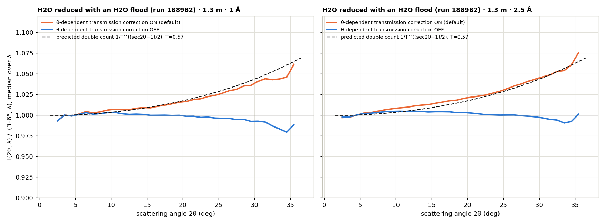

- **θ-dependent transmission correction OFF:** flat, +0.3 % at 20°, −0.3 % at 30°.
- **ON (the default):** +2.1 % at 20°, +4.5 % at 30°. It follows the predicted
  double count, 1 / T^((sec 2θ − 1)/2) with T = 0.57, almost exactly.

**Why.** A slab of transmission T scatters less toward large angles, because the
exit path through the sample is longer (1/cos 2θ). Call that loss A(T, 2θ).

| | its A(T, 2θ) … |
|---|---|
| the flood | is **kept**: the EQSANS preparer cannot correct it |
| the sample | is **divided out**: Mantid `ApplyTransmissionCorrection`, ThetaDependent, T(2θ) = T^((1 + sec 2θ)/2) |

The reduced sample is (sample ÷ its A) ÷ (flood with its A) = σ / A_flood.

The flood's own absorption loss becomes an **upturn** of 1/A_flood in *every*
sample reduced with it. A water flood makes it bigger than a thin PMMA flood,
because water absorbs more.

## 2. Is the sample position off? No

If the flood had been measured at a different sample position than the samples,
the ratio of two floods would bend the same way at every azimuth. Floods built
from the Sept samples at the water's position, compared pixel by pixel with the
August production flood:

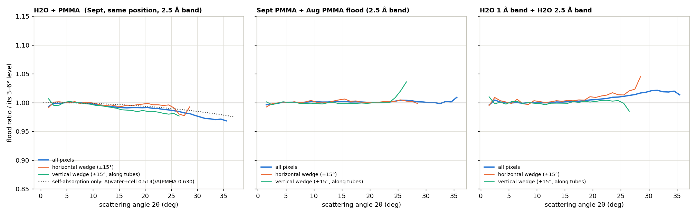

- **Sept PMMA ÷ Aug PMMA flood:** 1.000 at 20° and 30°. Flood and samples sat at the
  same position; a 1 cm offset would already give ~0.3 % at 20°.
- **H2O ÷ PMMA** (same position, same band, same day): follows the self-absorption
  difference A(water + cell, T = 0.514) / A(PMMA, T = 0.630) (dotted) out to 35°.
- **H2O 1 Å band ÷ H2O 2.5 Å band** (same water, same position): rises horizontally
  (+4.5 % at 28°), not vertically. A wavelength-dependent **detector** effect (§5).

## 3. The self-absorption model, tested across five floods

54 reductions: H2O, D2O and PMMA in both bands, with each of

- **prod** — production flood (Aug thin PMMA)
- **PMMA25** — Sept PMMA (2.5 Å band)
- **H2O25** / **H2O1** — Sept H2O (2.5 Å / 1 Å band)
- **prodSA** — production flood corrected for its own self-absorption (§4)

and with the θ-dependent transmission correction on and off. The model has no free
parameters:

- θ-correction off: σ · A_sample / A_flood
- θ-correction on: σ · A_sample / (A_flood · T_used^((sec 2θ − 1)/2))

It uses the measured transmissions vs empty beam: cell 0.902, H2O 0.570, D2O 0.921,
PMMA 0.630.

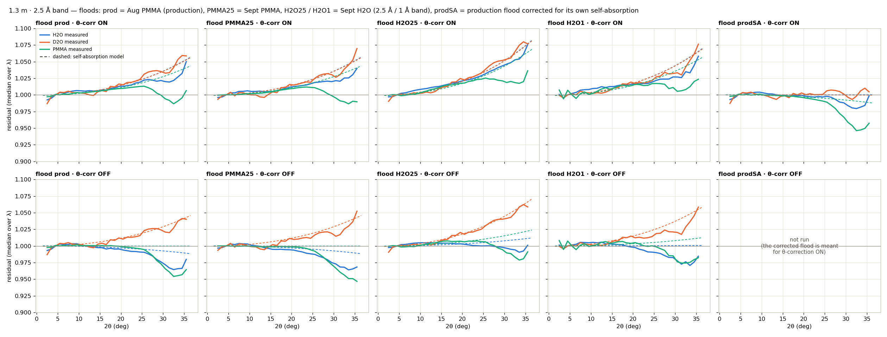

Rise at 2θ = 20°, all pixels, 2.5 Å band — measured (model):

| flood | θ-corr | H2O | D2O | PMMA |
|---|---|---|---|---|
| prod (Aug PMMA) | on | +1.3 % (+1.4) | +1.6 % (+1.4) | +1.0 % (+1.1) |
| PMMA25 (Sept PMMA) | on | +1.2 % (+1.4) | +1.5 % (+1.4) | +0.9 % (+1.1) |
| H2O25 (Sept H2O) | on | **+2.1 % (+2.1)** | +2.4 % (+2.0) | +1.8 % (+1.7) |
| H2O25 (Sept H2O) | off | **+0.3 % (+0.3)** | +1.9 % (+1.8) | +0.7 % (+0.6) |
| H2O1 (Sept H2O, 1 Å) | on | +1.6 % (+1.8) | +1.8 % (+1.7) | +1.5 % (+1.4) |
| **prodSA (corrected flood)** | on | **−0.1 % (0.0)** | **+0.2 % (0.0)** | **−0.4 % (−0.3)** |

Every combination agrees with the model to ≤ 0.4 %. The "water as flood" upturn
and the production-flood residual are the same effect. They differ only because
water absorbs more than thin PMMA.

## 4. The fix: correct the flood for its own self-absorption

`make_selfabs_flood.py` applies to the flood exactly the factor drtsans applies to
samples:

```
F_corr(pixel) = F(pixel) / T_f^((sec 2θ − 1)/2)     then renormalise to mean 1
```

T_f is the flood sample's transmission vs empty beam; for the 2026B thin-PMMA flood
T_f = 0.630. The correction raises the flood by 0.4 % at 10°, 1.5 % at 20° and
3.6 % at 30°. The corrected production flood was used for real reductions (prodSA,
θ-correction on):

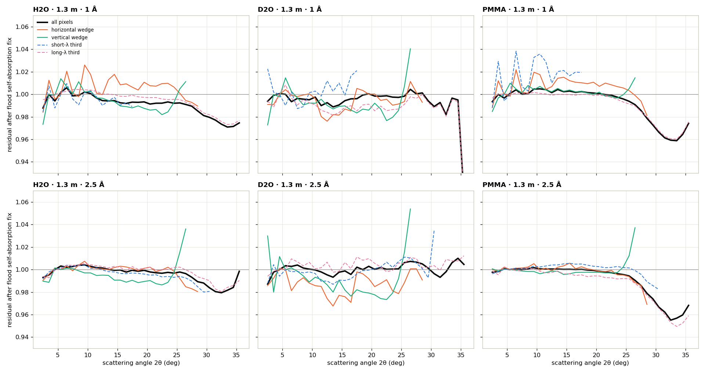

| 20°, all pixels | H2O | D2O | PMMA |
|---|---|---|---|
| 1.3 m · 1 Å | −0.8 % | −0.1 % | −0.2 % |
| 1.3 m · 2.5 Å | −0.1 % | +0.2 % | −0.4 % |

Before this fix the same data rose +0.7–1.6 % at 20°, and H2O / D2O +1.5–3.4 % at 30°.

**Beyond ~25° all three samples dip by 2–4 %** in this figure (H2O about −2 % at 30°,
PMMA about −4 %). §7 investigates this dip; its cause is only partly pinned down.

## 5. What is left: ±1–2 %, depending on direction

The residual that remains is no longer the same around the ring. Splitting into a
**horizontal** and a **vertical** ±15° wedge (the tubes are vertical) and into
wavelength groups:

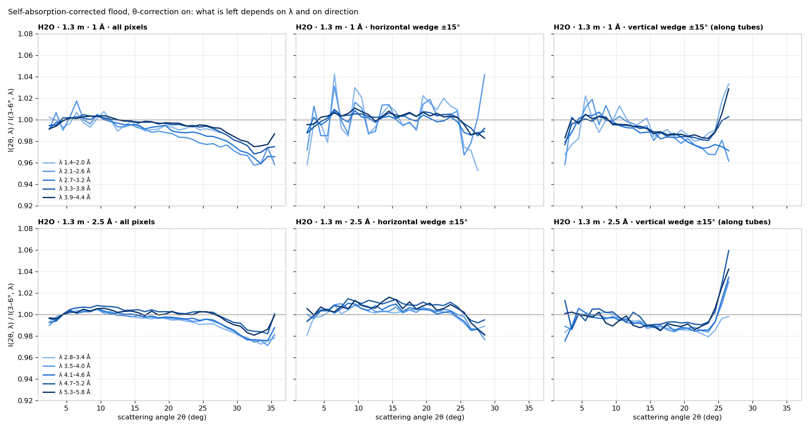

- **Horizontal (across tubes):** +0.3 to +1.9 % at 20°, largest at the shortest
  wavelengths (+1.9 % for 1.4–2.0 Å). It depends on λ, so it comes from the
  detector — front/back tube shadowing and detection efficiency at oblique
  incidence change with λ. A flood taken in one band (2.5 Å, integrated over λ)
  can't correct it at other wavelengths. The H2O flood made in the 1 Å band removes
  much of it for 1 Å data (H2O horizontal +1.1 % at 20°, vs +1.9 % with the 2.5 Å-band
  water flood).
- **Vertical (along tubes):** −0.8 to −2.0 % at 20°, at every wavelength.

A **wavelength-resolved flood** separates the two. It divides each sample by the
Sept PMMA *per pixel and per wavelength*, both measured at the same position, so
every detector factor — λ-dependent ones included — cancels exactly:

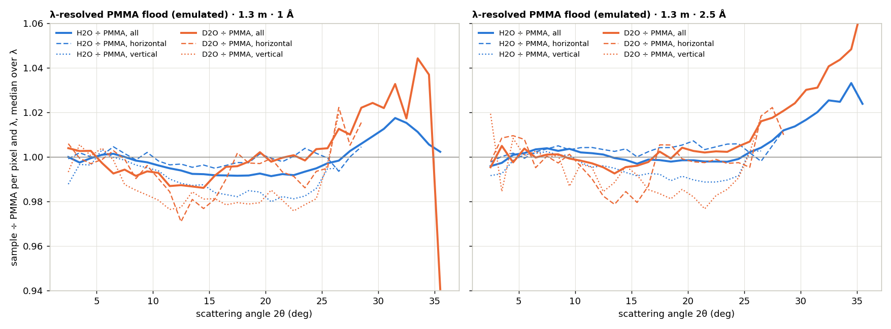

- **Horizontal residual → gone:** −0.2 to +0.6 % at 20° (H2O and D2O, both bands). The horizontal part is a
  detector effect.
- **Vertical residual → stays:** −0.9 to −1.8 % at 20°, for **both H2O and D2O**.
  It survives a same-pixel, same-λ, same-position ratio, so it is not the detector.
  It is common to the two samples in **banjo cells** and absent for the PMMA plate.
  It cancels when the flood is water in the same cell (water flood → H2O or D2O:
  vertical +0.2 / +0.6 % at 20°, θ-correction off). Most likely the banjo cell or its holder clips large
  **vertical** exit angles. It is geometric and does not depend on λ.

## 6. What it would take to make H2O flat

In order of size:

1. **Correct the flood for its own self-absorption** (§4) — the main piece,
   +1.5 % at 20° / +3.6 % at 30° with the thin-PMMA flood. drtsans has the hook
   (`PrepareSensitivityCorrection.set_transmission_correction`), but for EQSANS
   it's not implemented. It needs a transmission measurement of the flood sample
   (T-PMMA with every flood) — 2026B has none at 1.3 m, so T_f = 0.630 comes from
   the Sept PMMA. This is a one-line change to the flood: a drop-in file, no change
   to user reductions.
2. **A flood in the same cell and holder as the samples** — the vertical −1 to
   −2 %. Water or PMMA in a banjo cell, in the same holder, would carry the same
   clipping. Worth checking by measuring the holder's aperture.
3. **A flood per wavelength band** (or a λ-dependent sensitivity) — the horizontal
   ≤ 2 % at the shortest λ. drtsans applies one λ-independent sensitivity per
   configuration. A 1 Å-band flood for 1 Å data would already remove most of it.

With (1) alone, H2O is flat to ≤ 0.8 % at 20° in the all-pixel average, and within
about ±2 % in any direction, up to ~25°. The ~2 % dip beyond 25° (§7) is
only partly explained.

**Not changed yet:** the production floods in `2026B_mp/`. The corrected floods are
in `2026B_mp/sensitivity_selfabs/` for review (§9).

**Caveats:**
- The banjo-referenced transmissions used here (no empty-beam run in the Sept
  block) are fine for H2O and D2O (their T is the sample alone). For PMMA the
  reduction used 0.699 where the true value is 0.630; the analysis corrects that.
- The vertical-wedge result rests on one block of data and on the holder
  hypothesis, which has not been checked physically.

## 7. The dip beyond ~25° (2026-09-25)

**Is it the sample's Q-structure or an angle effect?** The same Q is seen at different
angles by different wavelengths. Each wavelength is normalised at the same low-Q
plateau (Q 0.10–0.20 Å⁻¹). Then, for narrow Q windows, intensity is plotted against the
angle at which that Q is seen:
- a flat line per Q window means **sample structure**;
- all windows bending together means an **angle effect**.

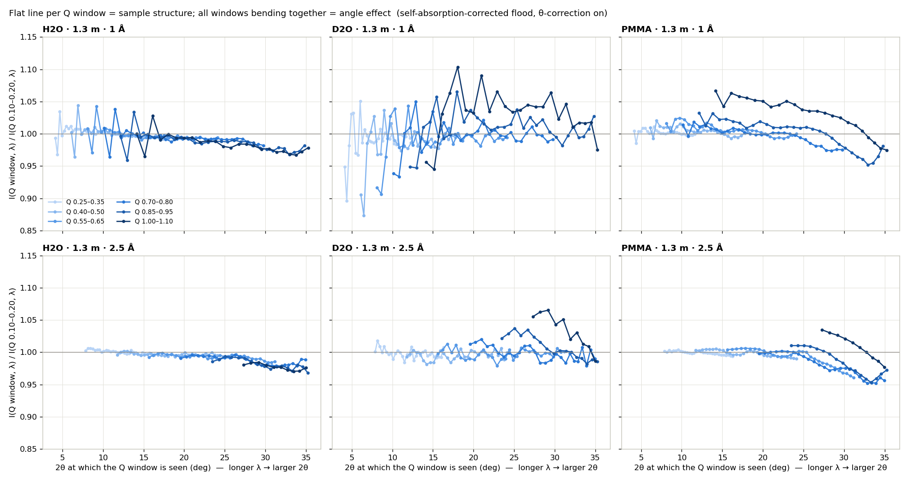

- **H2O: all six Q windows collapse onto one falling curve.** −2 % at 30°, −3 % at 35°.
  It is an **angle** effect, the same at every wavelength. It is not water's structure,
  which is flat to Q ≈ 1.1 Å⁻¹.
- **PMMA:** the same gentle angular fall, plus its own structure (windows at higher Q
  sit higher).
- **D2O:** too weak and noisy to separate; it dips less.

**Vanadium test.** On 2025-08-21 (IPTS-36254, cycle 2025B) **7.7 mm vanadium** and
**2.3 mm PMMA** were measured at 1.3 m / 2.5 Å on the same day:

| sample | run | its transmission run |
|---|---|---|
| vanadium | 167898 | 167895 |
| PMMA | 167897 | 167894 |
| empty | 167896 | 167893 |
| Cd (blocked beam) | 167914 | — |

The scattering runs are titled "T-" but are 48 min with the beamstop in. Vanadium
scatters almost purely elastically and isotropically, with no structure below
Q ≈ 2.9 Å⁻¹. It is a free-standing plate, with no cell.

Both were reduced identically: a 2025B flood built with the current recipe (reduction
geometry + flood self-absorption), θ-correction on, empty-beam and blocked-beam
subtraction.

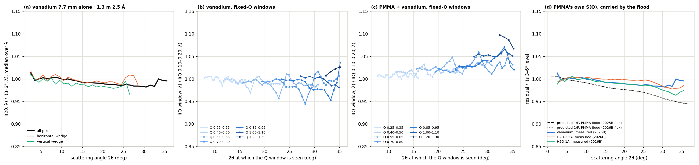

- **(a) Vanadium dips too:** −0.9 % at 20°, −1.6 % at 30°, and horizontally ≈ vertically.
  So the dip is **not water physics, not hydrogen inelasticity, and not the banjo cell**.
  It is common to every sample reduced with the PMMA flood. **(d)** H2O (2026B) follows
  vanadium closely.
- **(c) PMMA is not a flat scatterer.** Relative to vanadium it rises with Q: +2.5 % by
  Q ≈ 0.6, +4 % by 1.0, +9 % by 1.2 Å⁻¹, toward its amorphous peak. A PMMA flood is PMMA
  summed over wavelength, so at a large-angle pixel it carries that higher-Q excess.
  Dividing by it lowers every sample there. **The sign is right, but a simple estimate
  (dashed in d) is 2–3× too big:** −2.4 % at 20° and −4.3 % at 30°, against the measured
  −0.9 % and −1.6 %. So PMMA's structure is at most part of the story. Multiple scattering
  and detector response at oblique incidence remain candidates.
- **A water flood would barely change it.** After the self-absorption correction, water and
  PMMA floods differ by only ~0.2 % at 20° and ~0.8 % at 30° (§2: H2O ÷ PMMA follows the
  self-absorption curve closely). D2O comes out within 0.2 % with either flood.
- **Referencing to vanadium** (dividing the 2026B results by vanadium's angular curve;
  indicative only, across cycles) flattens H2O in the 1 Å band (0.0 % at 20°, −0.7 % at
  30°). It over-corrects H2O in the 2.5 Å band (+0.9 %) and D2O (+1.0 to +1.7 %). At the
  ±1 % level several effects compete, and a cross-cycle vanadium reference can't settle it.

**drtsans's inelastic-incoherent correction** (`fitInelasticIncoh`) does not help. It
subtracts a constant b(λ) per wavelength, referenced to the lowest slice — here the
band-edge slice, which is normalised too low. Subtracting a constant from a slice with a
multiplicative angular error amplifies that error by about level ÷ (level − b) ≈ 1.5×:

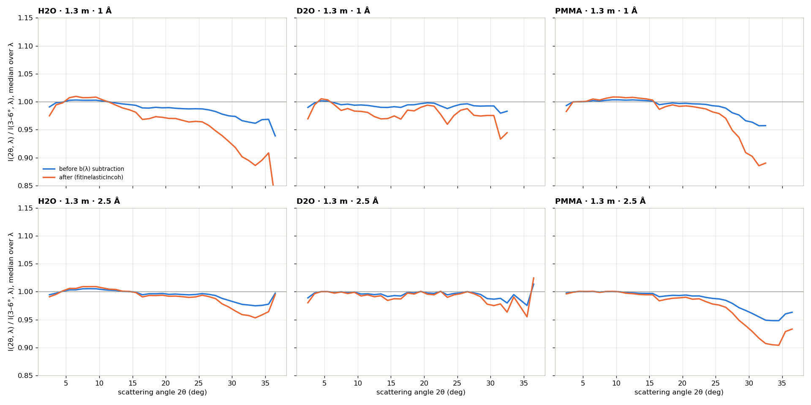

| 30° | H2O 1 Å | H2O 2.5 Å | D2O 2.5 Å | PMMA 1 Å | PMMA 2.5 Å |
|---|---|---|---|---|---|
| before b(λ) | −2.6 % | −1.7 % | −1.3 % | −3.5 % | −3.6 % |
| after b(λ) | **−7.7 %** | **−3.1 %** | **−2.4 %** | **−9.4 %** | **−6.6 %** |

It is meant for a coherent signal on an incoherent background. It is not an instrument
correction, and it cannot be applied to a flood: a flood is one number per pixel, with
no Q or λ axis.

### Is it only at 1.3 m? (2.5 m and 4 m with their self-absorption-corrected floods)

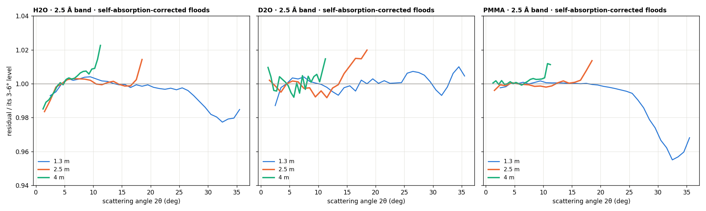

| H2O, all pixels | 8° | 11° | 18° | 20° | 30° | detector edge |
|---|---|---|---|---|---|---|
| 1.3 m | +0.3 % | +0.2 % | −0.1 % | −0.1 % | −1.6 % | dips beyond 25° |
| 2.5 m | +0.3 % | 0.0 % | +0.8 % | — | — | **rises** (edge 18.5°) |
| 4 m | +0.7 % | **+1.9 %** | — | — | — | **rises** (edge 11°) |

**The dip is only at 1.3 m.** At 2.5 m and 4 m there is no dip. Instead there is a small
**rise at each configuration's outermost pixels**, at 11° or 18°, where 1.3 m is flat at
the same angles. D2O and PMMA behave the same way. So besides the angle effect there is a
pattern tied to **where a pixel sits on the detector**.

### Horizontal, vertical, or both?

±15° wedges around the horizontal axis, the vertical axis, and the diagonals. Only the
diagonal (the corners) reaches beyond 28°.

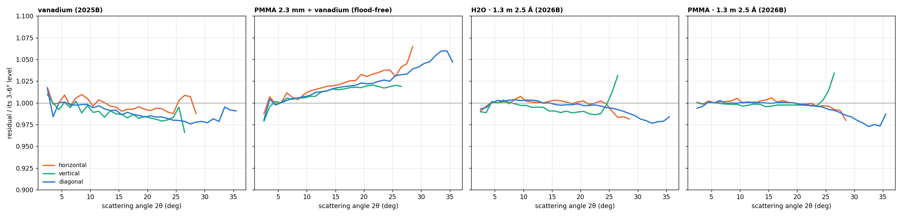

| 20° (diagonal also 30°) | horizontal | vertical | diagonal |
|---|---|---|---|
| vanadium (2025B, no cell) | −0.8 % | −1.7 % | −1.6 % / −2.2 % |
| H2O 1.3 m (2026B) | +0.2 % | −1.0 % (cell) | −0.2 % / −1.7 % |
| PMMA 1.3 m (2026B) | −0.1 % | −0.3 % | −0.1 % / −1.8 % |
| PMMA 2.3 mm ÷ vanadium (no flood) | +3.1 % | +1.9 % | +2.2 % / +4.3 % |

Where the wedges overlap in angle, horizontal and diagonal agree (H2O −0.5 % vs −0.6 % at
25°). The steep part beyond 25° can only be seen in the corners.

### Where on the detector?

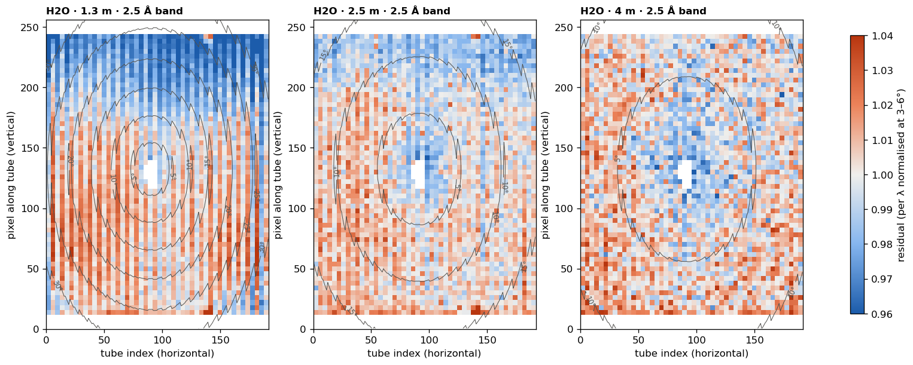

- **A top–bottom asymmetry** is common to every sample — vanadium from another cycle and
  flood included. It grows as the detector gets closer. At similar angles, rows 216–235
  (top) vs rows 20–39 (bottom):

| top − bottom | 1.3 m | 2.5 m | 4 m |
|---|---|---|---|
| H2O | −3.2 % | −1.8 % | −0.7 % |
| D2O | −2.3 % | −1.2 % | −0.4 % |
| PMMA (same material as the flood) | −1.2 % | −0.8 % | −0.5 % |
| vanadium (2025B) | −3.3 % | | |

  Much of the 1.3 m "dip" is the **top** of the detector, and the "edge rise" at 2.5 m and
  4 m is mostly the **bottom**. It is not PMMA structure and not the banjo cell. Candidates
  not yet separated:
  - a **tilt** of the flood or sample mount, which makes self-absorption differ for up and
    down exits (~5° tilt ≈ 2 % at 25° for T ≈ 0.63);
  - a height / geometry difference;
  - the detector's vertical response.
- **Front/back tube striping** at 1.3 m (±1–2 %): the two tube layers respond differently to
  water than to the PMMA flood.

**Where this leaves the 1.3 m high-angle deviation** (−1 % at 20°, −2 % at 30°): it is
**several overlapping effects**, none of them water physics:
1. **the flood material.** PMMA scatters 2–4 % more than vanadium at high angle, from its
   structure toward the 1–1.3 Å⁻¹ halo and probably multiple scattering; a PMMA flood turns
   that into a dip. Samples that themselves scatter strongly (H2O) dip less than vanadium,
   consistent with multiple scattering; this is not yet calculated.
2. **the top–bottom asymmetry** (up to ~3 % at 1.3 m, all samples).
3. **front/back tube striping**, and the **wavelength-dependent** horizontal part (§5).

## 8. Suggestions

1. **Keep thin PMMA as the routine flood; don't switch to water.** Once self-absorption is
   corrected, water and PMMA floods differ by only ~0.2 % at 20° (~0.8 % at 30°). Water
   adds container scattering and clipping, stronger self-absorption and multiple
   scattering, and liquid handling.
2. **Correct floods for their own self-absorption** — done in `prepare_sensitivity.py`
   (§9). It removes the largest piece (+1.5 % at 20° / +3.6 % at 30°).
3. **Don't use the inelastic-incoherent correction to flatten standards.** It amplifies
   angular residuals 1.5–3× (§7).
4. **For the flood-material part at 1.3 m, two options to test:**
   - **a long-wavelength (e.g. 5 Å) PMMA flood.** At 35° it would see Q ≤ 0.76 Å⁻¹
     instead of ≤ 1.26, avoiding PMMA's steep rise above ~0.9. PMMA already rises ~2.5 % by
     Q ≈ 0.6, so this reduces the effect rather than removing it. It also corrects
     detector efficiency at 5 Å, while 1.3 m data are mostly short-λ (the λ-dependent
     horizontal part reached ~2 % at the shortest λ).
   - **vanadium as a reference.** It is flat, elastic and structureless, but a weak
     scatterer (long counts) and strongly absorbing (T 0.49 → 0.32 across the band), so its
     own self-absorption must be wavelength-aware. Best used as a periodic reference for a
     smooth angular correction of the PMMA flood, not as the routine flood.
5. **A same-day test at 1.3 m next beamtime decides it:**
   - thin PMMA floods at 2.5 Å **and** 5 Å;
   - vanadium (~2 h);
   - water in its banjo cell;
   - T runs for each, and an empty beam;
   - and **check that the flood and sample mounts are perpendicular to the beam and at the
     same height** — the top–bottom asymmetry points there.

## 9. Built into `prepare_sensitivity.py`; 2026B floods rebuilt (2026-09-25)

`prepare_sensitivity.py` (the 2026B copy and the `tools/sensitivity/` master) now
corrects the flood for its own self-absorption. It fills the hook drtsans leaves
unimplemented for EQSANS (`_apply_transmission_correction`) with **the same drtsans
function reductions apply to samples** — `apply_transmission_correction(ws,
trans_value = T_f, theta_dependent = True)`. At that point the flood workspace
carries the reduction geometry, so flood and sample are corrected identically.

- **The transmission** is `FLOOD_TRANSMISSION = {4m, 2.5m, 1.3m: 0.630}`: the
  Sept-23 thin PMMA, measured as 0.699 vs the empty banjo × 0.902 banjo vs empty
  beam. The August flood PMMA and the Sept PMMA agree pixel for pixel, so it is the
  same sheet.
- **Each flood's `.geometry.json`** now also records `flood_self_absorption` (T and
  its source).
- **Options:** `--no-selfabs` turns it off. `--nominal` floods (pass 1 of a new
  cycle) are left uncorrected.
- **The previous script** is kept as
  `2026B_mp/legacy/prepare_sensitivity_2026B_no_selfabs.py`.

The three 2026B floods were rebuilt into **`2026B_mp/sensitivity_selfabs/`** for
review. **The files in `2026B_mp/` are not replaced yet.**

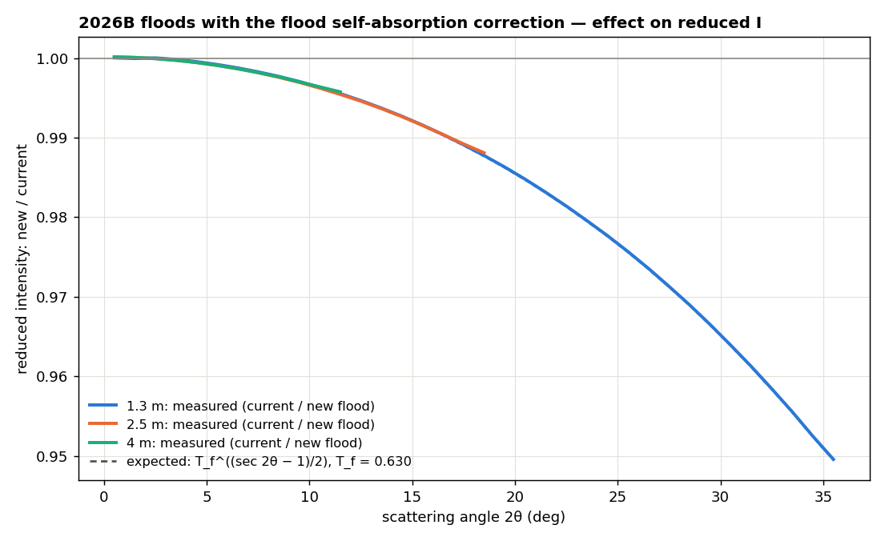

| distance | 10° | 20° | 30° | edge | matches T_f^((sec 2θ−1)/2) to |
|---|---|---|---|---|---|
| 1.3 m | −0.3 % | −1.4 % | −3.5 % | −5.0 % at 35° | 1 × 10⁻⁴ |
| 2.5 m | −0.3 % | — | — | −1.2 % at 18.5° | 3 × 10⁻⁷ |
| 4 m | −0.3 % | — | — | −0.4 % at 11.5° | 1 × 10⁻⁶ |

The rebuilt 1.3 m flood equals the test flood of §4 — the one that made H2O, D2O and
PMMA flat at 20° — to ±0.012 % (1st–99th percentile of pixels). So §4's results hold
for it unchanged. Validation: `2026B_mp/sensitivity_selfabs/validate_selfabs.py`.

## 10. Current floods, and two questions answered

**Which flood is where (2026B):**

| file | geometry | flood self-absorption correction | status |
|---|---|---|---|
| `2026B_mp/Sensitivity_patched_thinPMMA_*.nxs` | reduction (AgBe) | **no** | **in use** since 2026-09-24 |
| `2026B_mp/sensitivity_selfabs/Sensitivity_patched_thinPMMA_*.nxs` | reduction (AgBe) | yes, T_f = 0.630 | built 2026-09-25, **for review — not in use yet** |
| `2026B_mp/Sensitivity_patched_thinPMMA_*.OLD_nominal_geometry.nxs` | nominal | no | the August originals, kept |

Each flood's `.geometry.json` records which geometry and correction it was built with.
With the floods in use, 1.3 m data still carry the +1.5 % at 20° / +3.6 % at 30° rise
from the flood's own self-absorption.

**Is the sensitivity correction wavelength-dependent? No.** A flood file holds **one number
per pixel** (49 152 × 1 bin), and drtsans divides every wavelength bin of that pixel by the
same number (`sensitivity.py`, a plain `Divide`). The *flood run* is wavelength-dependent,
though: it is measured in one band (2.5 Å for our floods), not flux-normalised, and then
**summed over its wavelengths** (the preparer's `Integration`). So each pixel's number is a
band-weighted average of:

1. the pixel's detection efficiency at those wavelengths, including front/back tube
   shadowing at oblique angles;
2. what the flood sample scatters into that pixel: at angle 2θ the band covers
   Q = 4π sin θ / λ over a range, so a PMMA flood averages in PMMA's structure there.

It is exact only where a pixel's true response does not change with wavelength. That is
why the λ-dependent horizontal residual (§5) remains at the shortest wavelengths, and why
the **flood's band** matters: a 5 Å flood carries less of PMMA's high-Q structure but
averages the efficiency over 5 Å instead of the short wavelengths 1.3 m data mostly use.
The "wavelength-resolved flood" in §5 is only an emulation in this analysis; drtsans cannot
apply one for EQSANS.

**Is correcting the flood for its own self-absorption physically right? Yes, as long as
samples are θ-corrected in reduction (the drtsans default).**

- **What the flood should hold:** each pixel's efficiency, so dividing by it leaves only
  sample physics.
- **What the measured flood actually holds:** efficiency × solid angle × PMMA scattering ×
  PMMA's own self-absorption. Solid angle is divided out; self-absorption is not.
- **Why that matters:** the self-absorption loss is a property of the flood *sample*, not of
  the pixels. Left in, it makes large-angle pixels look less efficient than they are.
- **The fix:** correct the flood with the same drtsans function applied to samples, so flood
  and sample are treated alike. Water used as its own flood rises +2 % / +4.5 % at 20° / 30°
  without this, and is flat with it (§1).

Where the correction is approximate:
- **Single scattering, flat slab, normal incidence.** Thin PMMA is mostly an incoherent
  *scatterer*, so some of the "lost" neutrons are multiply scattered rather than removed;
  the formula slightly over-counts the loss.
- **T_f is borrowed from the Sept PMMA.** It is the same sheet as the August flood, but
  ±0.07 in T_f moves the result by about ±0.8 % at 30° (±0.3 % at 20°).
- **It assumes the flood is square to the beam.** A tilted mount breaks this — possibly
  related to the top–bottom asymmetry (§7).
- **One T for the whole band** (small here).

The only other self-consistent choice — correcting neither floods nor samples — leaves every
sample whose transmission differs from the flood's with its own angular loss, so it is worse
in general.

**Provenance.** 2026-09-25, drtsans `1.34.0`, `2026B_mp/reduction/water2/`:
- `make_floods_w2.py` → floods from Sept H2O (188982, 188966) and PMMA (188981).
- `make_selfabs_flood.py` → the self-absorption-corrected production flood.
- `reduce_w2.py` → 54 reductions (5 floods × θ on/off × H2O/D2O/PMMA × 2 bands),
  each keeping per-pixel, per-λ `_processed.nxs`.
- `compare_floods_w2.py` → flood ratios.
- `analyze_w2.py` → model vs measurement and the corrected flood.
- `analyze_w2_lambda.py` → wavelength / direction split and the λ-resolved flood.
- `analyze_w2_dip.py` → fixed-Q windows vs angle.
- `make_flood_2025B.py`, `reduce_vanadium.py`, `analyze_vanadium.py` → the vanadium test
  (IPTS-36254 runs 167893–167914), `vref_emulation.py` → the vanadium-referenced numbers.
- `incoh_effect.py` → before / after the inelastic-incoherent correction.
- `reduce_w2_dist.py` → 2.5 m / 4 m reductions with the rebuilt floods; `dump_geom_w2.py` →
  their pixel angles; `distance_w2.py`, `direction_w2.py`, `map_w2.py` → the distance,
  direction and detector-map figures.
- `2026B_mp/prepare_sensitivity.py` → `2026B_mp/sensitivity_selfabs/` (§9),
  `validate_selfabs.py` → its figure and numbers.
