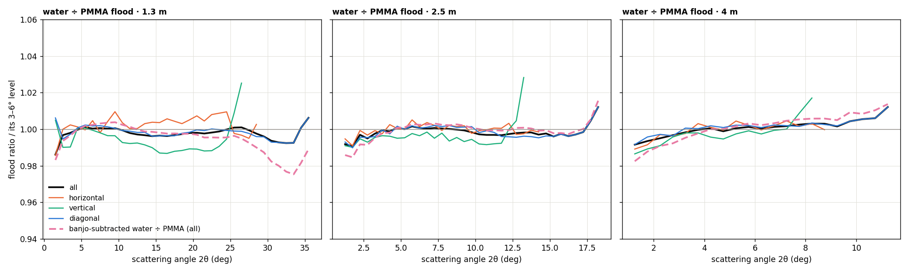
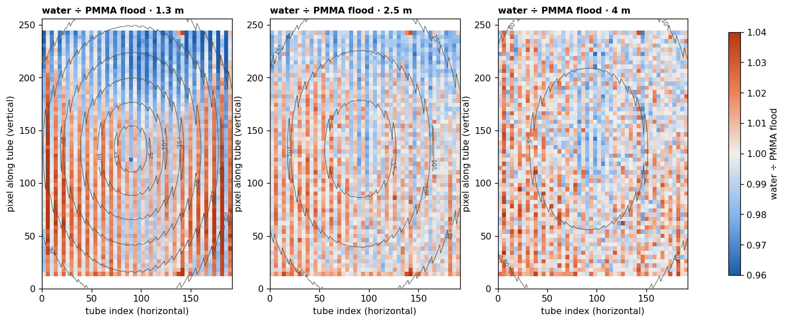
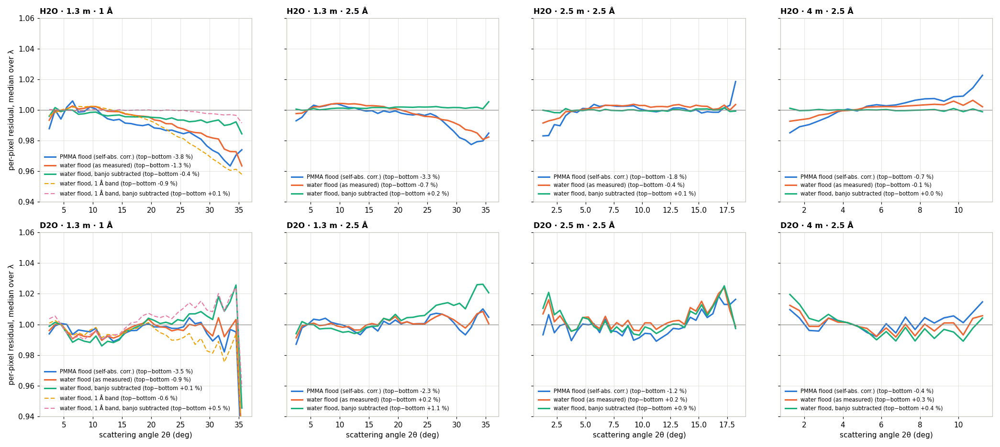
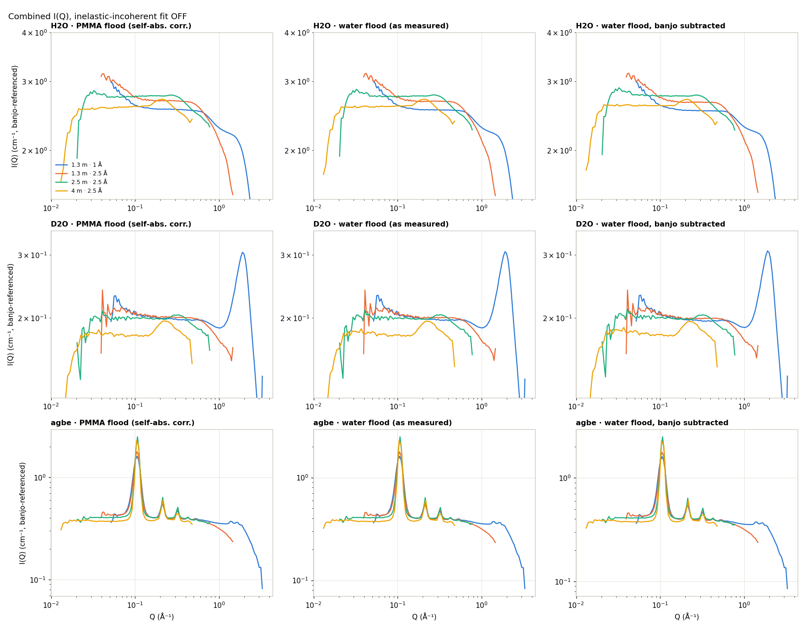
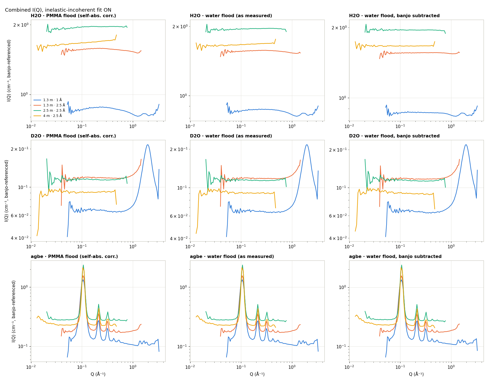
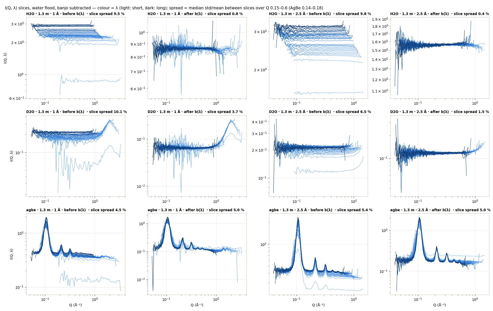
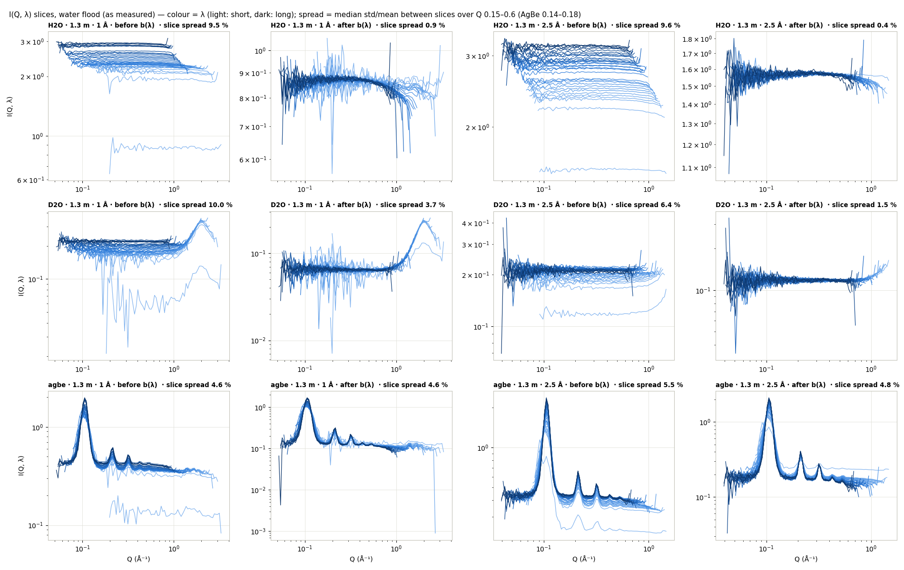
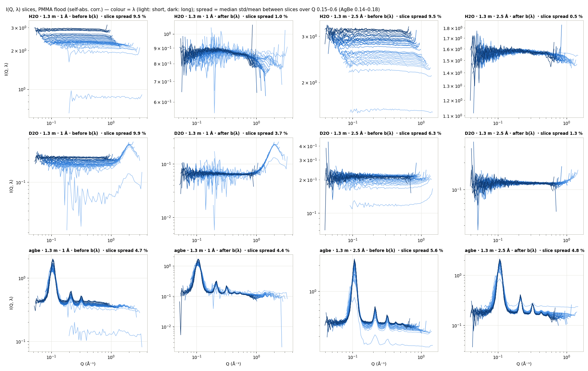

# Water 3 — H2O as the flood

**Date:** 2026-09-25 · **drtsans:** stable `1.34.0` · **data:** the 2026-09-23 block
(IPTS-37618): 1.3 m (1 Å and 2.5 Å bands), 2.5 m and 4 m (2.5 Å) · **scripts:**
`2026B_mp/reduction/water3/` — `make_water_floods.py`, `make_water_bs_floods.py`,
`reduce_w3.py` (84 reductions), `compare_floods_w3.py`, `analyze_w3.py`

**The idea.** Below Q ≈ 1.5 Å⁻¹, H2O has almost no structure factor: it is nearly all
incoherent. A flood made from H2O should therefore carry no sample structure at high angle,
unlike thin PMMA (Water 2, §7). This page:
- builds water floods at 1.3, 2.5 and 4 m, with solid-angle and θ-dependent
  (self-absorption) correction;
- builds a second set with the **banjo cell's own scattering subtracted**, because quartz has
  high-Q structure too;
- reduces H2O, D2O and AgBe with each flood, with `fitInelasticIncoh` off and on;
- keeps I(Q, λ) for the incoh-on runs.

**Short answer.**
- **The banjo-subtracted water flood is the flattest flood tested.**
  - **H2O 1.3 m 1 Å, reduced with the 2.5 Å-band flood** (an independent check): at 30° the
    residual goes from −2.5 % (PMMA flood) to −0.8 %; top−bottom from −3.8 % to −0.4 %.
  - With the 1 Å-band banjo-subtracted flood it is flat to 0.2 %.
  - At 2.5 m and 4 m the top–bottom asymmetry is gone.
  - Most of the PMMA flood's high-angle dip and top–bottom asymmetry therefore came from the
    flood, not from the math.
- **The high-angle dip is PMMA's own structure.** The PMMA flood is a free-standing thin
  sheet: no cell, so there is no background to subtract. Water with the cell removed is the
  flattest scatterer we have. Relative to it, the PMMA flood is 1.5 % higher at 30° and
  ~2.5 % higher at 33–35° (1.3 m), i.e. at Q ≈ 0.7–1.3 Å⁻¹. PMMA is an amorphous,
  carbon-rich polymer with a broad intermolecular halo near 1 Å⁻¹. That excess in the
  flood divides every sample down at high angle. It agrees with Water 2 §7, where PMMA ÷
  vanadium rises +2.5 % at 0.6 Å⁻¹ and +4 % at 1.0 Å⁻¹.
- **The top–bottom part has a different cause.** Isotropic sample structure cannot make the
  top and bottom of the detector differ. That part cancels because the water flood is
  measured in the same banjo and holder as the samples, and the PMMA sheet is not (§1).
- **Quartz matters.** A water flood that still contains the cell sits 1–2 % lower at 30–35°
  (1.3 m) than the same flood with the cell removed. The cell's scattering has high-Q excess.
- **Combined I(Q) with the incoh fit off still droops** for H2O at 1.3 m: I(1.0)/plateau is
  0.80 (2.5 Å) and 0.90 (1 Å), whatever the flood. This droop is in **wavelength**, not angle.
  The I(Q, λ) slices of H2O differ in level by ~9.5 %, and high Q comes only from the
  short-λ slices, which are the low ones. Each slice is flat in Q, so the offset is one
  factor per λ, common to every pixel. It is a **λ-normalisation** issue (flux spectrum,
  overall efficiency, H2O inelastic), not pixel-to-pixel sensitivity. The flood is the wrong
  place to fix it.
- **With the incoh fit on, H2O is flat** (waterbs flood: I(1.0)/plateau 0.99 in both bands),
  and the I(Q, λ) slices overlap to 0.4–1 %. However, the fit removes most of H2O's own
  signal as "b(λ)". The absolute level drops from ~2.6 cm⁻¹ to 0.87–1.95 cm⁻¹ and differs
  between configurations, so incoh-on data is only good for **shape**, not absolute scale.
- **AgBe is unaffected** by the flood or the incoh fit: q1 = 0.1059 / 0.1064 / 0.1071 /
  0.1071 Å⁻¹ in every case.

---

## 1. The floods

| name | flood run (S-H2O) | beam centre | T_f (water + cell vs empty) | file (`water3/floods/`) |
|---|---|---|---|---|
| 1.3 m, 2.5 Å | 188982 | 188970 | 0.570 × 0.902 = 0.514 | `Sensitivity_H2O_1o3m_188982.nxs` |
| 2.5 m, 2.5 Å | 188998 | 188986 | 0.574 × 0.902 = 0.518 | `Sensitivity_H2O_2o5m_188998.nxs` |
| 4 m, 2.5 Å | 189014 | 189002 | 0.576 × 0.902 = 0.520 | `Sensitivity_H2O_4m_189014.nxs` |
| 1.3 m, 1 Å | 188966 | 188954 | 0.628 × 0.902 = 0.566 | `Sensitivity_H2O_1o3m_1A_188966.nxs` |

**Water flood, as measured** (`make_water_floods.py`). It uses exactly the production recipe:
- `tools/sensitivity/prepare_sensitivity.py`, imported, not copied;
- reduction geometry (samoffset 285.0, detoffset 66.714, scalecomp 1.004124 / 1.057996);
- solid angle on;
- the flood self-absorption correction of Water 2 §9, with the water's own transmission.

T_f = T′(H2O vs the empty banjo, from the reductions' `_trans.txt`) × 0.902 (empty banjo
vs empty beam, Aug run 186164, assumed for all distances). The preparer subtracts no
background, so this flood **includes the banjo cell's scattering**, as a water flood would in
practice.

**Water flood, banjo subtracted** (`make_water_bs_floods.py`, files `Sensitivity_H2Obs_*`).
The preparer cannot subtract a background, so this flood is built from the H2O
**reduction** instead:
- **P(pixel, λ)** is the per-pixel, per-λ `_processed.nxs` of H2O, reduced with the PMMA
  flood X. It is dark-subtracted, flux-normalised, divided by solid angle, by X and by the
  water's θ-dependent transmission, with the empty banjo subtracted. That leaves **water
  only**.
- **F(pixel) = X(pixel) · Σ_λ flux(λ) · P(pixel, λ).** Multiplying by X undoes that flood
  exactly, pixel by pixel. Weighting by the flux restores the raw counts' wavelength
  weighting, as in a flood run.
- **Then as in the preparer:**
  - masked pixels stay masked;
  - normalise to mean 1;
  - thresholds 0.1–3.0.
- **Beamstop pixels.** The reduction masks 381 pixels behind the beamstop, but drtsans needs
  them for the zero-angle transmission. They are filled from the as-measured water flood,
  scaled to match at 2θ 1–3°.
- **Result:** 44 928 valid pixels, written into a copy of the as-measured water flood (same
  instrument and logs).

The PMMA flood (`2026B_mp/sensitivity_selfabs/`) is a thin PMMA sheet mounted on its own,
with no cell. The flood run is PMMA alone, and nothing needs subtracting. The background
question only arises for the water floods, whose water sits in a quartz banjo.

Each ratio is normalised to its 3–6° level.
- **Radially, the as-measured water flood ≈ the PMMA flood**, within ±0.5 % out to 30° at
  1.3 m. This is a coincidence of two excesses: the quartz cell in the water flood roughly
  matches PMMA's own high-Q scattering.
- **With the cell removed (dashed), water is below PMMA at high angle**: −0.4 % at 25°,
  −1.5 % at 30°, ~−2.5 % at 33–35° (1.3 m). This is the PMMA's structure (amorphous-polymer
  halo near 1 Å⁻¹), seen directly.
- **Vertically they differ.** The water flood's top − bottom is −2.6 / −1.4 / −0.6 % at
  1.3 / 2.5 / 4 m (−3.5 / −2.0 / −0.8 % banjo-subtracted). The water floods, being measured in
  the same banjo and holder as the samples, carry the same vertical pattern the samples do.
  The PMMA sheet does not.
- **Removing the cell lowers the flood at high angle**: −1 % at 30° and −2 % at 33–35°
  (1.3 m, 2.5 Å band), and −2.7 % at 30° in the 1 Å band. This is the quartz's high-Q excess.
  Left in the flood, it pushes every reduced sample down there.

---

## 2. Reductions

`reduce_w3.py <flood set> <config>`. Samples are H2O, D2O and AgBe in the banjo, with the
empty banjo as background (T = 1.0) and banjo-referenced transmission. Everything else is as
in Water / Water 2:
- reduction geometry;
- θ-dependent transmission on;
- 0.1 Å bins;
- per-pixel `_processed.nxs` kept.

Each is run with the incoh fit off, and on (`fitInelasticIncoh`, `selectMinIncoh`,
`outputWavelengthDependentProfile`). That makes 84 reductions in total.

| flood set | files | used for |
|---|---|---|
| `pmma` | `2026B_mp/sensitivity_selfabs/` (thin PMMA, self-abs. corrected) | all configs |
| `water` | `Sensitivity_H2O_*` | all; the 2.5 Å flood for both 1.3 m bands |
| `water1A` | `Sensitivity_H2O_1o3m_1A_188966` | 1.3 m 1 Å |
| `waterbs` | `Sensitivity_H2Obs_*` | all; the 2.5 Å flood for both 1.3 m bands |
| `waterbs1A` | `Sensitivity_H2Obs_1o3m_1A_188966` | 1.3 m 1 Å |

**Self-referential cases.** The H2O sample run in each configuration is the flood run of the
flood built from that configuration:
- 2.5 Å: 1.3 m H2O with `water`/`waterbs`, and 2.5 m and 4 m H2O with any water flood;
- 1 Å: 1.3 m H2O with `water1A`/`waterbs1A`.

Those H2O results only check the arithmetic. **The independent tests are:**
- D2O;
- AgBe;
- H2O 1 Å with the 2.5 Å-band floods.

---

## 3. Per-pixel residual (incoh off)

This uses the Water 2 method: each pixel's 0.1 Å slices are normalised to the 3–6° level,
the median over λ is taken, and the result is binned in 2θ. Points with Q > 0.9 Å⁻¹ are
dropped. This is the angle test with the wavelength problem (§4) taken out.

The table gives values at 20° / 30°, then the top − bottom rows (216–235 vs 20–39):

| flood | H2O 1.3 m 1 Å | H2O 1.3 m 2.5 Å | D2O 1.3 m 1 Å | D2O 1.3 m 2.5 Å |
|---|---|---|---|---|
| PMMA (self-abs. corr.) | −1.1 / −2.5 / −3.8 | −0.1 / −1.6 / −3.3 | −0.1 / −0.8 / −3.5 | +0.2 / −0.1 / −2.3 |
| water, as measured | −0.5 / −1.8 / −1.3 | 0.0 / −0.9 / −0.7 ᵃ | +0.2 / −0.6 / −0.9 | +0.3 / +0.2 / +0.2 |
| water, banjo subtracted | −0.5 / −0.8 / −0.4 | +0.2 / +0.2 / +0.2 ᵃ | +0.3 / +0.4 / +0.1 | +0.5 / +1.3 / +1.1 |
| water 1 Å band | −0.7 / −3.0 / −0.9 ᵃ | — | −0.1 / −1.8 / −0.6 | — |
| water 1 Å band, banjo subtracted | 0.0 / −0.2 / +0.1 ᵃ | — | +0.6 / +0.9 / +0.5 | — |

ᵃ self-referential. All values are in %.

At 2.5 m and 4 m, top − bottom goes as follows (PMMA → water → banjo-subtracted water):
- **H2O:** −1.8 → −0.4 → +0.1 % (2.5 m) and −0.7 → −0.1 → 0.0 % (4 m).
- **D2O:** −1.2 → +0.2 → +0.9 % (2.5 m) and −0.4 → +0.3 → +0.4 % (4 m).

What this says:
- **The PMMA flood's −1.6 to −2.5 % at 30° and −3 to −4 % top–bottom are flood effects.**
  The water floods remove most of both: in the independent H2O 1 Å test, −2.5 → −0.8 % at 30°
  and −3.8 → −0.4 % top−bottom.
- **The cell must come out of the flood.** The as-measured water flood leaves H2O 1 Å at
  −1.8 % at 30°; banjo-subtracted, it is −0.8 %. The water 1 Å-band flood that keeps the cell
  is worst of the water floods at 30° (−3.0 %), because in the 1 Å band the quartz's high-Q
  excess sits inside the detector.
- **D2O is the weak point.** D2O scatters about 13× less than H2O, so its residual is the
  most sensitive to the cell subtraction and to its own S(Q) onset near 0.8–0.9 Å⁻¹, which
  mixes in at the 1.3 m corners. With the banjo-subtracted floods it reads +0.4 to +1.3 % at
  30° and +0.1 to +1.1 % top−bottom, against ≤ +0.3 % with the as-measured water flood.
  Every water flood is within about ±1 % for D2O. Which one is best for D2O is not settled
  by this data.
- **The flood's band matters at the ≤ 1 % level.** For H2O 1 Å, the 1 Å-band banjo-subtracted
  flood is flat but self-referential. For D2O 1 Å it is +0.9 % at 30°, against +0.4 % for the
  2.5 Å-band one.

---

## 4. Combined I(Q) — incoh fit off

For H2O, I(Q) / plateau (0.1–0.3 Å⁻¹):

| flood | 1.3 m 1 Å: I(1.0) / edge | 1.3 m 2.5 Å: I(1.0) / edge | 2.5 m I(0.5) | 4 m edge |
|---|---|---|---|---|
| PMMA | 0.896 / 0.45 | 0.793 / 0.70 | 0.913 | 0.93 |
| water | 0.900 / 0.46 | 0.797 / 0.70 | 0.915 | 0.92 |
| water, banjo subtracted | 0.906 / 0.46 | 0.804 / 0.71 | 0.914 | 0.92 |

**The flood changes the combined I(Q) by less than 1 %.** The droop is set elsewhere. In the
combined I(Q), each Q is an average over the wavelengths that reach it, and the highest Q
comes only from the shortest λ. The I(Q, λ) slices of H2O are not at the same level (§6,
"before" panels): the short-λ slices sit up to ~30 % below the long-λ ones (slice spread ~9.5 %). So the combined
curve falls wherever only short λ contribute.

Within each slice, the level is flat in Q, i.e. the same at small and large angle. So the
offset is **one factor per wavelength, common to every pixel**. It is not a pixel-to-pixel
(sensitivity) effect. The flood only has to give the *relative* efficiency of each pixel,
and that is essentially the same at every λ. A global λ factor belongs in the wavelength
normalisation instead. Candidates:
- the flux spectrum (`bl6_flux_2026B_aug_rebinned.txt`) versus what the detector actually
  sees;
- the detector's overall efficiency versus λ, if the flux file does not include it;
- H2O's inelastic scattering, whose apparent cross-section depends on incident λ.

This is the same wavelength effect noted in Water 2.

**Pixel-relative λ dependence is small.**
- At 1.3 m, oblique incidence and front/back-tube shadowing make large-angle pixels slightly
  λ-dependent relative to central ones: Water 2 §5 measured +0.3 … +1.9 % at 20°, horizontal
  only.
- In §3 here, a 1 Å-band vs a 2.5 Å-band flood differ by ≤ 1 %.

Both are second-order and limited to the 1.3 m high-angle pixels.

---

## 5. Combined I(Q) — incoh fit on

With `fitInelasticIncoh` + `selectMinIncoh`, drtsans fits and subtracts a flat b(λ) per
wavelength before combining. For H2O, I(Q) / plateau:

| flood | 1.3 m 1 Å: I(1.0) / edge | 1.3 m 2.5 Å: I(1.0) / edge | 2.5 m edge | 4 m edge | plateau (cm⁻¹) 1.3 m 1 Å / 2.5 Å / 2.5 m / 4 m |
|---|---|---|---|---|---|
| PMMA | 0.937 / 0.95 | 0.970 / 0.96 | 1.00 | 1.02 | 0.88 / 1.58 / 1.96 / 1.68 |
| water | 0.952 / 0.97 | 0.978 / 0.97 | 0.99 | 1.01 | 0.87 / 1.57 / 1.96 / 1.68 |
| water, banjo subtracted | 0.973 / 0.99 | 0.992 / 0.99 | 0.99 | 1.00 | 0.87 / 1.56 / 1.95 / 1.67 |
| water 1 Å band, banjo subtracted | 0.992 / 1.01 ᵃ | — | — | — | 0.86 |

ᵃ self-referential.

- **Flatness.** With the λ-level offsets removed, the flood's angle effects show directly.
  The banjo-subtracted water flood gives the flattest H2O (within 1 % to the edge). PMMA is
  3–6 % low at 1 Å⁻¹, as in §3.
- **Absolute level.** For H2O the incoh fit removes most of the signal. H2O is nearly all
  incoherent, so "b(λ)" *is* the sample. The plateau falls from ~2.6 cm⁻¹ (incoh off) to
  0.87–1.95 cm⁻¹ and differs by more than 2× between configurations. **Do not use incoh-on
  data for absolute intensity.**
- **D2O.** The structure-factor rise above 0.8 Å⁻¹ is preserved (edge 1.8–1.9 × plateau at
  1.3 m 1 Å). The plateau also drops (0.20 → 0.065–0.12 cm⁻¹).
- **AgBe.** Peak positions are unchanged. The fit subtracts only a flat background.

---

## 6. I(Q, λ) — is the output good?

For each 1.3 m incoh-on reduction, drtsans wrote the per-λ profiles before and after the
b(λ) subtraction (`info/inelastic_incoh/`). Colour = λ (light = short, dark = long).
"Slice spread" is the median std/mean between λ slices over Q 0.15–0.6 Å⁻¹ (AgBe:
0.14–0.18 Å⁻¹).

| sample, config | spread before b(λ) | after: PMMA / water / banjo-subtracted water flood |
|---|---|---|
| H2O 1.3 m 1 Å | 9.5 % | 1.0 / 0.9 / 0.8 % |
| H2O 1.3 m 2.5 Å | 9.5–9.8 % | 0.5 / 0.4 / 0.4 % |
| D2O 1.3 m 1 Å | 9.9–10.1 % | 3.7 / 3.7 / 3.7 % |
| D2O 1.3 m 2.5 Å | 6.3–6.5 % | 1.3 / 1.5 / 1.5 % |
| AgBe 1.3 m 1 Å | 4.5–4.7 % | 4.4 / 4.6 / 5.0 % |
| AgBe 1.3 m 2.5 Å | 5.4–5.6 % | 4.8 / 4.8 / 5.0 % |

Reading the panels:
- **Before b(λ)**, the slices of H2O and D2O are flat in Q but stacked in level, with the
  shortest λ lowest. That stacking is the §4 droop.
- **After b(λ)**, H2O slices overlap to ≤ 1 % over the whole Q range. The output is
  self-consistent, and the remaining high-Q shape is common to all λ, so it is an angle
  effect, which is the flood's job.
- **D2O** overlaps to 1.3–1.5 % at 2.5 Å and 3.7 % at 1 Å. The 1 Å band has fewer counts per
  slice, and its S(Q) rise is sampled differently by each λ.
- **AgBe** stays at ~5 % before and after. The spread is the peak **width**, which changes
  with λ (resolution), not a level mismatch. The b(λ) fit is not meant to fix that, and it
  does not move the peaks.
- **The flood hardly changes the λ spread.** It is λ-independent, so it moves all slices of a
  pixel together.
- The single outlying light slice in the "before" panels is the first, shortest-λ bin at the
  band edge. It has few counts and is dropped by the fit.

---

## 7. What this means

- **H2O works as a flood.** Built from the same banjo samples, it removes most of the PMMA
  flood's high-angle dip and its top–bottom asymmetry. The H2O 1 Å independent test at 30°
  goes −2.5 → −0.8 %.
- **PMMA scatters more near 1 Å⁻¹; that is the dip.** The PMMA flood is a bare sheet with no
  background, so the 1.5–2.5 % it has above cell-free water at 30–35° is its own structure.
  PMMA is a carbon-rich amorphous polymer with a broad halo near 1 Å⁻¹. It is the same
  excess Water 2 found against vanadium. At 2.5 m and 4 m, cell-free water ÷ PMMA stays within
  ±0.1 % out to 15° (2.5 m) and 5° (4 m), so a thin PMMA flood is fine there. At 1.3 m its
  high-angle pixels (2θ > ~25°) carry this structure.
- **Subtract the cell.** The banjo's quartz has high-Q structure. Left in the flood, it costs
  1–2 % at 30–35° (1.3 m) and up to ~3 % in the 1 Å band. The preparer cannot subtract a
  background, so the banjo-subtracted flood here is built from a reduction. That is a
  two-step recipe, not a drop-in replacement.
- **The combined-I(Q) droop at 1.3 m is not a flood problem.** It is the λ-dependent level of
  the I(Q, λ) slices (§4, §6): one factor per λ, common to all pixels. It belongs in the
  wavelength normalisation (flux spectrum / overall efficiency), not in the sensitivity.
  Pixel-to-pixel sensitivity is essentially λ-independent (≤ 1–2 %, 1.3 m high angle only).
  The incoh fit hides the effect but only gives shape. The flood choice moves it by
  < 1 %.
- **The incoh fit makes H2O flat but is not absolute.** It also shifts D2O's plateau. Use it
  for shape and background-level checks, not for absolute calibration.
- **Nothing in production changed.**
  - `2026B_mp/` still uses the reduction-geometry PMMA floods without the self-absorption
    correction.
  - The self-absorption-corrected PMMA floods (`sensitivity_selfabs/`, Water 2 §9) and these
    water floods are for review only.

**If adopted, the practical recipe would be:**
1. Measure H2O (1 mm banjo) and the empty banjo at each configuration and band used, which
   the calibration block already does.
2. Reduce the H2O with any flood, keeping `_processed.nxs`.
3. Build F = X · Σ flux · P, then fill the beamstop pixels, normalise and threshold
   (`make_water_bs_floods.py`).

The same could be done inside `prepare_sensitivity.py` as a "subtract background run" step.

**Caveats.**
- The H2O results with a flood from the same configuration are self-referential; only D2O,
  AgBe and H2O-1 Å-with-the-2.5 Å-flood are independent.
- 0.902 (banjo vs empty beam) is from August at 1.3 m 2.5 Å, assumed for every distance and
  band. It enters the as-measured water flood's T_f. In the banjo-subtracted flood it is
  replaced by the reduction's own θ-dependent water transmission.
- D2O's residual with the banjo-subtracted floods (up to +1.3 % at 30°, +1.1 % top−bottom)
  is not fully understood.
- One water sample, one cell and one day. The water's thickness uniformity and fill level
  (top of the cell) are not checked here.

**Provenance.** 2026-09-25, drtsans `1.34.0`, `2026B_mp/reduction/water3/`:
- `make_water_floods.py` → `floods/Sensitivity_H2O_*` (via `tools/sensitivity/prepare_sensitivity.py`,
  reduction geometry, SA on, flood self-absorption on); `.geometry.json` sidecars.
- `make_water_bs_floods.py` → `floods/Sensitivity_H2Obs_*` from `reduced_pmma_incohoff/H2O_*_processed.nxs`.
- `reduce_w3.py` → `reduced_<set>_incoh<on|off>/` (84 reductions; incoh-on I(Q, λ) in
  `info/inelastic_incoh/`).
- `compare_floods_w3.py` → `w3_flood_ratio*.png/.json`.
- `analyze_w3.py` → `w3_iq_incoh*.png`, `w3_iqlambda_*.png`, `w3_residual.png`,
  `w3_metrics.json` (log `logs/analyze_w3.out`).
