# Water 4 — why self-flooded water is not flat, and what makes it flat

**Date:** 2026-09-25 · **drtsans:** stable `1.34.0` · **data:** the 2026-09-23 1.3 m block
(IPTS-37618), 1 Å and 2.5 Å bands; H2O 188966 / 188982, D2O, PMMA in the same block ·
**scripts:** `2026B_mp/reduction/water3/water4/`

**The question.** H2O is reduced with a flood made from **the same H2O run**. Everything is
done the same way in both:
- the banjo cell and the blocked beam are subtracted;
- solid-angle and θ-dependent transmission corrections are applied;
- the incoh fit is on.

Why, then, is I(Q) not perfectly flat? Every I(Q, λ) slice has a slight slope, and the
combined curve has small but systematic deviations.

> **Blocked-beam and flood set-up on this page.** Every reduction here is Water 3 §9 case D.
> - **Flood:** `Sensitivity_H2Obsbb_*`, built from the same H2O run, with the banjo AND the
>   blocked beam subtracted (188984 at 2.5 Å, 188968 at 1 Å).
> - **Reduction:** H2O, D2O and PMMA with `blockedBeamRunNumber` set to the same run; dark
>   current 186198.
>
> The flood band matches the data band.

**Short answer.** It is not the flood, and it is not the solid angle. Four things remain:

1. **The b(λ) fit amplifies each slice's shape, relative to a bad reference** (proven exactly,
   §3). drtsans subtracts a constant b(λ) so that every slice matches the reference slice.
   With `selectMinIncoh`, that is the slice with the smallest b: always the **band-edge**
   slice, which sits at about half the level of the others.
   - Each slice's relative shape is multiplied by c(λ)/c_ref, up to **2.0×** (2.5 Å band) and
     **3.4×** (1 Å band): measured correlation 1.000, slope 1.00.
   - The absolute level becomes the edge slice's: 0.86 / 1.55 cm⁻¹ instead of about 2.5.
2. **The band-edge slices are not usable** (§4). The first and last 2–3 λ bins of each band
   (the partly lit edges of the chopper window) are off by up to 2× in level and ±2 % in
   shape. They are the only slices that reach the highest Q, so they set the high-Q end.
3. **The θ-dependent transmission correction uses the incident-λ transmission for the exit
   path** (§5). *Diagnostic only, not applied as a fix* (§10): the outgoing energy of a general
   sample at a given temperature can't be predicted. For water, which scatters inelastically and heats cold neutrons, this puts an
   angle × λ error in each slice. It is proven with a fixed-Q test that is free of the sample's
   S(Q). Making the exit path λ-independent flattens the λ-trend: +0.33 → −0.03 %/Å.
4. **Above about 0.9 Å⁻¹, what is left is water's own S(Q)** (§7). About 4.6 % of H2O's
   cross-section is coherent. The same −0.4 % dip at 1.0–1.3 Å⁻¹ appears in both bands, although
   the 1 Å band sees it at 12–20° and the 2.5 Å band at 25–35°. It is real, and it should not
   be flattened.

**Summary of the whole study and the recommendations: §12.**

**Result — recommended: fixes 1 and 2 only** (band edges out via wider TOF cuts, so the
b(λ) reference is a normal slice). Self-flooded H2O is flat to **0.13 % rms (max 0.33–0.42 %)**
over Q 0.1–0.9 Å⁻¹ in both bands. Single-λ slices, back tubes and the valley near 1 Å⁻¹ are in
**§10**.

For comparison only, removing the exit path's λ-dependence as well (the §5 diagnostic, not a
recommendation) gives:
- **self-flooded H2O is flat to 0.08–0.11 % rms, and within 0.36 % everywhere, over
  Q 0.1–0.9 Å⁻¹, in both bands;**
- χ²/bin falls from 24 / 12 (default) to 4.3 / 2.3, i.e. 1.5–2 × the counting error;
- the absolute level after the incoh fit comes back to 2.25 / 2.46 cm⁻¹.

The production-style version needs only configuration changes: wider TOF edge cuts,
**`cutTOFmin` 1650 / `cutTOFmax` 3150 µs**. It already reaches 0.11–0.12 % rms (χ² 9.2).

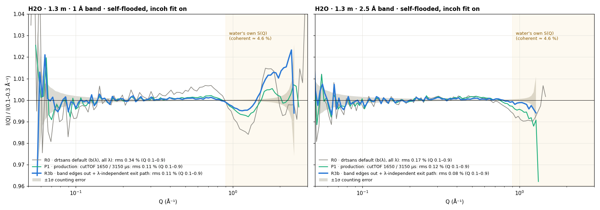

---

## 1. Why a self-flood can only be flat on average

The flood is one number per pixel: the flux-weighted sum over λ of the water's own counts.
Dividing by it removes everything that factorises as **(pixel) × (λ)**. So, at every pixel,
the flux-weighted average over λ of the self-flooded water is exactly flat.

What survives is the **non-separable part**: an angular shape that differs between
wavelengths. This is exactly what you see as "each slice has a slope". A slope common to all
slices would have been divided out by the flood, so the slices must tilt in different
directions: short λ one way, long λ the other. Their average is flat, but the combined I(Q)
is not an average over all λ at every Q. At the highest Q only the shortest λ contribute,
so their tilt shows.

The non-separable part can be measured without any flood:
Δ(pixel, λ) = r / (λ-median of r at that pixel), with r = P / P(2θ 3–6°) per λ. Any
per-pixel factor, i.e. any flood, cancels in Δ (`diag_w4.py`).

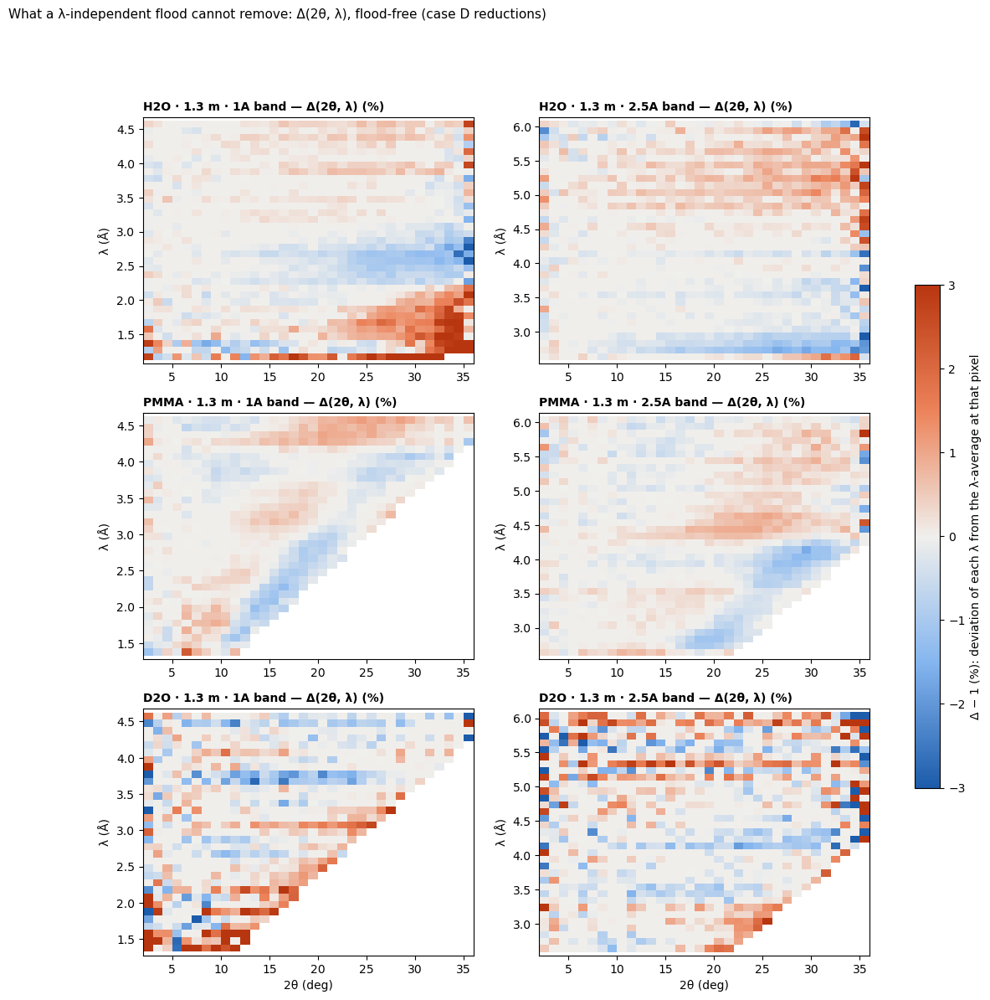

How to read the maps:
- **Diagonals are lines of constant Q** (λ ∝ sin θ), so they are the sample's own structure.
  PMMA's map is almost all diagonals (its ~1 Å⁻¹ structure). So is most of H2O's 1 Å map: red
  at Q > 1.6 Å⁻¹ and blue at 1.1–1.5 Å⁻¹.
- **Horizontal bands are λ-effects:** in H2O at 2.5 Å, red at 4.8–5.5 Å growing with angle,
  and blue at the 2.7 Å band edge.

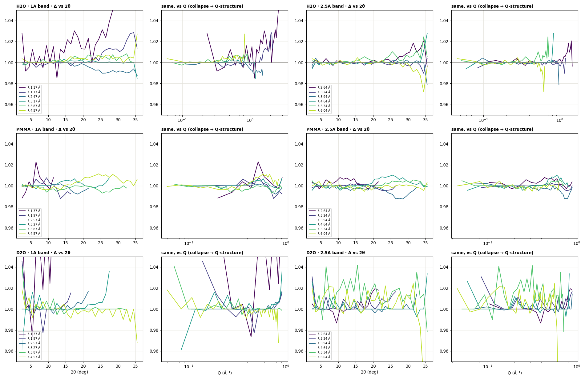

## 2. Hypotheses and verdicts

| | hypothesis | prediction | test | verdict |
|---|---|---|---|---|
| H1 | detector efficiency vs angle and λ (tube layers, oblique incidence) | same for every sample; strongest at short λ; direction-dependent | Δ by layer/direction; 3He shadowing model fitted (`model_w4.py`) | **exists per pixel, not the cause in I(Q)** (§6) |
| H2 | water's inelastic scattering: exit neutrons faster than incident | an angle × λ error in the θ correction, only for inelastic samples | fixed-Q test, exit-path scan (§5) | **confirmed** |
| H3 | self-absorption / multiple-scattering model | scales with (1 − T) | part of H2's test | covered by H2 |
| H4 | water's own S(Q) (coherent ≈ 4.6 %) | depends on Q, not angle; same in both bands | both bands overlaid (§7) | **confirmed, above ~0.9 Å⁻¹** |
| H5 | count-rate dead time | depends on rate (H2O ≫ banjo) and the flux peak | not tested | not needed: the rest is at the statistical level |
| H6 | the b(λ) fit (additive, band-edge reference) | amplifies each slice by c(λ)/c_ref | drtsans's before/after profiles (§3) | **confirmed, exactly** |

Everything was checked through **drtsans's own code**. `tail_w4.py` reloads a reduction's
`_processed.nxs`, applies a per-pixel × per-λ correction, and calls drtsans's
`convert_to_q` → `split_by_frame` → `bin_i_with_correction` (binning, b(λ) or k(λ), and the
combination), with the reduction's own parameters. With no correction it reproduces the
original `_Iq.dat` **bit for bit** (max relative difference 0.0).

## 3. Test 1 — the b(λ) fit amplifies each slice's shape (H6)

drtsans's b(λ) (`calculate_b_factors`) works like this:
- the reference is the shortest λ, or with `selectMinIncoh` the slice with the smallest b;
- every slice is shifted down by b(λ) = its mean excess over that reference.

A constant shift keeps each slice's *absolute* deviation, so its *relative* deviation grows by
c(λ)/c_ref. The reference is the band-edge slice (level 1.55 against up to 3.15 in the 2.5 Å
band; 0.86 against 2.90 in the 1 Å band).

| band | largest gain c(λ)/c_ref | rms slice deviation before → after b(λ) | after = before × c/c_ref |
|---|---|---|---|
| 1 Å | 3.39 | 1.03 % → **2.54 %** | correlation 0.999, slope 0.96 |
| 2.5 Å | 2.03 | 0.53 % → **0.89 %** | correlation 1.000, slope 1.00 |

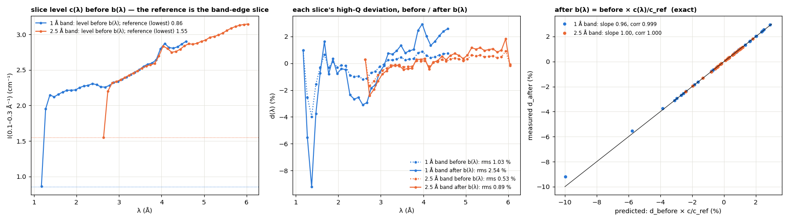

The same mechanism sets the absolute level after the fit to that of the band-edge slice, which
is why the incoh-on plateau differed between configurations (Water 3 §5).

## 4. Test 2 — the band-edge slices

The fixed-Q test (§5 figure) shows the first 2–3 bins of the 1 Å band and the last 3 of the
2.5 Å band deviating by 1–2 % in shape, besides their factor-2 level offset.

Dropping 3 bins (0.3 Å) at each end has two effects:
- **The b(λ) reference becomes a normal slice.** With the edges out, b(λ) and a
  multiplicative k(λ) give the same result (R3 vs R3b in §8).
- **The spurious high-Q end goes away.**

In production this is the TOF edge cut. The present `cutTOFmin` 500 / `cutTOFmax` 2000 µs is
too small at 1.3 m. **1650 / 3150 µs** (≈ +0.3 Å at each end) was tested in a normal drtsans
reduction (P1, §8).

## 5. Test 3 — the θ-dependent transmission correction's exit path (H2)

drtsans divides every sample by A = T(λ)^((1 + sec 2θ)/2), using the transmission of the
**incident** wavelength for the path out of the sample as well. Water scatters strongly and
inelastically: cold neutrons are mostly *heated*, so the scattered neutrons are faster and
are attenuated less on the way out than T(λ) implies. The exit-path loss is therefore
over-corrected, more at longer λ (lower T) and at larger angle. That produces a fan: long-λ
slices tilt up, short-λ slices down.

**The fixed-Q test** (`fixq_w4.py`) takes, for each λ, the ratio I(Q 0.6–0.9) / I(Q 0.2–0.35).
Both windows are at fixed Q, so the sample's S(Q) cancels identically. Only the angle of the
windows changes with λ, and any λ-trend is an angle × λ artifact. The exit path's
λ-dependence was scanned: T_out = T(λ)^γ · T_ref^(1−γ), with γ = 1 drtsans and γ = 0
λ-independent.

| H2O, fixed-Q λ-trend | γ = 1 (drtsans) | γ = 0.5 | γ = 0 |
|---|---|---|---|
| 2.5 Å band | +0.33 %/Å | +0.15 %/Å | **−0.03 %/Å** |
| 1 Å band | +0.33 %/Å | +0.24 %/Å | +0.15 %/Å |

- **The 2.5 Å band's trend is removed completely; the 1 Å band's is halved.** The 1 Å
  remainder is dominated by the band-edge slices.
- **D2O (T = 0.93) is unchanged by γ,** as expected, because its correction is small.
- **A single constant exit transmission is exactly equivalent to γ = 0.** Its angular shape is
  λ-independent, so a self-flood removes it. Only the λ-dependence can be tested, and it
  should be about zero for water.

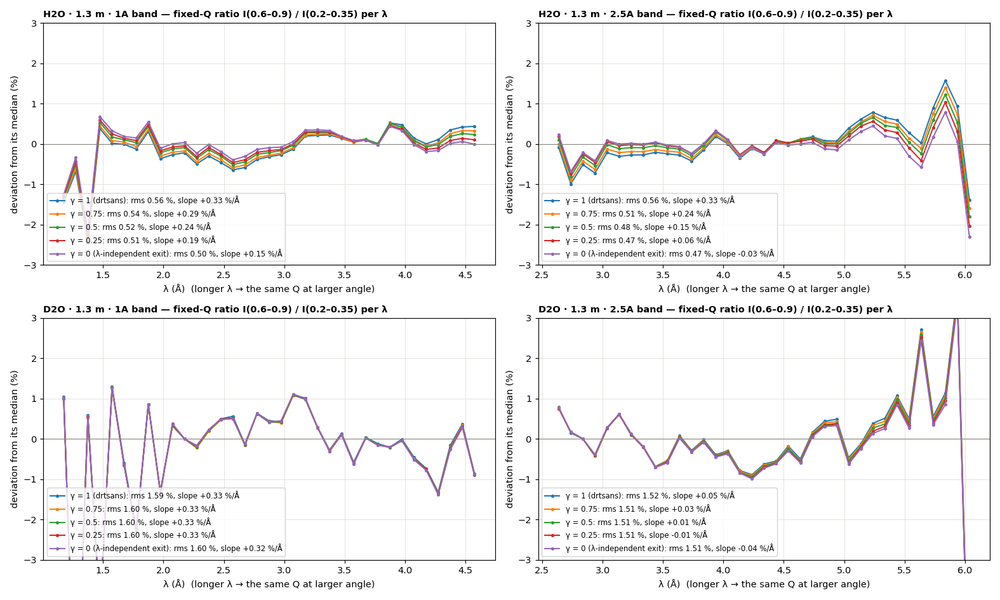

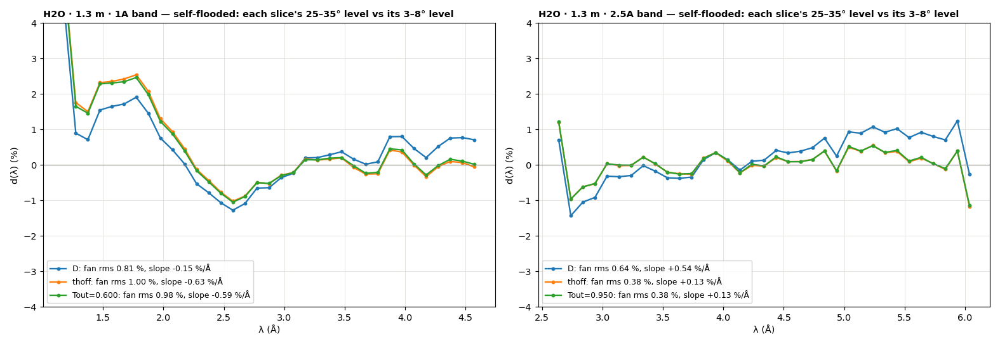

## 6. Test 4 — detector efficiency by tube layer and angle (H1)

The detector has two tube layers per 8-pack:
- **Front layer:** tubes at 11.0 mm pitch.
- **Back layer:** 8.2 mm further from the sample and shifted half a pitch, behind the front
  layer's gaps (from the reduction geometry).

A back tube sees most of the beam *through* the front tubes, so its efficiency relative to the
front layer depends on λ (Water 3 §8: ±1.5 % between the 1 Å and 2.5 Å floods). Δ confirms it
per pixel. At 25°, H2O's back-layer pixels read +5 % (2.64 Å) and +12 % (1.17 Å) relative to
their λ-average, against −2.4 to −2.7 % for the front layer.

But a physical model (`model_w4.py`: 3He absorption ∝ λ, the real tube positions, chords
lengthened by the vertical angle, shadowing by the front tubes; tube radius R and pressure P
fitted to the back/front and vertical/horizontal contrasts) **did not describe it**. The best
fits sit at the edge of the grid (R = 3.5 mm, P = 2–4 atm), and at 2.5 Å it fits worse than no
model at all. The effect is real but not yet understood.

**It does not matter for I(Q):** every Q ring averages both layers equally, and the final
H2O curves are at the counting-statistics level without it. It would matter for 2D,
sector or per-pixel work.

## 7. What is left above ~0.9 Å⁻¹ is water's own S(Q) (H4)

Water's scattering is about 95 % incoherent, but about 4.6 % is coherent: 7.7 b of 168 b per
molecule. That coherent part has H2O's intermolecular structure, peaking near 2 Å⁻¹; D2O,
mostly coherent, shows the same peak very strongly.

With the fixes, the 1 Å and 2.5 Å bands show the **same −0.4 % dip at Q 1.0–1.3 Å⁻¹**. The
1 Å band sees it at about 12–20° and the 2.5 Å band at about 25–35°. Same Q, different angles,
same deviation: it is the sample. The 1 Å band then rises +1–2 % toward the 2 Å⁻¹ peak. This
is physics, and a reduction should keep it.

(The self-flood itself absorbs part of that structure at the high-angle pixels. Any water
flood at 1.3 m carries water's S(Q) at the ±1 % level beyond about 25°.)

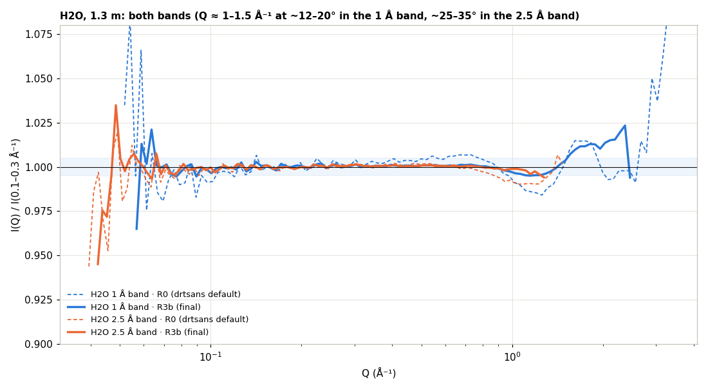

## 8. Results — recipes through drtsans's own binning

All are self-flooded H2O (and D2O with the same H2O flood), incoh fit on unless stated.
"Edges out" means 3 λ bins removed at each end (`tail_w4.py --crop 3`); P1 uses the drtsans
TOF cuts instead.

| recipe | H2O 1 Å: Q 0.1–0.9 max / rms / χ²/bin | H2O 2.5 Å: max / rms / χ²/bin | H2O plateau 1 Å / 2.5 Å (cm⁻¹) | H2O slice spread 1 Å / 2.5 Å |
|---|---|---|---|---|
| R0 drtsans default | 0.83 / 0.34 % / 24 | 0.53 / 0.17 % / 12 | 0.86 / 1.55 | 0.82 / 0.43 % |
| R1 multiplicative k(λ) instead of b(λ) | — / 0.15 % (Q 0.07–0.9) | — / 0.12 % | 0.86 / 1.55 | — |
| R5 edges out, b(λ) | 0.41 / 0.13 % / 10 | 0.34 / 0.11 % / 8.7 | 2.15 / 2.36 | — |
| **P1 production: cutTOF 1650 / 3150 µs** | **0.33 / 0.11 % / 9.2** | **0.41 / 0.12 % / 9.2** | 2.08 / 2.34 | 0.34 / 0.26 % |
| **R3b edges out + γ = 0, b(λ)** | **0.36 / 0.11 % / 4.3** | **0.31 / 0.08 % / 2.3** | 2.25 / 2.46 | **0.31 / 0.21 %** |
| R3 edges out + γ = 0, k(λ) from H2O | 0.48 / 0.14 % (Q 0.07–0.9) | 0.39 / 0.10 % | 2.25 / 2.46 | — |

The per-bin counting error is 0.05 %. R3b is within 1.5–2 × of it.

**Independent test — D2O** (reduced with the H2O flood; not self-referential):

| recipe | D2O slice spread 1 Å / 2.5 Å | D2O I(1.0)/plateau, 1 Å vs 2.5 Å band | D2O plateau 1 Å / 2.5 Å (cm⁻¹) |
|---|---|---|---|
| R0 default | 3.55 / 1.50 % | 1.134 vs 1.071 (bands differ 6 %) | 0.067 / 0.117 |
| P1 production | 1.52 / 0.91 % | 1.057 vs 1.055 | 0.164 / 0.180 |
| R3b | 1.47 / 0.95 % | **1.054 vs 1.051** | 0.165 / 0.184 |

With the fixes, the two bands' D2O agree to 0.3 % at 1 Å⁻¹, where they differed by 6 %.

P1 alone leaves the exit-path effect at high Q: in the 2.5 Å band its I(Q) dips to about −1 % above 1 Å⁻¹, where only the short-λ slices contribute. R3b does not (headline figure).

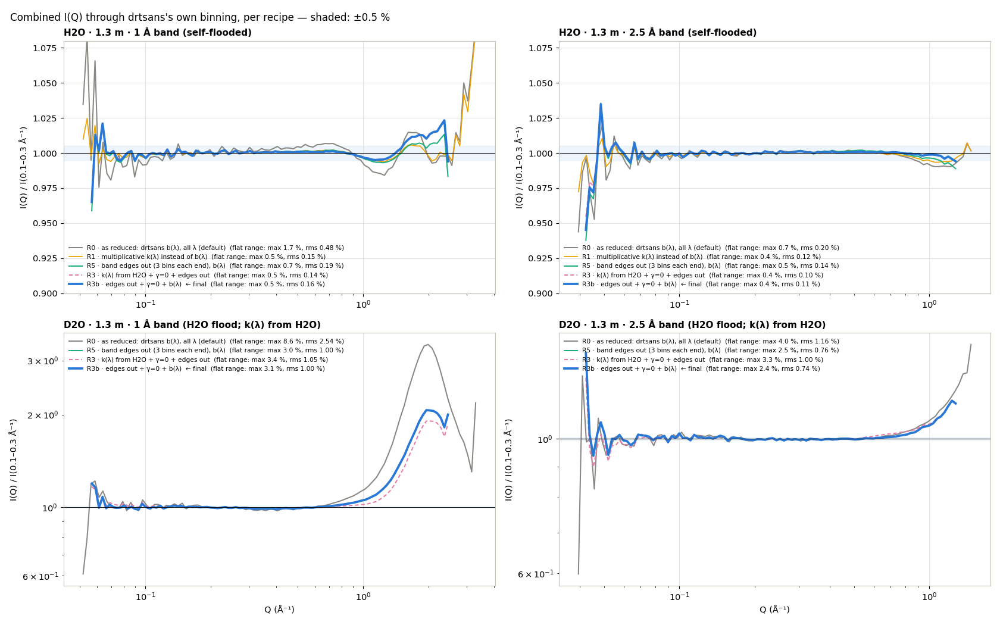

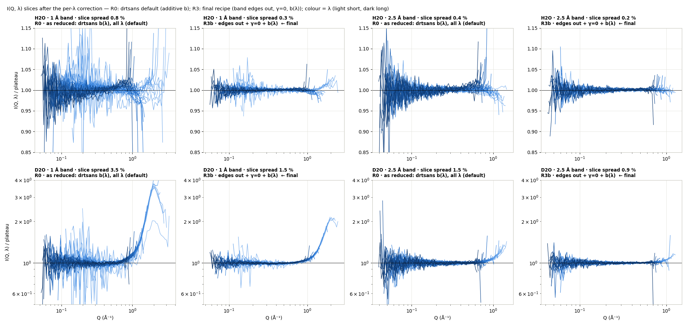

**Why the final recipe keeps drtsans's additive b(λ) rather than a multiplicative k(λ).**
Normalising each slice by water's k(λ) (drtsans's elastic-reference normalisation, with H2O
as the reference) flattens H2O just as well. But applied to D2O, the slices **do not align**:
the short-λ slices sit 5–10 % low. Water's λ-dependence is *water's own*: its apparent
cross-section grows with λ because of inelastic scattering. It is not an instrument
normalisation, so it must not be transferred to other samples. With the band edges out, the
b(λ) fit no longer does harm.

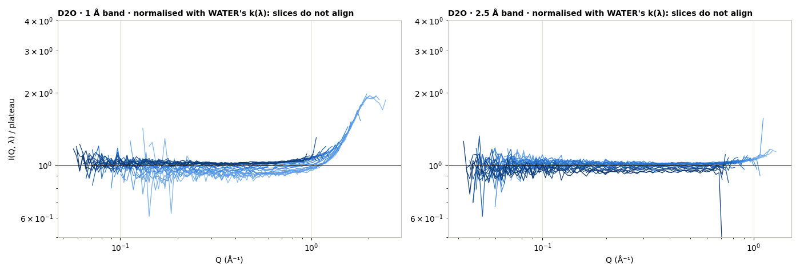

## 9. What to change

- **Now, configuration only:**
  - Widen the TOF edge cuts at 1.3 m (**`cutTOFmin` 1650, `cutTOFmax` 3150 µs** tested here;
    check other configurations).
  - Subtract the blocked beam in both the flood and the reduction (Water 3 §9).

  Self-flooded H2O goes from 0.34 / 0.17 % rms to 0.11 / 0.12 % rms, the D2O slice spread
  halves, and the incoh-fit absolute level is no longer set by a band-edge slice.
- **Flood band: see §12.** At 1.3 m, prefer a long-λ band (6 Å) for the water flood, so
  water's structure factor stays out of it. The blocked beam must match each run's band.
- **Not recommended as a correction:** changing the θ correction's exit path. The outgoing
  energy of a general sample can't be predicted, so it would be speculation; §5 only shows
  that an angle × λ effect of this kind exists for water.
- **drtsans, to raise with the developers:**
  - **`selectMinIncoh`:** the minimum-b slice is almost always the band edge. A reference
    chosen away from the edges (or excluding them) avoids the amplification even when the TOF
    cuts are left at their defaults.
- **Not a problem for I(Q):** tube-layer (front/back) efficiency; the flood's λ-independence
  along each tube.
- **Physics, keep it:** water's S(Q) above about 0.9 Å⁻¹ (±1–2 %).

**Provenance.** 2026-09-25, drtsans `1.34.0`, `2026B_mp/reduction/water3/`:
- **Reductions:**
  - `reduce_w3.py` gained `--samples=` and `--cuttof=`.
  - PMMA at 1.3 m, case D (`reduce_w3.py waterbsbb[1A] <cfg> --bb --samples=PMMA`).
  - P1: `reduce_w3.py waterbsbb[1A] <cfg> --bb --samples=H2O,D2O --cuttof=1650,3150` →
    `reduced_*_bb_cut1650-3150_incoh*`.
- **`water4/` scripts:**
  - `tail_w4.py`: drtsans's post-processing tail, bit-exact.
  - `diag_w4.py`: Δ maps and cuts.
  - `model_w4.py`: detector model and fit (`w4_model.json`, `logs/model_fit.log`).
  - `amp_w4.py`: b(λ) amplification.
  - `fan_w4.py`, `fixq_w4.py`: the θ-correction exit path.
  - `build_corr_w4.py`, `run_tail_w4.sh`, `run_tail_w4b.sh`: recipes R0–R5 in `out/`.
  - `final_w4.py`, `hero_w4.py`: figures, `w4_final.json`, `w4_flatness.json`,
    `w4_production.json`.

---

## 10. Part 2 — fixes 1 + 2 only: single-λ slices, back tubes, and the valley near 1 Å⁻¹ (2026-09-25)

Only fixes 1 and 2 are applied here, **consistently in the flood and the reduction**:
- the band edges are cut (`cutTOFmin` 1650 / `cutTOFmax` 3150 µs), so the b(λ) reference is a
  normal slice;
- the blocked beam is subtracted;
- drtsans's θ-dependent transmission correction is used **unchanged** (no exit-path
  assumption).

New floods `Sensitivity_H2Obsbbcut_1o3m[_1A]_*` were built from H2O reduced with the same
cuts. **Back tubes are not masked in the floods** (all 44 928 pixels valid).

The data reductions (H2O, D2O, incoh fit on) come in four variants: own-band or other-band
flood, each with and without back tubes masked in the reduction (`useMaskBackTubes`). That is
32 reductions.

> **Back tubes:** none of the earlier Water 1–4 reductions masked them (`useMaskBackTubes =
> False` in all 252). Here masking is tested **in the data reduction only**.

**Single-λ slices** are the clearest view. Each panel is one λ bin: I(Q, λ) before b(λ),
divided by its own plateau. If every slice were flat, the reduction would be perfect.

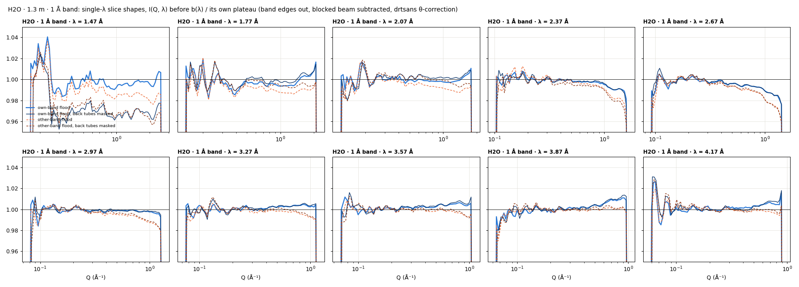

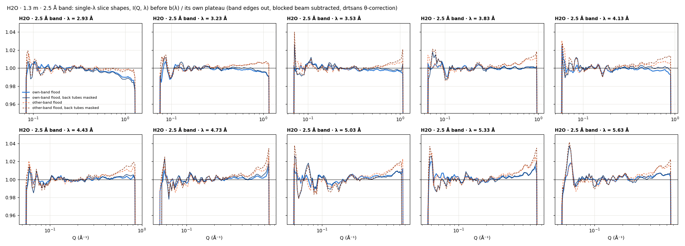

With the own-band flood (solid blue):
- **Mid-λ slices droop** at their high-Q end, i.e. their largest angles (~25–35°): by 1–2 % at
  λ 2.4–3.0 Å in the 1 Å band.
- **Long-λ slices rise** by 0.5–1 % there.
- **The shortest slices are roughly flat.**

**The combined curve's dip at Q 1.0–1.3 Å⁻¹ is made of those drooping mid-λ slices,** not of
water's S(Q). It is over-compensation at high angle, as suspected: water should be flat there,
then rise smoothly toward its ~2 Å⁻¹ peak.

**Where it lies: constant angle, not constant Q.** In the (Q, λ) maps a feature of the
sample's S(Q) is vertical (fixed Q), and a per-pixel feature follows the dotted constant-2θ
curves. The H2O deviations follow the constant-angle curves.

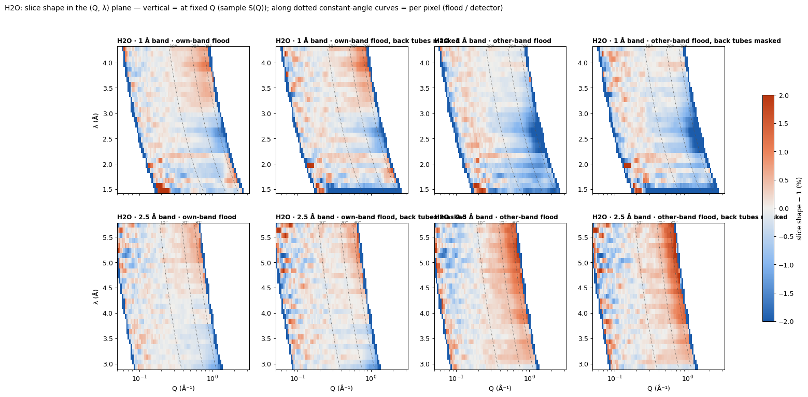

Combined I(Q) (drtsans, incoh fit on):

| H2O | Q 0.1–0.9 max / rms | χ²/bin | I(0.8) | I(1.0) | I(1.2) | I(1.5) | I(2.0) |
|---|---|---|---|---|---|---|---|
| 1 Å band, own-band flood | 0.33 / 0.13 % | 14 | 1.001 | 0.997 | **0.994** | 1.000 | 1.003 |
| 1 Å band, own-band, back tubes masked | 0.35 / 0.14 % | 15 | 1.003 | 0.997 | 0.994 | 1.000 | 1.002 |
| 1 Å band, **2.5 Å-band flood** | 0.89 / 0.24 % | 136 | 0.993 | 0.986 | **0.982** | 0.987 | 0.988 |
| 1 Å band, 2.5 Å-band flood, back tubes masked | 0.80 / 0.21 % | 52 | 0.995 | 0.987 | 0.983 | 0.988 | 0.988 |
| 2.5 Å band, own-band flood | 0.42 / 0.13 % | 11 | 0.998 | 0.994 | 0.988 | – | – |
| 2.5 Å band, own-band, back tubes masked | 0.35 / 0.13 % | 6.5 | 0.999 | 0.994 | 0.987 | – | – |
| 2.5 Å band, 1 Å-band flood | 0.74 / 0.33 % | 197 | 1.006 | 1.004 | 1.001 | – | – |

- **Back-tube masking is not the fix.** It changes the combined curve by ≤ 0.1 %, and the
  slices become *less* consistent across λ, because it removes half the counts. The spread
  over λ at Q 0.8–1.2 grows 2.2 → 5.4 % (1 Å) and 1.5 → 1.8 % (2.5 Å).
- **The flood's band makes a ~1 % difference at high angle with these two bands.** In the
  combined I(Q), the 2.5 Å water flood on 1 Å data gives −1.8 % at 1.2 Å⁻¹ and keeps the
  high-Q end about 1.2 % low. That is the flood's band-dependent high-angle response (Water 3
  §8). With only the 1 Å and 2.5 Å floods, the detector's band dependence can't be separated
  from water structure in the flood. A 6 Å-band flood would keep water's structure out
  (§12); whether its band difference matters is still to be measured.

**Your point 4: does the water flood absorb water's own S(Q)?** A flood made from a scatterer
that is not flat carries its I(Q) at every pixel. The standard remedy assumes nothing about
energy transfer, only that the sample scatters as a function of Q. Divide the sample's own
shape out: F = X · Σ_λ φ · P / S(Q). S(Q) is estimated from the data themselves and iterated to
self-consistency (`leak_w4.py`; converged, flood change < 0.02 %).

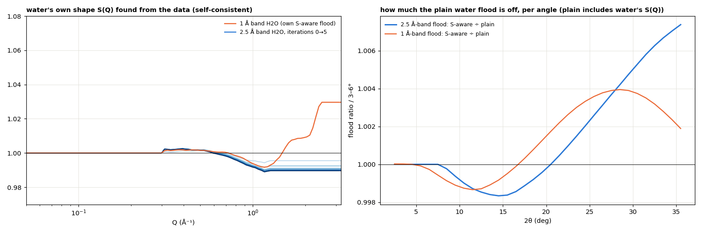

- **The effect is small:** the 2.5 Å flood changes by at most 0.7 % at 35°, the 1 Å flood by
  at most 0.4 %.
- **It goes the wrong way:** the S-aware flood is *higher* at large angle, which would push
  the samples further *down* there.

So flood leakage of water's S(Q) is **not** what makes the valley.

**Is the remaining angle × λ "fan" the detector or the sample?** Take away everything that
depends on Q only (each slice ÷ the median over λ at the same Q). What is left, F(Q, λ) − 1, is
the pure angle × λ part. It can be compared between samples at the same (Q, λ), and so at the
same pixels, flood and detector (`fanshare_w4.py`).

| other sample vs H2O | k (1 = same fan) | correlation |
|---|---|---|
| PMMA (solid, T ≈ 0.63), 1 Å / 2.5 Å band | −0.13 / −0.06 | −0.18 / −0.06 |
| D2O (liquid, T ≈ 0.93), 1 Å / 2.5 Å band | 0.92 / 0.68 | 0.17 / 0.22 (noisy) |

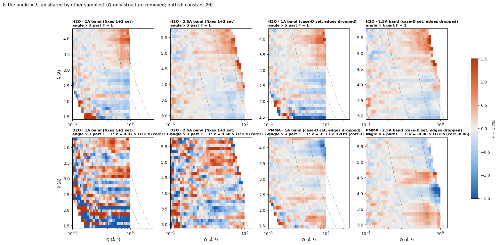

**PMMA does not share H2O's fan;** its own pattern is roughly the opposite. A detector or
flood effect would be the same for every sample at the same pixels and λ, so **the fan
belongs to the sample, liquid water**. D2O, also liquid water, leans the same way, but its
weak signal makes that uncertain.

That points to water's inelastic scattering. The neutrons that reach the detector do not have
the incident energy, and their detection efficiency and path attenuation differ from what the
reduction assumes. As noted, that cannot be quantified for a general sample without knowing the
energy transfer, so it is **not corrected** here.

**Summary of part 2.**
- **Recommended:** fixes 1 and 2 (TOF edge cuts in flood and reduction; blocked beam in both),
  with the **own-band** flood. Self-flooded H2O is flat to 0.13 % rms (Q 0.1–0.9), dips
  −0.6 % (1 Å band) / −1.2 % (2.5 Å band) at Q 1.2 Å⁻¹, and rises smoothly to +0.3 % at 2 Å⁻¹
  (1 Å band).
- **Not the cause:** back tubes (masking doesn't help), and flood leakage of water's S(Q)
  (≤ 0.7 %, opposite sign).
- **The cause of the remaining valley:** an angle × λ fan of the individual slices, specific
  to liquid water (not shared by PMMA), i.e. sample-side inelastic effects. A λ-independent
  flood cannot remove it, and correcting it would need the sample's energy transfer.
- **Flood band:** ~1 % effect at high angle between the 1 Å and 2.5 Å floods. A long-λ
  (6 Å) flood is preferred for 1.3 m and still to be tested (§12).

**Provenance (§10).** 2026-09-25, drtsans `1.34.0`, `2026B_mp/reduction/water3/`:
- **Floods:** `reduce_w3.py pmma <cfg> --bb --cuttof=1650,3150 --only=H2O:off` →
  `make_water_bs_floods.py --bb --cut` → `floods/Sensitivity_H2Obsbbcut_*`.
- **Reductions:** `reduce_w3.py waterbsbbcut[1A] <cfg> --bb --cuttof=1650,3150 [--maskback]
  --samples=H2O,D2O` (new option `--maskback`, data reduction only). Output:
  `reduced_waterbsbbcut*_bb_cut1650-3150[_mb]_incoh*`.
- **Analysis in `water4/`:**
  - `slices_w4.py` → `w4b_slices_*.png`, `w4b_maps_*.png`, `w4b_slices.json`;
  - `leak_w4.py` → `w4b_leak.png/.json`;
  - `fanshare_w4.py` → `w4b_fanshare.png/.json`;
  - combined metrics → `w4b_combined.json`.

---

## 11. Tube ends: vertical positions, and masking more of the ends (2026-09-25)

**Why the tube ends.** Along a 3He tube the vertical position comes from charge division. It
can be non-linear or drift, especially near the ends of the tube. Horizontal positions are
the tubes' physical positions and cannot drift. The earlier "high-angle" problem at 1.3 m
sits where the tube ends are (±45–53 cm, 2θ ≈ 22–26° at the central tubes). Rows 0–10 and
245–255 are masked today.

Everything in this section is judged on **individual I(Q, λ) slices only**. The combined I(Q)
can create shapes that no single slice has. The fixes 1 + 2 set is used (own-band floods
`H2Obsbbcut`, `cutTOFmin` / `cutTOFmax` 1650 / 3150 µs, blocked beam in flood and reduction).
**Extra rows are masked in the data reduction only** (drtsans-style detector masking in the
tail); the flood is unchanged.

**1. AgBe says the vertical positions are off near the tube ends** (`agbe_pos_w4.py`). The
AgBe peaks are fitted in assigned Q in two ways:
- per group of 8 rows along the central tubes (radius ≈ |y|);
- per group of 8 tubes along the central rows (radius ≈ |x|).

At 4 m, 2.5 m and 1.3 m alike, the vertical error grows toward both ends of the tubes, to about
**4–6 mm (≈ 1–1.4 pixels) at ±450–520 mm**, relative to about 1–2 mm at ±250 mm. It is the same
in millimetres at every distance, so it is a property of the tubes, not of the geometry (a tilt
or distance error would scale with 1/L). Horizontally, the error varies smoothly by 1–2 mm
(beam centre / scale).

**2. The tube ends also respond differently with λ** (`tubeend_w4.py`, `rowend_w4.py`). A
position error alone would not change a flat sample's intensity. So the flood-free
λ-dependence Δ was compared between pixels at the **same scattering angle**:
- tube-end pixels in the central tubes;
- pixels in the middle of the tubes (central rows, far tubes).

| H2O, same 2θ | tube ends, Δ rms over λ | tube middle, Δ rms over λ |
|---|---|---|
| 1 Å band, \|y\| 30–40 cm (2θ 16–20°) | 0.24 % | 0.18 % |
| 1 Å band, \|y\| 40–47 cm (21–23°) | 0.43 % | 0.26 % |
| 1 Å band, **\|y\| 47–53 cm (24–26°)** | **1.73 %** | 0.29 % |
| 2.5 Å band, **\|y\| 47–53 cm** | **0.90 %** | 0.24 % |

In the structure-free end/middle ratio, D2O rises too toward the ends: 0.8 → 1.0 → 1.7 %
(2.5 Å band) and 1.4 → 1.5 → 2.6 % (1 Å band). So it is the detector, not water.

Row by row, H2O's anomaly lies within **~15–18 pixels (7–8 cm) of the tube end**. In the 1 Å
band the bottom end stays mildly elevated to about 30 pixels. D2O is too noisy at this
row-by-row level.

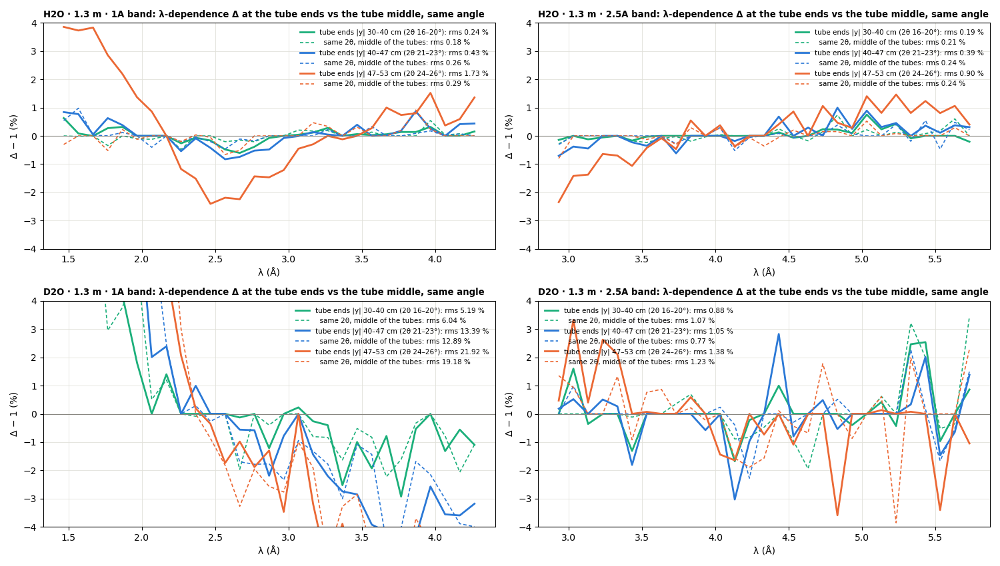

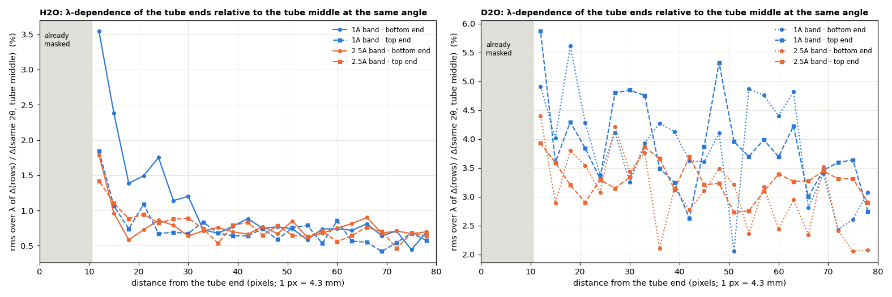

**3. Masking 8 more rows at each end (19 pixels in total) removes most of it.** Each slice's
shape, relative to its own plateau (`tb_w4.py`):

| H2O, per slice | +0 rows (today) | +8 rows | +16 rows | +32 rows |
|---|---|---|---|---|
| 2.5 Å band: slice-end rms | 0.49 % | **0.31 %** | 0.29 % | 0.25 % |
| 2.5 Å band: slice flatness (Q > 0.3) | 0.40 % | **0.26 %** | 0.22 % | 0.21 % |
| 1 Å band: slice-end rms | 0.69 % | 0.69 % | 0.79 % | 0.81 % |
| 1 Å band: slice flatness (Q > 0.3) | 0.50 % | **0.39 %** | 0.35 % | 0.39 % |

- **In the 2.5 Å band** the mid-λ droop (λ 3.0–3.6 Å, −1.1 % at 30–35°) halves to −0.5 to
  −0.7 %. The long-λ rise (5.1–5.4 Å, +1–1.5 %) shrinks to +0.3–0.5 %.
- **In the 1 Å band** the mid-λ droop (λ 2.5–2.8 Å) also halves. What is left sits at the
  extreme corners (> 32°), where few pixels remain.
- **More than +8–16 rows gains little** and costs the corners.
- **The slice-to-slice agreement is unchanged** (H2O 0.23–0.33 %, D2O 0.9–1.4 %). The
  masking fixes each slice's *shape* at large angle, not the λ-to-λ levels.

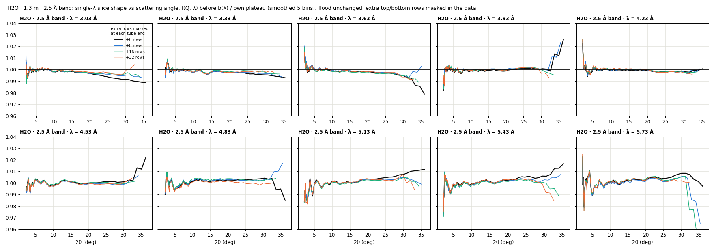

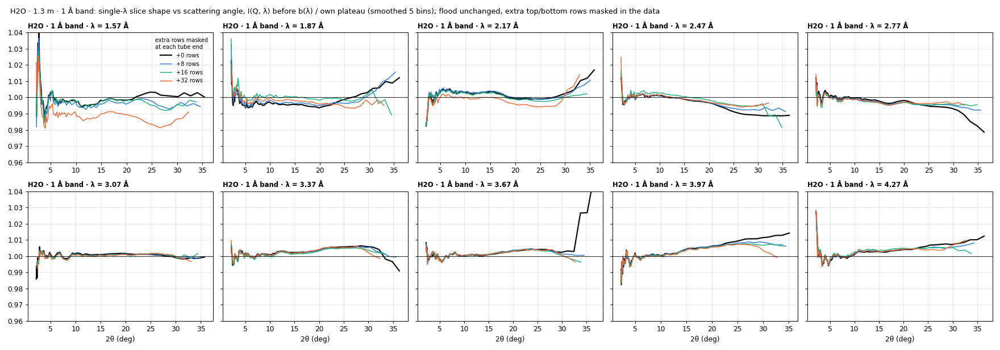

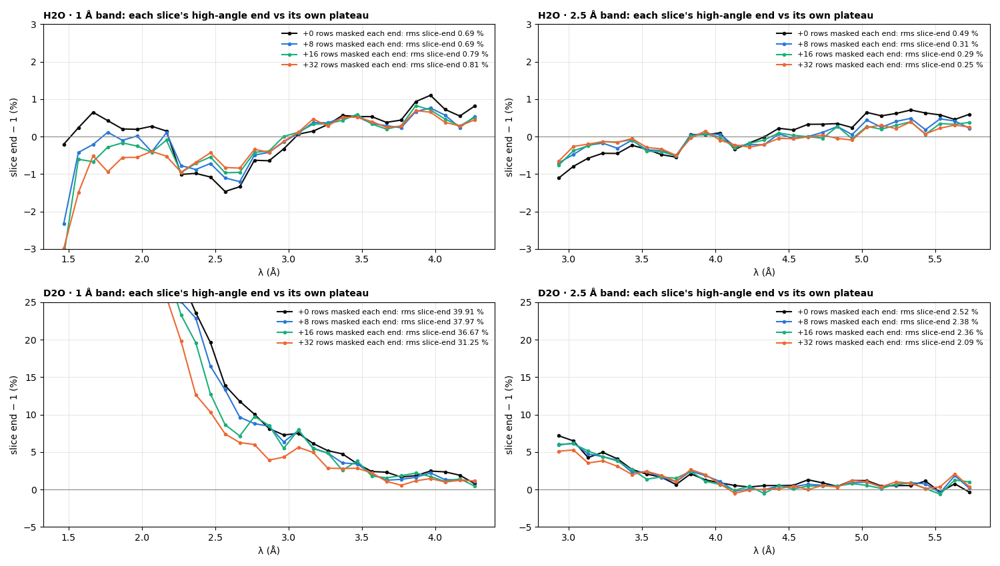

(An earlier version of this test set the masked pixels to NaN. drtsans then drops every Q bin
that contains one, which cut each slice at about 21° and looked like a big improvement. The
numbers above use proper detector masking, and the unmasked baseline reproduces drtsans
exactly.)

**So what should the water sensitivity be?** Everything tested points to this recipe:
1. **H2O 1 mm in the banjo, with the banjo cell AND the blocked beam subtracted.** Built from
   a reduction, `make_water_bs_floods.py --bb --cut`; the plain preparer keeps the quartz cell
   in the flood.
2. **Solid angle with the reduction geometry, and the θ-dependent (self-absorption)
   correction.** Both come with the water's own reduction.
3. **Wider TOF cuts**, `cutTOFmin` 1650 / `cutTOFmax` 3150 µs at 1.3 m, in the flood and in
   the data.
4. **A long-λ band for the flood at 1.3 m (6 Å, to be measured).** A 1 Å-band water flood
   reaches Q ≈ 2–3 Å⁻¹ at large angles, where water's structure factor comes in. A 6 Å flood
   stays below about 0.65 Å⁻¹ on the whole detector (§12).
5. **The tube ends masked in the data reduction:** about 19 pixels from each end (rows 0–18
   and 237–255) instead of 11. The flood's end pixels then do not matter.
6. **The blocked beam subtracted in the data reduction too**, measured **in the same band as
   each run** (flood and samples). The 1 Å-band blocked beam is ~30 % higher than the 2.5 Å one
   (22 000 vs 17 000 counts/s).

**Still open:**
- **Tested only on water and D2O at 1.3 m.** It should be validated on AgBe / PMMA and at
  2.5 m and 4 m (the tube-end position error is there at every distance).
- **Water's own angle × λ behaviour stays in the flood, averaged over the band.** PMMA does not
  share it (§10); expect ≤ ±0.5 % at the largest angles for non-water samples.
- **The 1 Å band's bottom tube ends** may want ~30 pixels.
- **The production flood (`prepare_sensitivity.py`) has no banjo or blocked-beam subtraction.**
  Building this water flood routinely would need that step added, or the reduction-based
  build used as here.

**Provenance (§11).** 2026-09-25, drtsans `1.34.0`, `2026B_mp/reduction/water3/water4/`:
- `tail_w4.py` now masks pixels (`MaskDetectors`) whose correction is NaN at every λ.
- `run_tail_tb.sh` → `out_tb/tb{0,8,16,32}/` (the tb0 baseline is checked bit-exact against
  drtsans).
- `tb_w4.py` → `w4c_tb_*.png`, `w4c_tb.json`; slice-to-slice spreads → `w4c_tb_spread.json`.
- `agbe_pos_w4.py` → `w4c_agbe_pos.png/.json` (AgBe from `reduced_waterbs_incohoff/`).
- `tubeend_w4.py` → `w4c_tubeend.png/.json`; `rowend_w4.py` → `w4c_rowend.png/.json`.

---

## 12. Summary — what makes self-flooded water flat, and what to do (2026-09-25)

**Question.** H2O reduced with a flood made from the same H2O should be flat, incoh fit on. Why
were the I(Q, λ) slices not flat? The criterion is **every single-λ slice flat**. The combined
I(Q) is not used to judge it, because averaging over λ can create shapes that no slice has.

**What was wrong, and what fixes it**

| # | finding | evidence | action |
|---|---|---|---|
| 1 | The b(λ) fit (`selectMinIncoh`) takes the **band-edge slice** as reference. It amplifies each slice's shape by up to 2–3.4× and sets the absolute level from that slice. | Exact: after = before × c(λ)/c_ref, correlation 1.000 (§3) | Fixed by 2 |
| 2 | **The band-edge λ bins are bad:** up to 2× in level, ±2 % in shape. | Fixed-Q test, slice levels (§4) | `cutTOFmin` / `cutTOFmax` **1650 / 3150 µs** at 1.3 m (default 500 / 2000), in the flood and the data |
| 3 | **Tube ends:** vertical positions drift by 4–6 mm (≈ 1 pixel) near the ends, and the last ~15–18 pixels respond differently with λ. | AgBe at 4 / 2.5 / 1.3 m; same-angle end-vs-middle Δ: 1.7 / 0.9 % vs 0.3 % (§11) | Mask **~19 pixels at each tube end** in the data (rows 0–18, 237–255; today 0–10, 245–255). This halves the per-slice deviation in the 2.5 Å band. |
| 4 | **Blocked beam:** 1.5 % of the water counts, top-heavy. Not removed by the banjo subtraction. | Water 3 §9 | Subtract it in the flood **and** the data, measured **in each run's band** |
| 5 | **Banjo quartz in a water flood** adds high-Q structure. | Water 3 §1–3 | Build the water flood with the banjo subtracted |
| 6 | A water-specific **angle × λ fan** remains (±0.3–0.5 % at the largest angles). | Not shared by PMMA (§10); fixed-Q trend (§5) | **Not corrected.** It depends on the sample's energy transfer, and assuming it would be speculation. |
| 7 | **Back tubes** | Masking them changes ≤ 0.1 %; slices get noisier (§10) | Keep them |
| 8 | **The flood absorbing water's own S(Q)** | Self-consistent S-aware flood: ≤ 0.7 %, opposite sign (§10) | Not the cause |

**Result (H2O at 1.3 m, own reduction, fixes 2 + 3, drtsans θ correction unchanged):** single-λ
slices are flat to **0.26 % rms (2.5 Å band) and 0.39 % (1 Å band)** over Q > 0.3 Å⁻¹. They
agree with each other to 0.2–0.3 %. What remains is concentrated at the extreme corners
(> 32°) and in the water-specific fan (item 6).

**Recommended water sensitivity (1.3 m):**
1. **Sample:** H2O 1 mm in the banjo. Subtract **the empty banjo and the blocked beam**,
   measured in the flood's band; build the flood from the water's reduction
   (`make_water_bs_floods.py --bb --cut`).
2. **Corrections:** solid angle with the reduction geometry, and the θ-dependent
   (self-absorption) correction with the water's own transmission.
3. **TOF cuts:** 1650 / 3150 µs, in the flood and the data.
4. **Band: long λ (6 Å) for the flood.** At 1.3 m a 1 Å-band water flood reaches Q ≈ 2–3 Å⁻¹ at
   large angles, where water's structure factor comes in. A 6 Å flood stays below about
   0.65 Å⁻¹ everywhere (λ ≥ 6 Å at 2θ ≤ 36°), where water is flat. In our data the 1 Å and
   2.5 Å floods differ by about 1 % at high angle. Whether a 6 Å flood's band difference
   matters for short-λ data has to be measured.
5. **Data reductions:** tube ends masked (~19 pixels), blocked beam in the same band as each
   run, TOF cuts as above.

**Next measurement (proposed, 1.3 m):**
- H2O 1 mm, the empty banjo, their transmissions, and a **blocked beam in the 6 Å band**;
- the blocked beam repeated in every band used;
- AgBe and PMMA for validation.

Then compare the 6 Å and 2.5 Å water floods on single-λ slices of H2O, D2O, AgBe and PMMA at
1 Å and 2.5 Å, and apply the recipe at 2.5 m and 4 m, where the tube-end position error is
also present.

**Not changed:** production floods and settings. The water floods remain in
`2026B_mp/reduction/water3/floods/` (the banjo-subtracted `H2Obs` copies are in `2026B_mp/`
as alternatives).
