# Water 5 — the EQSANS pixel sensitivity depends on wavelength

**Date:** 2026-09-25 · **drtsans:** stable `1.34.0` · **data:** 1.3 m, IPTS-37618 (2026B: H2O,
D2O, PMMA) and IPTS-36254 (2025B: PMMA, vanadium) · **scripts:**
`2026B_mp/reduction/water3/water5/` (`simple_w5.py`, `proof_w5.py`, `result_w5.py`), using the Water 4 tools in
`water3/water4/` (`tail_w4.py`: drtsans's own binning / incoh-fit tail; `run_tail_end.sh`)

> **Update (Water 7, 2026-09-26):** the tube-end part is a **count-rate** effect (most likely pile-up in the charge-division readout), not a pure wavelength effect. In broadband runs it follows the instantaneous count rate over the time frame with one coefficient for both bands, and it vanishes in low-rate monochromatic runs. The front/back-layer and incidence-angle parts are genuine wavelength effects. See the **Water 7** tab.

**Question.** Does the sensitivity of the pixels along a vertical 3He tube change with
wavelength, most of all at high angle? If so, a flood with one value per pixel cannot be
exact.

## The simple picture: one tube set, several wavelengths

Take the same tubes: those within 25 cm of the beam horizontally, about 90 tubes, median over
them. Plot the intensity along the tube (pixel 0 = bottom end, 255 = top end) for 6 wavelength
groups. Each curve is divided by its own level in the tube middle, then by the average of all
wavelengths.

**If the pixel sensitivity did not depend on wavelength, every curve would lie on zero.**

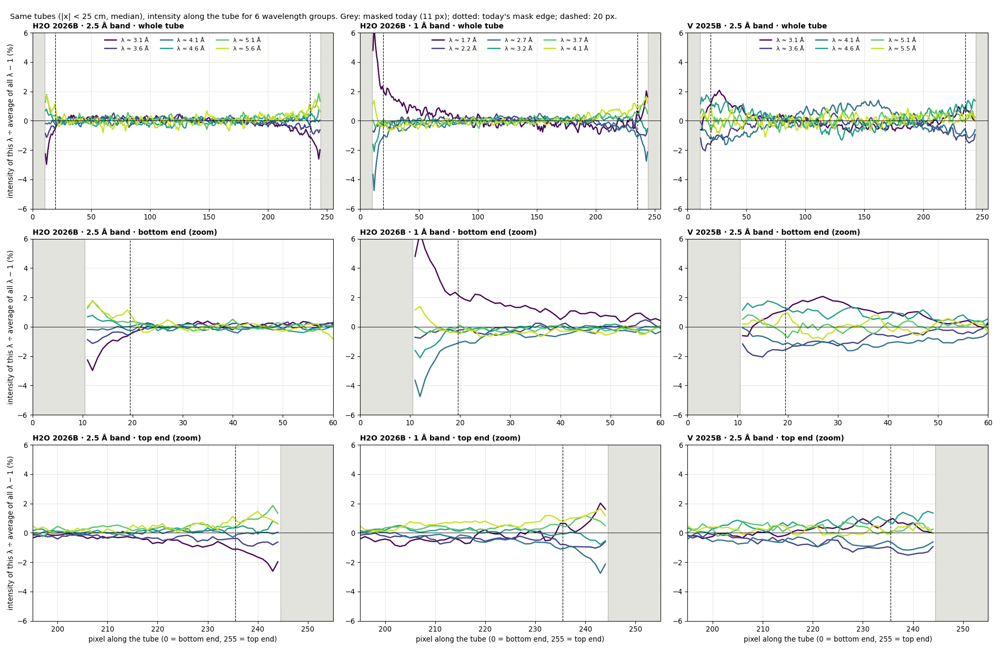

- **In the body of the tube** the curves lie on top of each other within about ±0.3 %.
- **Near both ends they split:**
  - **H2O, 2.5 Å band:** the short-λ curve (≈3.1 Å) drops to −3 % and the long-λ curves rise
    to +1.5 %.
  - **H2O, 1 Å band:** the 2.7 Å group drops to −4.7 % and −2.7 % at the two ends.

  Nothing in the sample can do that: at a given pixel all wavelengths see the same tube,
  angle and flood.

**How many pixels are affected?** The shortest-minus-longest-wavelength curve against distance
from the tube end. The band shows the noise level (±3σ) in the tube middle:

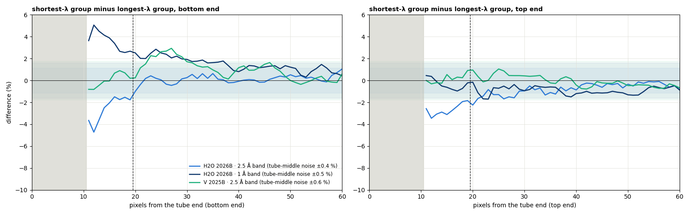

| H2O, 2.5 Å band | difference at 11–12 px from the end | at 18–20 px | back within noise |
|---|---|---|---|
| bottom end | −3.6 to −4.7 % | −1.7 % | **~20–22 pixels** from the end |
| top end | −2.6 to −3.5 % | −2.0 % | **~25–28 pixels** from the end |

- **1 Å band:** the 2.7 Å group shows the same end effect, reaching about 20 pixels.
- **The shortest group (≈1.7 Å) is not a tube effect.** It has a slow +2 % tail at the bottom
  end over 20–40 pixels. At those pixels and that wavelength Q ≈ 1.4–1.7 Å⁻¹, where water's
  structure factor rises.
- **Vanadium (2025B)** is too noisy in this view (±0.6 %) to add much. The detailed
  comparison (§2) shows the same end effect in V and PMMA.

**So:** about 20 pixels are affected at the bottom end of the tubes and about 25 at the top.
Today 11 are masked. A mask of **20 pixels at the bottom and 25 at the top** (or 24 at both
ends as a single number) removes it.

---

**Answer: yes.** Three detector effects, the same in every sample tested:

| # | effect | size | what it does to I(Q) |
|---|---|---|---|
| 1 | **Tube ends** (the last ~20 pixels) | Up to **−5 % at 3 Å and +3 % at 5.5 Å** relative to the tube middle (2.5 Å band); non-linear in the 1 Å band (+5 / −3.6 / +3 % at 1.5 / 2.5 / 4.3 Å); λ-slope +1.2 to +3.2 %/Å at 11–13 px from the end | **Does not cancel.** At 1.3 m the tube ends are the highest vertical angles. |
| 2 | **Front vs back tube layer** (the whole tube) | Front-layer pixels are more λ-sensitive than back-layer pixels by **1.1–1.7 %/Å** (2.5 Å band) and **5.4–5.8 %/Å** (1 Å band) | Cancels in the azimuthal average (every ring holds both layers); **not** in 2D / sector / per-pixel work |
| 3 | **Bottom-to-top gradient in the front layer** | Front-layer λ-slope rises from ~0.1–0.4 %/Å (rows 30–60) to ~0.7–0.8 %/Å (rows 200–230), 2.5 Å band | Cancels in full rings (top and bottom at the same 2θ); not in 2D |

**The data sets:**
- H2O 2026B, 2.5 Å and 1 Å bands;
- PMMA 2026B;
- PMMA and vanadium 2025B, measured a year earlier with a different flood.

A solid, an elastic incoherent scatterer and water, from two cycles, all show the same three
patterns, so they are properties of **the detector**. A λ-independent sensitivity is exact
only where these effects are zero.

**So: yes, EQSANS needs a λ-dependent sensitivity**, in two places:
- **At the tube ends**, for any reduction, because they are the high angles at 1.3 m. Until
  there is one, **mask the tube ends**: about 20 pixels at the bottom and 25 at the top, or
  24 at both (11 today).
- **Across the whole detector** for 2D / anisotropic work (effects 2 and 3).

**H2O with 20 pixels masked at each tube end** (single λ slices, 2.5 Å band):
- median slice flatness improves **0.40 → 0.27 %**;
- the high-angle ends improve from rms 0.49 → 0.33 % and max 1.11 → 0.72 %;
- the combined I(Q) improves 0.13 → 0.11 % rms over Q 0.1–0.9, in both bands.

In the 1 Å band the slices improve less (flatness 0.50 → 0.38 %). A ±0.5–1 % fan across λ
remains that the end mask does not touch (§4).

---

## 1. How the λ-dependence of a pixel is measured

For each data set (per pixel × per λ, all drtsans corrections applied), the flood-free quantity:

- r(pixel, λ) = P / median P at 2θ 3–6° (per λ)
- Δ(pixel, λ) = r / its median over λ — any per-pixel factor (the flood) cancels
- s(pixel) = slope of Δ vs λ (% per Å), band-edge bins excluded
- **s_rel(pixel) = s − the median s of all pixels at the same 2θ** (0.5° rings)

Everything that depends on the scattering angle is removed by s_rel:
- the sample's S(Q);
- self-absorption and multiple scattering;
- inelastic effects;
- solid angle;
- the flood.

What remains is the pixel's own wavelength sensitivity relative to its ring. With a
λ-independent sensitivity, s_rel would be zero everywhere.

## 2. Proof, three ways

**Maps.** Every data set shows the same structure:
- the tube ends light up just inside today's mask;
- the front / back layers alternate in groups of 4 tubes (the 8-pack layers);
- the front layer shows a bottom-to-top gradient.

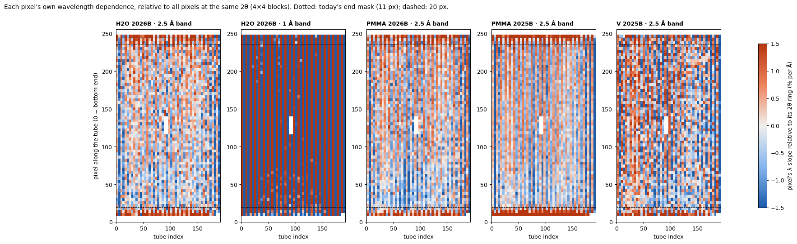

**Along the tube** (median over all tubes, front and back layers separately). The curves of
the five data sets lie on top of each other:
- **Tube ends:** spikes at both ends, inside ~20 pixels.
- **Front layer:** about +0.2 %/Å (bottom) rising to +0.7 %/Å (top), 2.5 Å band.
- **Back layer:** about −0.7 to −1.0 %/Å, fairly flat.
- **1 Å band:** the same shape, 3–4× larger (front ~ +2 to +2.6, back ~ −3.3 %/Å).

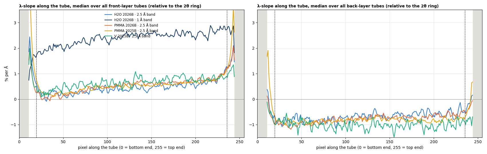

**Relative sensitivity vs λ, by distance from the tube end.** Central tubes, each row group
÷ the middle of the tubes at the **same scattering angle**:

| λ-slope, rows (px from the end) | 11–13 | 14–16 | 17–19 | 20–23 | 24–31 | 40–59 |
|---|---|---|---|---|---|---|
| H2O 2026B, 2.5 Å band | +1.62 %/Å | +1.02 | +0.52 | +0.25 | +0.16 | −0.07 |
| PMMA 2026B, 2.5 Å band | +1.25 | +0.41 | +0.19 | +0.22 | −0.09 | −0.17 |
| PMMA 2025B, 2.5 Å band | +3.18 | +1.27 | +0.64 | +0.34 | +0.09 | −0.20 |
| H2O 2026B, 1 Å band | −0.60 (non-linear: +5 / −3.6 / +3 % at 1.5 / 2.5 / 4.3 Å) | −0.30 | +0.09 | −0.02 | −0.10 | −0.10 |

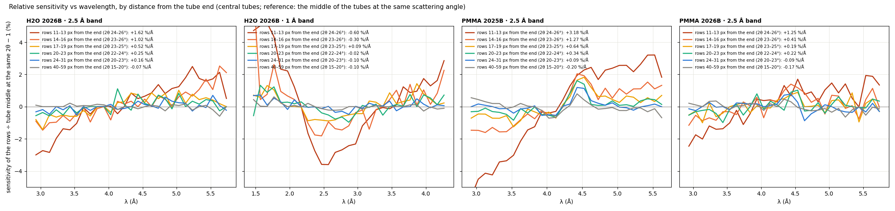

The same comparison, with vanadium included (Water 4 §13):

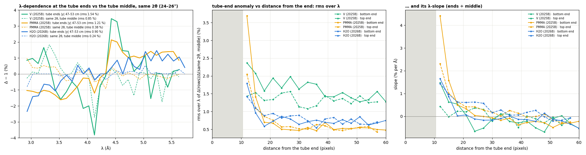

Near the ends the **vertical positions** are also off by 4–6 mm (≈ 1 pixel), from AgBe at 4,
2.5 and 1.3 m (Water 4 §11). The tube ends are imperfect in both position and λ-response,
consistent with the end region of a charge-division tube.

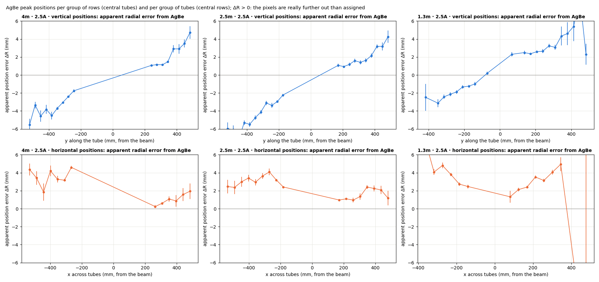

**Is 20 pixels enough?** Averaged over both ends, the tube-end slope falls from +1.2 to +3.2 %/Å
at 11–13 px to +0.2 to +0.3 %/Å at 20–23 px and about 0 beyond 24 px. The simple picture
above shows the top end reaching a little further (~25 px) than the bottom (~20 px).
**20 px removes most of it; 24 px (or 20 bottom / 25 top) is the safe choice.** It costs
another 3 % of pixels. In H2O, 24 px gives a small further gain in the 2.5 Å band (§3).

## 3. H2O (and D2O) with 20 pixels masked at each tube end

This uses the fixes 1 + 2 set of Water 4 §10–§12, unchanged:
- own-band water floods `Sensitivity_H2Obsbbcut_*` (banjo + blocked beam subtracted);
- `cutTOFmin` / `cutTOFmax` 1650 / 3150 µs;
- blocked beam subtracted in the data;
- drtsans's θ correction; incoh fit on.

The tube ends are masked **in the data reduction only** (drtsans detector masking in the tail;
flood unchanged): rows 0–19 and 236–255 (20 px), or 0–23 and 232–255 (24 px). The
today's-mask baseline reproduces drtsans's `_Iq.dat` bit for bit.

**Single-λ slices** (I(Q, λ) before b(λ) ÷ its own plateau):

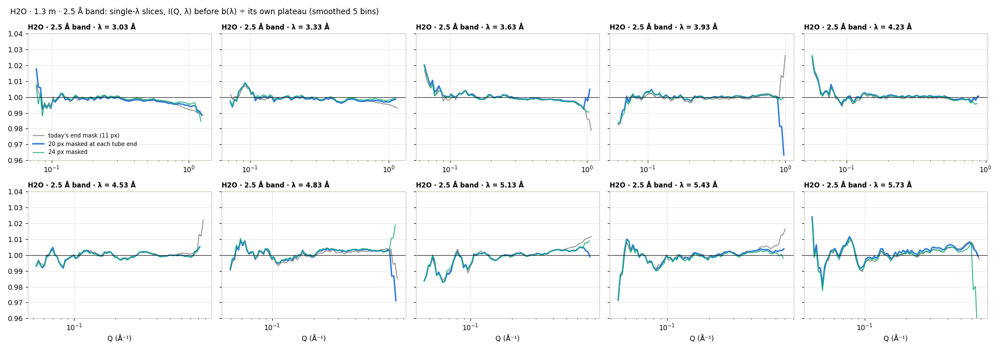

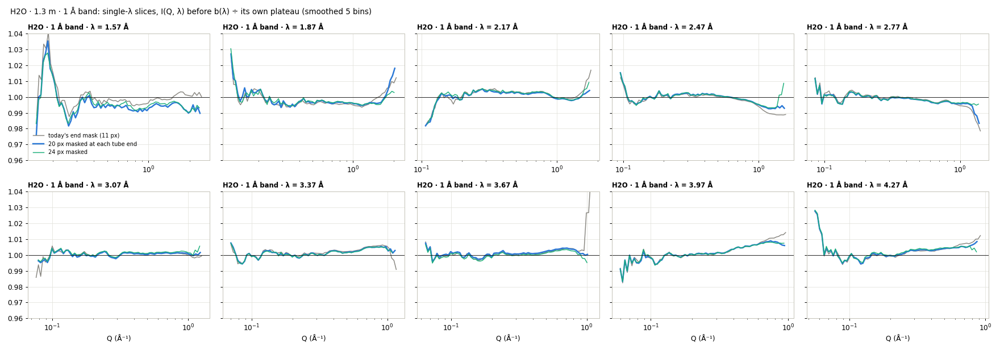

| H2O, per slice | today (11 px) | **20 px** | 24 px |
|---|---|---|---|
| 2.5 Å band: flatness (median rms, Q > 0.3) | 0.40 % | **0.27 %** | 0.24 % |
| 2.5 Å band: high-angle end, rms / max | 0.49 / 1.11 % | **0.33 / 0.72 %** | 0.27 / 0.75 % |
| 1 Å band: flatness | 0.50 % | **0.38 %** | 0.35 % |
| 1 Å band: high-angle end, rms / max | 0.69 / 1.47 % | 0.62 / 1.84 % | 0.75 / 2.84 % |
| slice-to-slice spread after b(λ), 1 Å / 2.5 Å | 0.41 / 0.32 % | 0.39 / 0.30 % | — |

- **2.5 Å band:** the mid-λ droop and the long-λ rise at large angle both shrink, and the
  extreme-angle spikes are gone.
- **1 Å band:** the droop of the λ 2.5–2.8 Å slices shrinks (−1.1 → −0.7 %). A gentle fan
  across λ remains (short λ tilting down, long λ up, ±0.5–1 % near 1 Å⁻¹). The end mask does
  not touch it: it is in the body of the detector (§4).

**All λ slices overlaid** (after b(λ), each ÷ its own plateau):

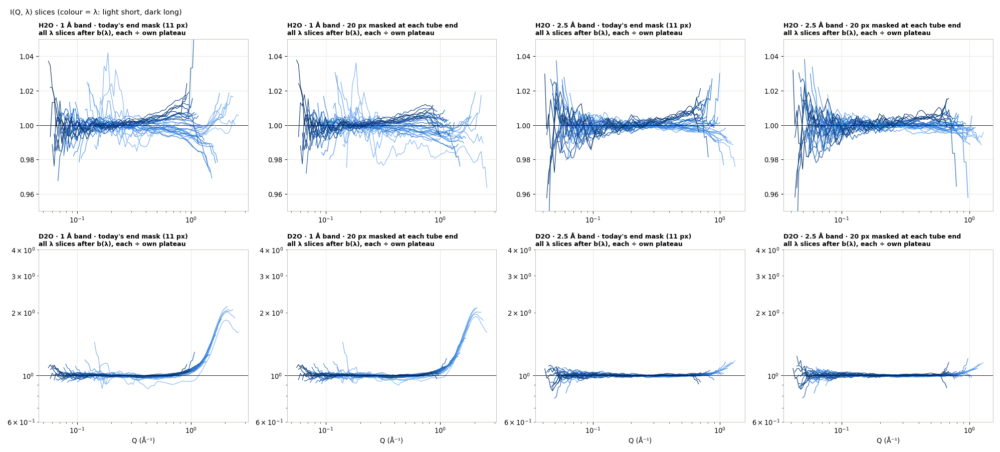

**Combined I(Q):**

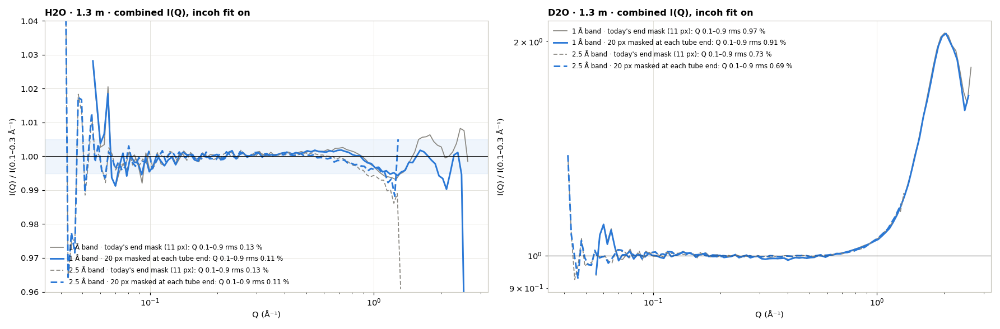

| combined I(Q) | Q 0.1–0.9: max / rms | I(0.8) | I(1.0) | I(1.2) | I(1.5) | I(2.0) |
|---|---|---|---|---|---|---|
| H2O 1 Å, today | 0.33 / 0.13 % | 1.001 | 0.997 | 0.994 | 1.000 | 1.003 |
| H2O 1 Å, **20 px** | **0.30 / 0.11 %** | 1.001 | 0.997 | 0.995 | 0.999 | 0.994 |
| H2O 2.5 Å, today | 0.42 / 0.13 % | 0.998 | 0.994 | 0.988 | – | – |
| H2O 2.5 Å, **20 px** | **0.37 / 0.11 %** | 0.998 | 0.996 | **0.992** | – | – |
| D2O 1 Å, today / 20 px | 3.39 / 2.83 % max | 1.021 / 1.018 | 1.058 / 1.050 | 1.119 / 1.127 | 1.408 / 1.430 | 2.04 / 2.04 |
| D2O 2.5 Å, today / 20 px | 2.98 / 2.62 % max | 1.016 / 1.017 | 1.054 / 1.053 | 1.136 / 1.130 | – | – |

- **H2O:** flat to 0.11 % rms up to 0.9 Å⁻¹ in both bands, and within about 0.5–0.8 % up to
  1.2–1.5 Å⁻¹.
- **D2O, independent:** its shape is unchanged. Its two bands agree at 1 Å⁻¹ (1.050 vs 1.053).
- **Pixels removed:** 3456 more (7 % of the detector), mostly at the highest vertical angles.
  The Q range shrinks only slightly (first-slice Q_max 2.63 → 2.57 Å⁻¹ in the 1 Å band).

## 4. What is left, and conclusions

**What is left** (H2O, 1.3 m):
- a ±0.3 % (2.5 Å band) / ±0.5–1 % (1 Å band) fan across λ in the body of the detector;
- slice-to-slice agreement of 0.3–0.4 %;
- the extreme corners (> 32°).

The fan is not shared by PMMA (Water 4 §10), so it is not the tube ends. It may be
water-specific (inelastic scattering), or a residual of the layer effects (2, 3) that does
not fully cancel where a ring is lopsided at the detector edge. A detector-only λ-dependent
sensitivity (below) would tell them apart.

**Conclusions:**
1. **The EQSANS pixel sensitivity depends on wavelength.** It is shown by the same three
   patterns in H2O, PMMA and vanadium, from two cycles and two floods: tube ends, front /
   back layers, and a bottom-to-top gradient in the front layer.
2. **For azimuthally averaged I(Q) only the tube ends matter.** At 1.3 m they are the highest
   vertical angles, which is why the problem looked like a "high-angle" problem. About 20
   pixels are affected at the bottom end and 25 at the top (the simple picture). Masking
   **20 pixels at each end** (today 11) already removes most of it: the 2.5 Å slices are a
   third flatter, the extreme-angle spikes are gone, and the combined H2O is flat to 0.11 %.
   **24 px (or 20 bottom / 25 top)** is the safe choice.
3. **For 2D, sector or anisotropic work a λ-dependent sensitivity is needed across the
   detector.** The front / back layer effect alone is 1–2 %/Å (2.5 Å band) and ~5 %/Å
   (1 Å band).
4. **A λ-independent flood cannot fix any of this** (one number per pixel, band-averaged). The
   right correction is **sensitivity(pixel, λ)**. It needs a **detector-only** reference: not
   water (its own inelastic behaviour), not PMMA (its structure). That means vanadium, or a
   long-λ water flood validated against vanadium. drtsans applies one value per pixel for
   EQSANS today, so it would need support there (or a post-processing step like `tail_w4.py`).
5. **The 1 Å band is the most affected:** the layer effect is 3–4× larger and the tube ends are
   non-linear in λ. It is also where water's structure factor enters at 1.3 m. A long-λ (6 Å)
   water flood (Water 4 §12) avoids the latter.

**Recommendations:**
- **Now:** mask the tube ends in reductions at every distance (a detector property): **24 px
  at both ends**, or 20 bottom / 25 top. That means a new mask file: today's `mask_4m.nxs`
  masks 11. **Not changed yet, your decision.**
- **Next beam time:**
  - **Vanadium** (4–6 h per configuration, same cycle), in the bands used, with empty-beam,
    blocked-beam and transmission runs. From it, build and test a **λ-dependent sensitivity**
    (per pixel × λ bins, or at least per tube-end row and per layer).
  - The **6 Å water flood** at 1.3 m with its own blocked beam, for comparison.
- **drtsans:** a λ-dependent sensitivity (a sensitivity workspace with λ bins) would be the
  proper fix; raise it with the developers.

**Provenance.** 2026-09-25, drtsans `1.34.0`:
- `water5/simple_w5.py` → `w5_simple.png`, `w5_simple_reach.png`, `w5_simple.json` (the simple
  picture).
- `water5/proof_w5.py` → `w5_slope_maps.png`, `w5_slope_profile.png`,
  `w5_sens_vs_lambda.png`, `w5_proof.json`.
- `water4/run_tail_end.sh` → `water4/out_end/end{20,24}/` (H2O and D2O, both bands; tail with
  `MaskDetectors`).
- `water5/result_w5.py` → `w5_slices_*.png`, `w5_iqlambda.png`, `w5_iq.png`,
  `w5_result.json`.
- `w5_tubeend_samples.png` and `w5_agbe_pos.png` are from Water 4 §13 / §11.
- **Data:**
  - 2026B: `water3/reduced_waterbsbbcut*_bb_cut1650-3150_incoh*` (H2O, D2O) and
    `reduced_waterbsbb_bb_incohoff` (PMMA);
  - 2025B: `water2/reduced_vanadium/` (PMMA, V).
