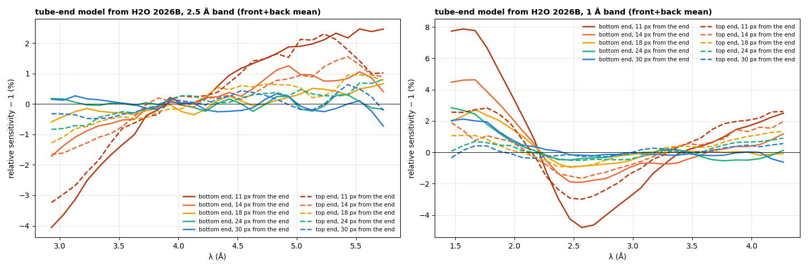
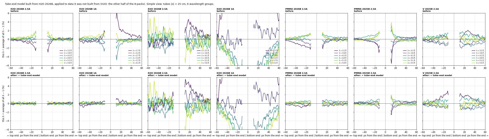
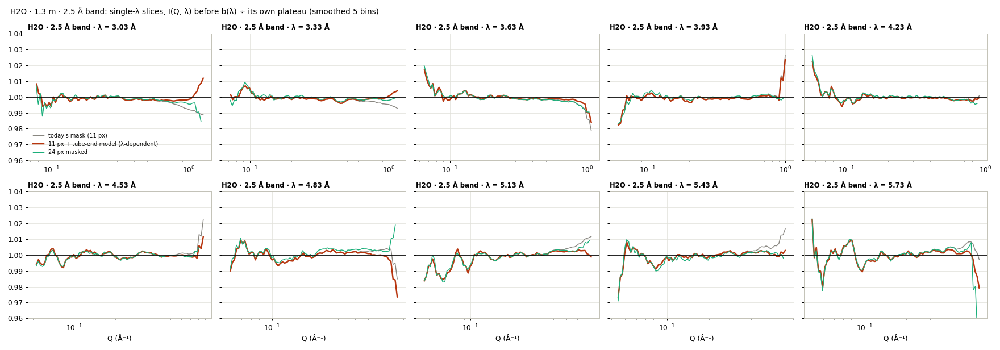
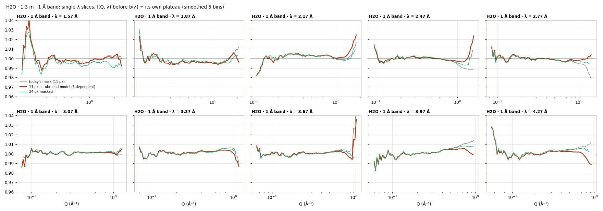
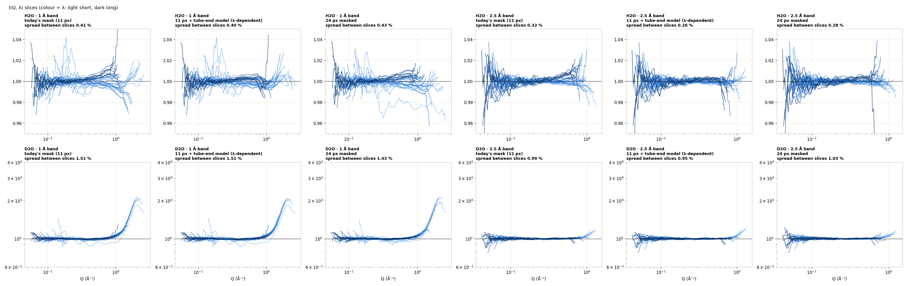
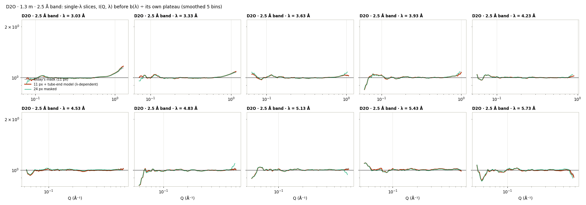

# Water 6 — a wavelength-dependent sensitivity for the tube ends

**Date:** 2026-09-26 · **drtsans:** stable `1.34.0` · **data:** 1.3 m, IPTS-37618 (2026B: H2O,
D2O, PMMA) and IPTS-36254 (2025B: PMMA, vanadium) · **scripts:**
`2026B_mp/reduction/water3/water5/endmodel_w5.py` (model and validation), `result_w6.py`
(slices), `water3/water4/run_tail_endmodel.sh` (drtsans's own binning, `tail_w4.py`)

> **Update (Water 7, 2026-09-26):** the tube-end part is a **count-rate** effect (most likely pile-up in the charge-division readout), not a pure wavelength effect. In broadband runs it follows the instantaneous count rate over the time frame with one coefficient for both bands, and it vanishes in low-rate monochromatic runs. The front/back-layer and incidence-angle parts are genuine wavelength effects. See the **Water 7** tab.

**Question.** The pixels near the tube ends have a sensitivity that depends on wavelength
(Water 5). A flood with one number per pixel cannot follow that. Can the distortion be
**modelled from the H2O flood measurement** and applied during the reduction? Does it help, and
is it a reasonable approach?

**Answer: yes for H2O, and it beats masking. It is not yet a general correction.**

- **Built from H2O and applied to independent H2O pixels** (the other half of the detector),
  the tube-end distortion falls from **1.3–2.0 % to 0.12–0.13 %**, the level of the tube body.
- **In the I(Q, λ) slices,** the high-angle ends improve from 0.49 → **0.18 %** rms
  (2.5 Å band) and 0.69 → **0.32 %** (1 Å band). A 24-pixel mask reaches only 0.27 % and
  0.75 %, and the model keeps every pixel and the full Q range.
- **It carries over to PMMA from the same cycle** (0.99 → 0.29 %), and only halfway to PMMA
  from 2025B (2.23 → 1.02 %). The distortion changes between cycles, so it must be measured
  each cycle, like the flood.
- **It does not fix D2O.** D2O's tube ends are distorted by a similar amount, but with a
  different wavelength shape, and the H2O model leaves it unchanged or slightly worse.
- **So** the model is right for H2O and for samples that behave like it, and the method is
  sound. A universal tube-end correction needs a reference that behaves like any sample, i.e.
  an **elastic** scatterer such as vanadium.
- **Until then, masking ~24 pixels at each tube end** stays the safe default for general
  samples.

Everything is judged on **single I(Q, λ) slices**. The combined I(Q) is not used: its
irregular shape comes from the per-λ step of the averaging (b(λ) or k(λ)), not from the
sensitivity.

---

## 1. The idea

The flood already gives each pixel's sensitivity **averaged over the band**. What it misses at
the tube ends is how that sensitivity **changes with λ**. So the missing piece is a relative
factor for the end rows only: **model(row, layer, λ)**, with a band average of 1. It is 1
everywhere else. The reduction divides by it on top of the normal flood.

How it is measured from the H2O run:
1. **Take each pixel's intensity per λ**, relative to its own average over λ (so the flood
   cancels).
2. **Divide by the same quantity for pixels in the tube body at the same scattering angle**
   (rows 40–215). The water's S(Q), its own angle × λ effects, solid angle and self-absorption
   are the same for both, so they cancel. What is left is the tube end's own λ-dependence.
3. **Take the median over tubes** for each row in the last 40 rows at each end, each layer
   (front / back) and each λ bin, and smooth over 3 rows × 3 λ bins.

**The model:**
- **2.5 Å band, 11 pixels from the end:** −4 % (bottom) / −3.2 % (top) at 2.9 Å, rising to
  about +2.4 % at 5.7 Å. At 14 pixels about −1.7 → +1 %. From 18 pixels on it stays within
  about ±0.7 %.
- **1 Å band: not linear in λ.** 11 pixels from the bottom end it is +7.8 % at 1.5 Å, −4.8 % at
  2.6 Å and +2.5 % at 4.3 Å; at the top end +2.6 / −3.0 / +2.6 %.
- **Beyond ~24–30 pixels** it fades to within about ±0.5 %.

The two bands' models should agree where their wavelengths overlap (2.6–4.3 Å). They do to
about 1.9 % rms in the last 10 rows, against 0.8 % rms for the model itself there. That is
partly noise at the ends of the bands and partly real (see §4).

## 2. Validation on data the model was not built from

- **H2O:** the model built from **half of the 8-packs** is applied to the **other half**, and
  vice versa.
- **The other samples** get the model built from all the H2O tubes.

The figure uses the simple view of Water 5: the same tubes, 6 wavelength groups, each ÷ the
average of all λ. If the sensitivity were independent of λ, every curve would be flat at zero.

| tube-end distortion (rms over λ, relative to the tube body) | rows 11–14 from the end: before → after | 15–19 px | 20–24 px | tube body (40–60 px) |
|---|---|---|---|---|
| **H2O 2026B, 2.5 Å band** (model from the other half) | 1.32 → **0.12 %** | 0.57 → 0.07 % | 0.28 → 0.13 % | 0.02 % |
| **H2O 2026B, 1 Å band** (other half) | 1.96 → **0.13 %** | 0.68 → 0.12 % | 0.41 → 0.09 % | 0.03 % |
| PMMA 2026B (another sample, same cycle) | 0.99 → **0.29 %** | 0.38 → 0.22 % | 0.22 → 0.20 % | 0.06 % |
| PMMA 2025B (another cycle and flood) | 2.23 → 1.02 % | 0.73 → 0.30 % | 0.34 → 0.26 % | 0.13 % |
| D2O 2026B, 2.5 Å / 1 Å | 0.68 → 1.34 % / 1.46 → 1.61 % | no change | no change | 0.09 / 0.20 % |
| V 2025B | 0.89 → 1.01 % | noise-limited | | 0.42 % |

- **Independent H2O pixels:** the correction brings the tube ends down to the level of the
  tube body.
- **PMMA, same cycle:** most of it is removed.
- **PMMA, a year earlier:** about half. The 2025B distortion was larger (2.2 % vs 1.0–1.3 %
  now), so the tube ends change with time.
- **Vanadium** is too weak a scatterer in that short run to tell.
- **D2O:** see §4.

(In the simple view, D2O's curves spread along the whole tube, not only at the ends. The view
compares wavelengths at the same pixel, i.e. different Q, and D2O's strong structure factor
shows up there. The table's metric compares pixels at the same angle and is free of that.)

## 3. The I(Q, λ) slices of H2O and D2O

This uses the Water 4–5 set, with only the tube-end treatment changed:
- same-band water floods, wider TOF cuts, blocked beam subtracted, incoh fit on;
- binned by drtsans's own code.

**H2O uses the model from the other half of the detector, so it is not self-referential.**

| variant | what is done at the tube ends |
|---|---|
| today | 11 px masked |
| **model** | 11 px masked + the tube-end model |
| 24 px | 24 px masked, no model |

| H2O, single slices | today (11 px) | **model** | 24 px masked |
|---|---|---|---|
| 2.5 Å band: high-angle end of each slice, rms / max | 0.49 / 1.11 % | **0.18 / 0.46 %** | 0.27 / 0.75 % |
| 2.5 Å band: slice flatness (median rms, Q > 0.3) | 0.40 % | 0.26 % | 0.24 % |
| 2.5 Å band: spread between slices | 0.32 % | **0.26 %** | 0.28 % |
| 1 Å band: high-angle end, rms / max | 0.69 / 1.47 % | **0.32 / 0.77 %** | 0.75 / 2.84 % |
| 1 Å band: slice flatness | 0.50 % | 0.36 % | 0.35 % |
| 1 Å band: spread between slices | 0.41 % | 0.40 % | 0.43 % |
| highest Q reached (first slice, 1 Å band) | 2.63 Å⁻¹ | **2.63 Å⁻¹** | 2.54 Å⁻¹ |

- **For H2O the model beats the mask.** The slice ends are about 2× flatter than with the
  24-pixel mask, the flatness is the same, and **no pixels are lost**. The mask loses the
  corners (highest angles), and its slice ends get noisier there.
- **The mid-λ droop and long-λ rise at large angle are mostly gone** in the 2.5 Å slices (e.g.
  λ 3.0–3.3 Å). The very last bins at the extreme corners still wander by about ±1 %.

**All slices overlaid** (after b(λ), each ÷ its own plateau):

**D2O slices** (the model built from H2O):

The D2O slices are **unchanged** by the model: the spread between slices is 0.99 → 0.95 %
(2.5 Å band) and 1.51 → 1.51 % (1 Å band). Their shape is dominated by D2O's own structure
factor.

## 4. Why the H2O model does not transfer to D2O

Taking the two tube ends separately, **D2O's tube ends are distorted as much as H2O's**. Rows
11–14 from the end, rms over λ:

| | bottom end | top end |
|---|---|---|
| H2O 2.5 Å band | 1.39 % | 1.30 % |
| D2O 2.5 Å band | 1.50 % | 1.07 % |
| H2O 1 Å band | 2.76 % | 1.47 % |
| D2O 1 Å band | 2.24 % | 1.63 % |

But the **wavelength shape** is different, so the H2O model does not cancel it. Two
explanations, not yet separated:

1. **The detected energy is not the incident energy.** The tube-end efficiency should depend on
   the energy of the neutron that is actually **detected**. H2O scatters inelastically and
   heats cold neutrons strongly, so the neutrons it sends to the detector are faster than the
   incident λ that drtsans assigns. D2O (mostly coherent, heavier), PMMA and vanadium do this
   less. A model built from H2O, as a function of the incident λ, is then **specific to
   H2O-like samples**. That fits the pattern: it works fully for H2O, well for PMMA (also
   hydrogen-rich) and not for D2O.
2. **Background subtraction.** D2O is a weak scatterer. The empty banjo plus the blocked beam
   are about **50 % of its raw counts** (12–14 % for H2O), and both are large and
   λ-dependent at the top of the detector (see the Blocked beam page). Small imperfections there
   show up in D2O's tube ends far more than in H2O's.

## 5. Is it a reasonable approach?

**Yes. It is the right direction, and it needs to be developed into a proper method:**
- **A λ-dependent sensitivity is needed, at least at the tube ends.** One number per pixel
  cannot represent a response that changes by several percent across the band (Water 5). The
  model shows it can be measured and corrected: for H2O the correction works on independent
  pixels and beats masking.
- **It must be measured every cycle,** like the flood. The tube-end distortion was about twice
  as large in 2025B as now.
- **The reference should be elastic,** so the model is a property of the detector and not of
  the reference sample's energy transfer. **Vanadium** is the natural choice (long counting,
  same cycle, the bands in use; see the discussion on the Water 4 / 5 pages). With a vanadium
  model, the test is whether H2O, D2O and PMMA all flatten.
- **Until then:**
  - **General samples:** mask ~24 pixels at each tube end (safe, no assumptions).
  - **H2O and H2O-like samples:** the H2O-derived model is better than the mask, and keeps the
    corners.
- **Implementation:** drtsans applies one sensitivity value per pixel for EQSANS. A
  λ-dependent sensitivity for the end rows (a small table: row × layer × λ) could be applied as
  an extra per-pixel × per-λ factor before binning, as done here with `tail_w4.py`. Raise it
  with the drtsans developers.

**Provenance.** 2026-09-26, drtsans `1.34.0`:
- **Model and validation:** `water5/endmodel_w5.py` → `w6_endmodel.png`,
  `w6_endmodel_validation.png`, `w6_endmodel.json` (copied from `water5_assets`). The
  per-pixel correction arrays are written to `water4/corr/endmodel_*.npy`.
- **Reductions:** `water4/run_tail_endmodel.sh` → `water4/out_endmodel/model/` (H2O: model from
  the other half of the 8-packs; D2O: model from all H2O tubes).
- **Comparison:** `water5/result_w6.py` against `water4/out_tb/tb0` (today) and
  `water4/out_end/end24` (24 px) → `w6_slices_*.png`, `w6_iqlambda.png`, `w6_result.json`.
- **D2O analysis:** the per-end tube distortion and the raw background fractions (D2O 188983,
  banjo 188978, blocked beam 188984) were computed inline and are quoted in §4.
