# Water 7 — a wavelength-dependent detector model fitted to the flood

**Date:** 2026-09-26 · **drtsans:** stable `1.34.0` · **data:** 1.3 m H2O flood runs of the
2026-09-23 block (IPTS-37618), both bands, set up as in Water 4–6 (same-band water flood,
banjo and blocked beam subtracted, `cutTOFmin/max` 1650/3150); D2O and PMMA 2026B; PMMA and V
2025B; the monochromatic H2O / D2O runs of Aug 2026 at 4 m · **scripts:**
`2026B_mp/reduction/water3/water7/` (`fitM_w7.py`, `fitM2_w7.py`, `eval_w7.py`, `physics_w7.py`,
`amp_w7.py`, `rate_w7.py`, `rate_test_w7.py`, `mono_test_w7.py`)

**The idea.** The detector's real efficiency factorises into a pixel-to-pixel sensitivity s and
a smooth model M of how the response changes with λ:

  **ε(pixel, λ) = s(pixel) × M(pixel, λ)**

1. **Fit M** to the flood measured per λ.
2. **Divide the flood by M.** It becomes flat in λ, and what is left is the true pixel
   sensitivity s.
3. **In the reduction,** divide the data by M(pixel, λ) and then by s. The same M is used in
   both places, so the correction is consistent.

**The logic holds. Four things need care:**
1. **M must not take up the flood sample's own physics.** Water's S(Q), self-absorption and
   inelastic scattering depend on 2θ and λ. M is therefore built from **detector coordinates**
   (distance from the tube end, front/back layer, incidence angle). Water gets a separate term in
   2θ, which is fitted but **not applied**.
2. **M is only defined up to** a pixel-only factor (that part is s) and a λ-only factor (that
   part is the flux normalisation). So every term is band-average-free.
3. **Which λ the detector sees:** the detected energy is not the incident energy for inelastic
   samples.
4. **Stability:** M must be re-measured each cycle. Applying it needs a per-pixel × λ step
   before the sensitivity.

**What was found.**
- **The model works.** Fitted to the H2O flood, M follows the flood's λ-dependent structure
  along the tubes for every wavelength group. The flood ÷ M is flat within the noise, leaving
  only the pixel-to-pixel sensitivity (§2).
- **Two of the three effects are wavelength physics, with quantitative explanations** (§4):
  - **Front vs back layer.** The back tubes are partly shadowed by the front tubes. One
    shadowing function fits both bands (0.35 % rms). It implies a **tube inner diameter of
    7.2 mm** (8 mm tubes on the 11 mm pitch). The effect is present at low rate too.
  - **Incidence angle.** Neutrons hitting the tube at a vertical angle travel further in the
    gas. With the absorption taken from the layer fit, the predicted size is −2.7 %/Å
    against **−3.1 %/Å fitted** (2.5 Å band).
- **The tube-end effect is not a wavelength effect: it is a COUNT-RATE effect** (§4c).
  - **Rate test:** its amplitude follows the **instantaneous count rate** in the frame with
    **one coefficient for both bands** (bottom-front: −1.1 % per 10 k counts/s per 8-pack,
    95 % of the variation explained). A wavelength shape explains almost none of it.
  - **Low-rate test:** in the monochromatic runs, ~100× lower rate, the tube-end effect is
    **zero** (0 ± 0.1 %/Å) while the layer effect is still there.
  - **Mechanism:** most likely pile-up in the charge-division readout. Two overlapping events
    are placed at a charge-weighted mean position, which pulls counts away from the tube ends
    when the rate is high.
  - **Decay along the tube:** 19–26 mm (bottom) and ~48 mm (top). That is far longer than an
    electrostatic end effect (1.5 mm).
- **This explains the D2O puzzle of Water 6.** D2O runs at a 4× lower rate, so an H2O-derived
  tube-end correction over-corrects it.
- **A front-layer bottom-to-top gradient** (~0.3 %/Å) remains **unexplained**.

**So:**
- **The layer and incidence terms are a true λ-dependent sensitivity.** They carry over to
  D2O, PMMA and vanadium (2025B included). They matter for 2D / per-pixel work, and cancel in
  azimuthal I(Q).
- **The tube-end term depends on each run's own count rate.** It needs a **rate-dependent
  correction**, computed from the run's own rate, or low rates, or masking. A flood-derived
  λ table cannot fix it for all samples.

---

## 1. The model

Everything is fitted in log space to the H2O flood data per pixel and per 0.1 Å bin:

  log D(pixel, λ) = s(pixel) + c(λ) + w(2θ, λ) + m(pixel, λ)

| term | what it is | applied to data? |
|---|---|---|
| s(pixel) | the pixel-to-pixel sensitivity | yes (it is the new flood) |
| c(λ) | overall λ scale (flux normalisation) | no |
| w(2θ, λ) | the **water's own** angle × λ behaviour: free per 0.5° ring and λ | **no** (fitted only) |
| **m(pixel, λ)** | the **detector model**: detector coordinates only | **yes** |

Terms of m. There are two versions. **v1** uses quadratic λ-shapes. **v2** uses the physical
λ-shapes of §4 and, for the tube ends, a free amplitude in every λ bin.

| detector term | form (v2) | variable |
|---|---|---|
| tube ends | exp(−(d − 11)/ℓ) × A(λ), per end (bottom/top) × layer | d = pixels from the tube end |
| front vs back layer | ±½ ln((1 − f) + f e^(−κλ)) × amplitude | layer |
| incidence | (sec ψ − 1) × h(λ) × amplitude, h = 3He path-length response | ψ = vertical incidence angle |
| gradient | (row − 128)/128 × g × (λ − λ₀), per layer | position along the tube |

**How the fit works.**
- It alternates between the nuisance terms (s, c, w as medians of the residual) and least
  squares for m.
- The decay lengths ℓ are scanned.
- A model fitted on half of the 8-packs is kept for cross-validation.

**Why detector and water terms separate:** pixels at the same 2θ but at different places on
the tube (end vs middle, vertical vs horizontal, front vs back) see the same water but a
different detector.

## 2. The fit: M describes the flood along the tube, and flood ÷ M is flat

The detector part of the flood (flood − s − c − w), along the tube, is shown for 6 wavelength
groups. The thin lines are the median over tubes within 25 cm of the beam. The dashed lines are
the model M. Next to each is **flood ÷ M**: what is left, which should be flat.

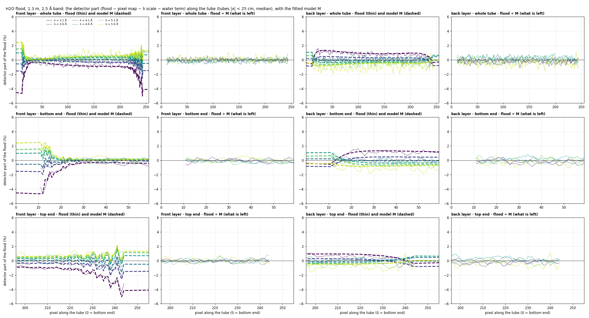

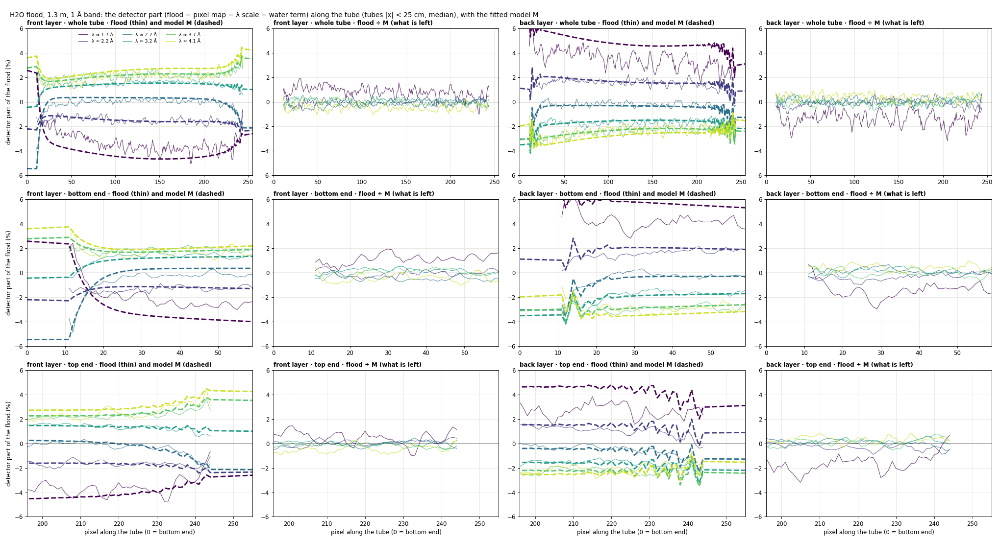

| rms over the profile and λ groups, before → after ÷ M (v2) | tube ends (11–30 px), front / back | tube body, front / back |
|---|---|---|
| 2.5 Å band | 1.30 → 0.39 % / 0.81 → 0.61 % | 0.58 → 0.39 % / 0.74 → 0.55 % |
| 1 Å band | 2.13 → 0.62 % / 2.40 → 0.89 % | 2.17 → 0.55 % / 2.24 → 0.69 % |

(The "after" values are close to the noise of these medians, about 0.3–0.5 %.)

- **2.5 Å band:** the flood ÷ M is flat for every λ group, all along the tube, both layers.
- **1 Å band:** flat except the shortest group (≈ 1.7 Å), which keeps a ±1–2 % layer
  residual.

**The water term** is the flood's own behaviour. It is kept out of M and never applied:

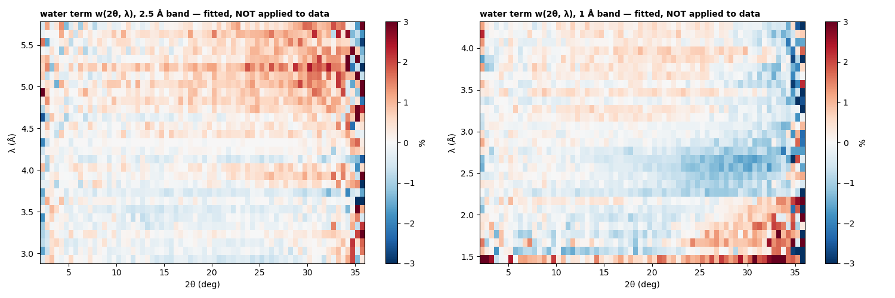

## 3. Parameters

| | 2.5 Å band | 1 Å band |
|---|---|---|
| tube-end decay length ℓ, bottom (v2) | 6.0 px = 26 mm | 4.5 px = 19.5 mm |
| tube-end decay length ℓ, top (v2) | ≥ 11 px ≈ 48 mm (edge of the scan) | ≥ 11 px |
| layer amplitude (v2; 1 = the physical shadowing function) | 0.78 | 1.02 |
| incidence amplitude (v2; 1 = the physical path-length function) | 1.32 | 0.69 |
| front-layer gradient | +0.28 %/Å (top vs middle) | +0.35 %/Å |
| model from half of the detector vs the other half | layer 0.75 / 0.82; incidence 1.38 / 1.23 | layer 1.01 / 1.04; incidence 0.49 / 0.89 |

The two halves of the detector give the same model. The physically shaped terms come out with
amplitudes near 1: **the physics accounts for them quantitatively**.

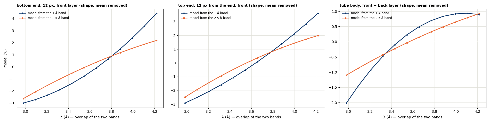

## 4. Does it make physical sense?

### 4a. Front vs back layer: shadowing by the front tubes

A back-layer tube sits behind a gap of the front layer, but a fraction f of its face is behind
front tubes, whose 3He absorbs part of the beam. The back layer therefore sees relatively more
at short λ, where the front tubes are more transparent:

  back / front = (1 − f) + f · exp(−κ λ)

One such function fits the fitted layer term of **both bands** to 0.35 % rms, with **f = 0.48**
and **κ = 1.02 per Å**.
- **Geometry check.** The pitch is 11 mm and the back layer is shifted by half a pitch, so
  f = (2D − 11)/D gives an **inner tube diameter D = 7.2 mm**. That is consistent with 8 mm
  tubes, so the geometry and the fit agree.
- **Front-tube transmission** through the shadowing chords: 22 % at 1.5 Å, 8 % at 2.5 Å, 2 % at
  4 Å.
- **Implied absorption:** μ = 2.34 cm⁻¹ Å⁻¹, i.e. a 3He fill of ~29 atm (for a 7.2 mm tube).
  That is high; the tubes' specified fill pressure would confirm or correct it.
- **Rate check:** the layer effect is also present in the low-rate monochromatic runs (§4c),
  so it is not a rate effect.

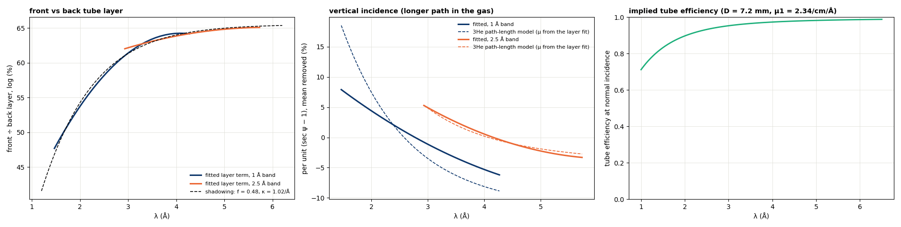

### 4b. Incidence angle: a longer path in the gas

At a vertical angle ψ a neutron crosses sec ψ more gas, which raises the efficiency most where
the tube is least black, i.e. at short λ. With the absorption from 4a, a 3He tube predicts
**−2.7 %/Å per unit (sec ψ − 1)** in the 2.5 Å band; **the fit gives −3.1 %/Å**. In the 1 Å
band the prediction is 1.8× larger than the fit (−9.0 vs −5.0 %/Å).

Two independent detector terms are thus tied together by one absorption parameter.

### 4c. Tube ends: a count-rate effect, not a wavelength effect

**The λ-shape does not behave like a wavelength effect.** The tube-end amplitude, measured free
in each λ bin (v2), does **not** agree between the two bands at the same λ. In each band it has
the same pattern: a deep dip, then a rise. No wavelength shape describes it: the 3He path
length, the front-tube transparency and a straight line all leave most of it.

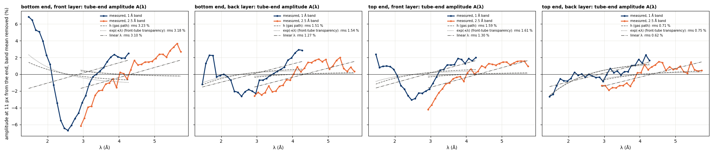

**It follows the instantaneous count rate.** Because every 0.1 Å bin spans the same time
width, the raw counts per bin give the count rate at that point of the frame. The 1 Å band
peaks at ~121 k counts/s per 8-pack (at 2.6 Å); the 2.5 Å band starts at ~109 k counts/s (at
2.9 Å). Plotting the tube-end amplitude against that rate puts **both bands on one line**:

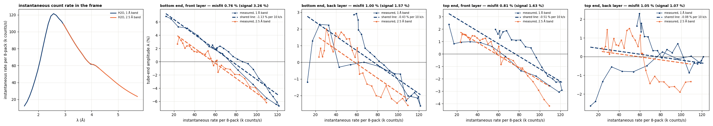

| tube end, layer | signal (rms) | misfit, one rate line for both bands | best misfit, a wavelength shape | slope, 1 Å band / 2.5 Å band |
|---|---|---|---|---|
| bottom, front | 3.26 % | **0.76 %** (95 % explained) | 3.10 % | −1.2 / −1.0 % per 10 k/s |
| top, front | 1.63 % | **0.81 %** (75 %) | 1.30 % | −0.43 / −0.62 |
| bottom, back | 1.57 % | **1.00 %** (59 %) | 1.27 % | −0.38 / −0.52 |
| top, back | 1.07 % | 1.05 % | 0.62 % | – |

(The front tubes count more than the back tubes behind them, and they show the larger effect.)

**At low rate it vanishes.** The monochromatic H2O / D2O runs at 4 m (Aug 2026) cover single
wavelengths from 2.5 to 10 Å at rates 0.1–14 k counts/s, about 100× below the broadband runs.
The tube-end rows' response relative to the tube body at the same 2θ:

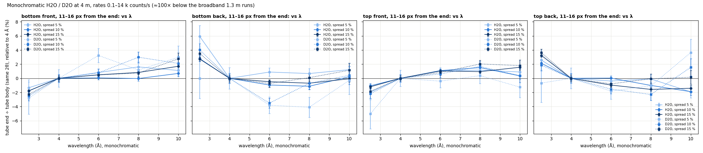

| 4 m, low rate: λ-slope of tube end ÷ body | front layer | back layer | the tube end itself (layer average) |
|---|---|---|---|
| H2O, bottom | +0.37 ± 0.04 %/Å | −0.39 ± 0.04 | **−0.01** |
| H2O, top | +0.35 ± 0.03 | −0.57 ± 0.04 | **−0.11** |
| D2O, bottom | +0.63 ± 0.08 | −0.45 ± 0.09 | **+0.09** |
| D2O, top | +0.53 ± 0.07 | −0.43 ± 0.09 | **+0.05** |

- **The front/back split is the layer effect** (4a), still present.
- **The tube end itself shows no λ-dependence at low rate** (≈ 0 ± 0.1 %/Å), against +1.2 to
  +3.2 %/Å in the high-rate broadband runs.
- **H2O and D2O agree here,** where both rates are low.

The incidence angle at the 4 m tube ends is smaller (~7°), but at 1.3 m the incidence term
accounts for only ≈ −0.3 %/Å at the tube ends. So the smaller angle cannot explain the
difference.

**A plausible mechanism: pile-up in the charge-division readout.**
- **Positioning:** a tube places an event from the ratio of charges at its two ends.
- **Overlap:** two events within the resolving time τ of the 8-pack electronics are placed at a
  charge-weighted mean position, i.e. pulled toward the middle, so the tube ends lose counts.
- **Size:** at 100 k counts/s per 8-pack and τ ≈ 0.5 µs, ~2rτ ≈ 10 % of events overlap. That
  matches the ~11 % swing of the bottom-front amplitude over the frame.
- **Where:** it acts only near the ends, over ~20–50 mm. The field / end-cap scale (~1.5 mm)
  is far too short; a position pull is not.

This is not proven at the electronics level, but it fits every observation:
- the shared rate coefficient in both bands;
- the effect is gone at low rate;
- it is larger in the (busier) front layer;
- D2O, at a 4× lower rate, has a different tube-end pattern (Water 6), so the H2O-derived
  correction over-corrects it.

**Two tests that did not decide it:**
- **D2O, model-free.** Its measured tube-end signal (1.4–4.7 %) is larger than either
  hypothesis predicts. D2O's signal is weak and sits on a background taken at a different
  rate, so it is a poor test sample.
- **AgBe Bragg orders at 2.5 m.** The shorter-λ order indicates ~0.3–1 mrad smaller angles at
  the tube ends, but a similar −0.6 mrad appears in the tube middles (a TOF peak-shape effect).
  Inconclusive.

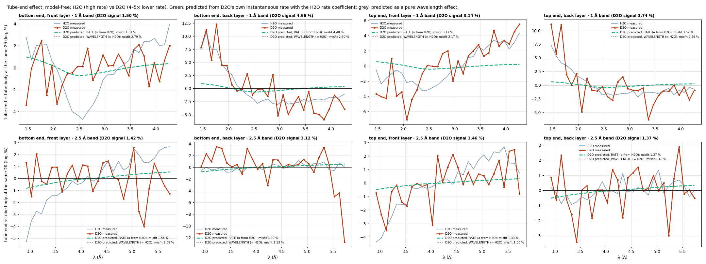

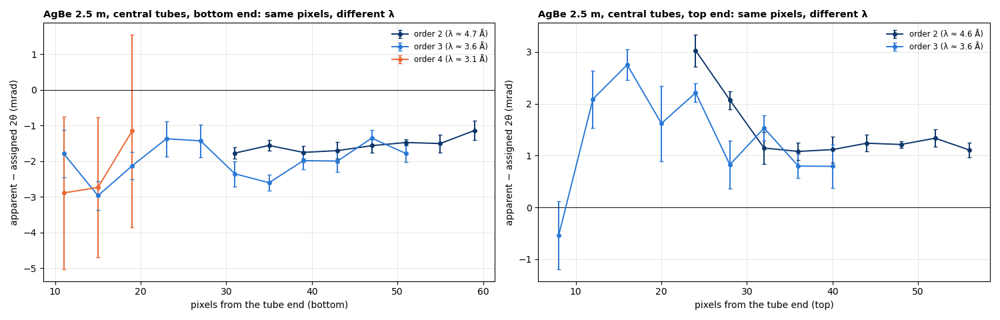

### 4d. The front-layer bottom-to-top gradient

About +0.3 %/Å from the middle to the top of the front layer (half that in the back layer). It
is shared by all samples, but none of the pictures above explains it. Candidates: a small
vertical tilt, a gain gradient, or a residual of the top-heavy, λ-dependent beam background
(see the Blocked beam page). Open.

## 5. Transfer to other samples

The model is fitted on H2O (for H2O: on the other half of the detector) and applied to other
data. The metrics are flood-free, relative to the tube body at the same 2θ, and give the rms
over λ.

| v2, before → after | tube ends 11–14 px | front − back layer | front top − bottom |
|---|---|---|---|
| H2O 2.5 Å (other half) | 1.35 → 0.44 % | 0.79 → 0.17 % | 0.28 → 0.10 % |
| H2O 1 Å (other half) | 2.21 → 0.53 % | 4.73 → 0.40 % | 0.43 → 0.21 % |
| D2O 2.5 Å | 1.31 → 1.70 % ✗ | 0.32 → 0.09 % | 0.53 → 0.36 % |
| D2O 1 Å | 1.96 → 1.80 % | 4.65 → 0.38 % | 0.65 → 0.57 % |
| PMMA 2026B | 1.00 → 0.29 % | 1.04 → 0.34 % | 0.32 → 0.16 % |
| PMMA 2025B | 2.35 → 1.42 % | 1.13 → 0.42 % | 0.30 → 0.20 % |
| V 2025B | ~noise | 1.39 → 0.71 % | 0.35 → 0.23 % |

- **Every sample's layer and gradient terms are corrected by the H2O model:** these are
  detector properties, independent of the sample and stable over a year.
- **The tube-end term transfers only to samples at similar rates:** H2O and PMMA 2026B.
  2025B PMMA was measured at a similar rate but a year earlier, and is corrected about halfway;
  D2O is not corrected (lower rate).

## 6. H2O in I(Q, λ) slices

This is drtsans's own binning; the H2O model comes from the other half of the detector.

| H2O, single slices: high-angle end rms | today (11 px) | Water 6 row table | Water 7 v1 | **Water 7 v2** | 24-px mask |
|---|---|---|---|---|---|
| 1 Å band | 0.69 % | **0.32 %** | 0.58 % | 0.47 % | 0.75 % |
| 2.5 Å band | 0.49 % | **0.18 %** | 0.27 % | 0.31 % | 0.27 % |
| slice flatness 1 Å / 2.5 Å | 0.50 / 0.40 % | 0.36 / 0.26 % | 0.44 / 0.30 % | 0.38 / 0.34 % | 0.35 / 0.24 % |

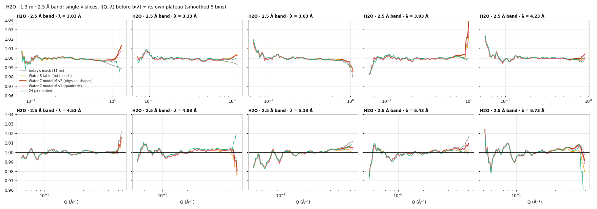

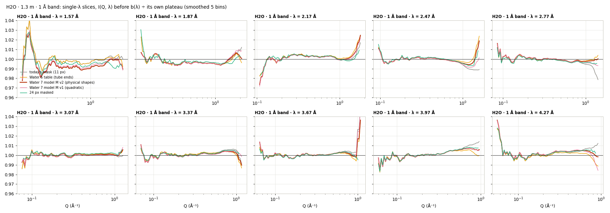

- **For azimuthal I(Q) only the tube-end term matters** (the layer effects cancel in rings).
  There the smooth model is not better than the Water 6 row-by-row table: a single exponential
  along the tube is not the right profile (the top end reaches further).
- **Since the tube-end term is a rate effect,** the right next step is not a better λ-shape but
  a **rate-dependent** tube-end correction (§7).

## 7. Conclusions

1. **The factorisation is right, and it works.** A detector model in detector coordinates,
   fitted to the flood with the water's own behaviour kept separate, describes the flood's λ-
   and position-dependence along the tubes. The flood ÷ M is flat, leaving the pixel-to-pixel
   sensitivity. The model from one half of the detector corrects the other half.
2. **What the pieces are physically:**
   - **front/back layer:** shadowing in 3He, quantitatively (D = 7.2 mm);
   - **incidence:** the gas path length (predicted magnitude matched in the 2.5 Å band);
   - **tube ends:** a **count-rate effect** (one rate coefficient for both bands, zero at low
     rate), most likely pile-up in the charge-division readout;
   - **front-layer gradient:** unexplained.
3. **What to apply, and how:**
   - **Layer and incidence terms:** a true λ-dependent sensitivity. Apply them to every sample
     (needed for 2D / per-pixel work; harmless for azimuthal I(Q)).
   - **Tube-end term:** a **rate-dependent** correction using each run's own instantaneous rate
     per 8-pack (known from the run itself): factor = 1 + α · e^(−d/ℓ) · (r − r̄). Alternatives:
     an event-level pile-up / dead-time correction, lower rates (attenuate strong scatterers
     like H2O at 1.3 m), or masking the ends (~24 px).
4. **Next checks:**
   - **Pile-up directly:** the same sample at different rates in broadband mode (attenuators,
     aperture), which the rate picture predicts changes the tube-end effect.
   - **The detector specification:** the tubes' fill pressure (vs ~29 atm implied) and the
     8-pack readout's resolving time (vs ~0.5 µs implied).
   - **Vanadium:** measured each cycle at a known rate, for the λ-dependent (layer, incidence)
     part.

**Provenance.** 2026-09-26, `2026B_mp/reduction/water3/water7/`:
- **Fits:** `fitM_w7.py` (v1) and `fitM2_w7.py` (v2) → `M*_<band>_<all|even|odd>.npz`,
  `fitM*_w7.json`.
- **Evaluation:** `eval_w7.py` (`MODEL=M2` for v2) → `w7[v2]_fit_*.png`,
  `w7[v2]_water_term.png`, `w7[v2]_band_overlap.png`, `w7[v2]_eval.json`; correction arrays
  `water4/corr/Mw7[v2]_*.npy`.
- **Physics:** `physics_w7.py` → `w7_physics_*.png/.json`; the AgBe horizontal control →
  `w7_agbe_control.json`.
- **Tube-end tests:**
  - `amp_w7.py` → `w7_endshape`;
  - `rate_w7.py` → `w7_rate` (instantaneous rates from `blockedbeam/bb_*.npz`);
  - `rate_test_w7.py` → `w7_rate_test` (raw D2O / H2O via `blockedbeam/d2o_load.py`);
  - `mono_test_w7.py` → `w7_mono` (runs 187544–187573, raw event ids).
- **Slices:** `water4/run_tail_w7.sh` and `run_tail_w7v2.sh` → `water4/out_w7/`;
  `water5/result_w7.py` → `w7_slices_*.png`, `w7_iqlambda.png`, `w7_result.json`.
