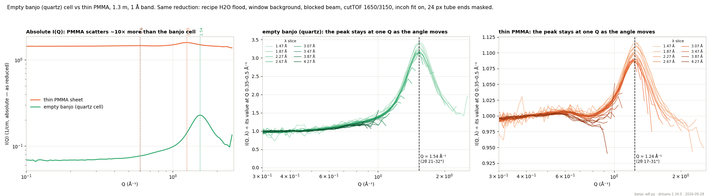
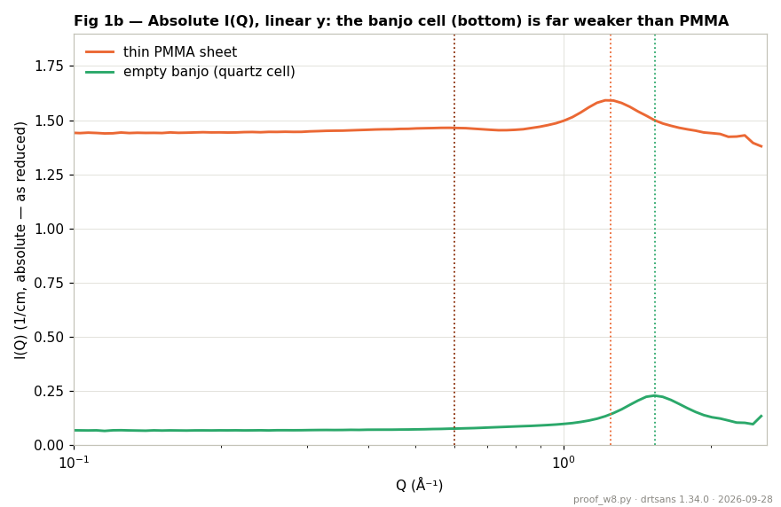
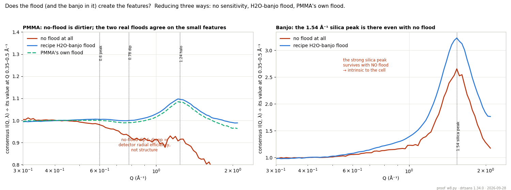
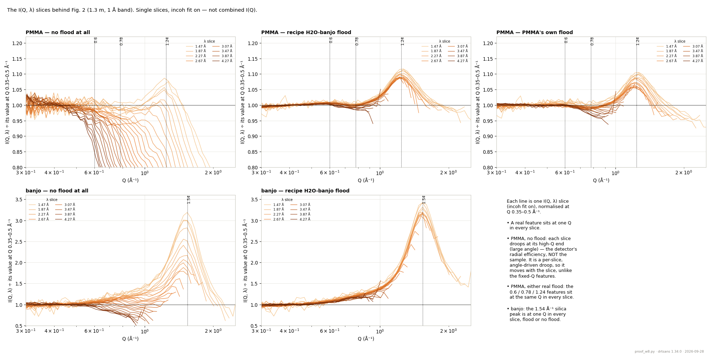
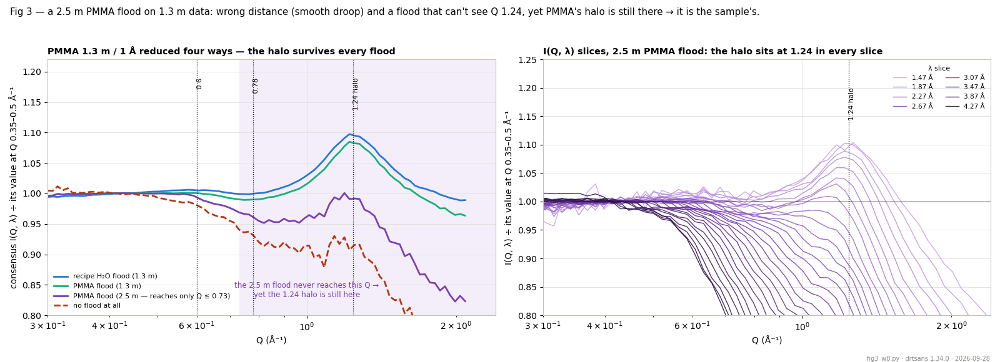
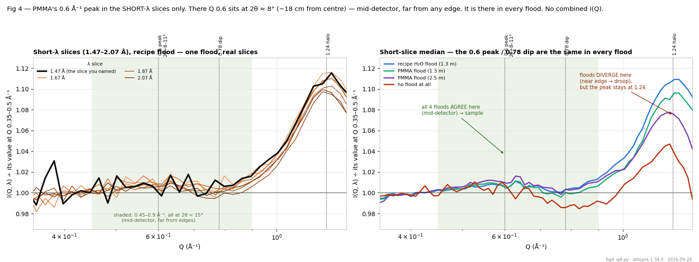

# Water 8 — where the banjo cell's structure sits, vs PMMA

**Date:** 2026-09-28 · **drtsans:** stable `1.34.0` · **data:** 1.3 m, 1 Å band (IPTS-37618, 2026-09-23
block): empty banjo cell S 188962 / T 188954, thin PMMA S 188965 / T 188957, PeltierWindow background
S 188961 / T 188953 · **scripts:** `2026B_mp/reduction/water3/summary/banjo_w8.py`, `proof_w8.py`, `reduce_w3.py` (sets `recipe` / `none` = no sensitivity, `--winbkg`), `water4/tail_w4.py`

Two of our flood choices carry the sample cell's or sheet's own structure into the flood: a **thin
PMMA** flood carries PMMA's, and a **water-in-banjo** flood carries the empty banjo cell's (which is
why Water 3 subtracts the banjo). This page just shows **where each one's structure sits in Q**, so it's
clear they don't land in the same place.

The 1.3 m **1 Å band** is the one to use: it reaches Q ≈ 2.5 Å⁻¹, far enough to see the banjo cell's
peak. Longer bands and larger distances stop below ~1.3 Å⁻¹ and never reach it.

## The comparison

Empty banjo and PMMA reduced **identically**: recipe H2O flood (flat, banjo already removed),
PeltierWindow background (both are bare — a cell and a sheet), blocked beam, cutTOF 1650/3150, incoh fit
on, 24 px tube ends masked in the data. Each curve is normalised to its own value at Q 0.35–0.5 Å⁻¹ to
compare shape (the absolute levels differ — PMMA scatters far more, being hydrogen-rich).

*Fig. 1 — Left: combined I(Q) on an **absolute** log scale (as reduced) — PMMA is ~10× the banjo
everywhere. Middle and right: single I(Q, λ) slices, each normalised to its own value at Q 0.35–0.5 Å⁻¹
to show that the peak stays at one Q while the wavelength (and therefore the detector angle) moves.*

## The banjo scatters much less than PMMA (absolute)

In absolute intensity the banjo cell is far weaker than PMMA, everywhere:

| Q (Å⁻¹) | 0.4 | 0.7 | 1.0 | 1.24 | 1.54 |
|---|---|---|---|---|---|
| **PMMA** I(Q) (1/cm) | 1.46 | 1.46 | 1.50 | 1.59 | 1.50 |
| **banjo** I(Q) (1/cm) | 0.072 | 0.082 | 0.099 | 0.14 | 0.23 |

So PMMA scatters 7–20× more than the empty banjo — as expected, since PMMA is hydrogen-rich. What makes
the banjo's silica peak *look* dominant is only the shape normalisation in the slice panels: quartz is a
**coherent** scatterer (low flat background, sharp peak → ×3 relative), while PMMA's ~1.5 level is mostly
flat **incoherent** background from its hydrogen, with a small coherent halo on top (only +10 % relative).
Weak-but-sharp vs strong-but-broad. The reduction of both is on the same absolute scale; only the middle
and right panels are divided by their own baseline to compare shape.

*Fig. 1b — the same absolute I(Q) on a **linear** y-axis (Fig. 1 left is log). The banjo cell sits near
the bottom (~0.1), a fraction of PMMA (~1.5). Its silica peak at 1.54 Å⁻¹ and PMMA's halo at 1.24 Å⁻¹
are both visible as small bumps on their respective levels.*

## What it shows

| feature | Q (Å⁻¹) | as 2θ, 1 Å band | height above baseline | what it is |
|---|---|---|---|---|
| PMMA inter-chain peak | ≈ 0.6 | 8–27° | +0.6 % | polymer chain–chain spacing (Water summary §5b) |
| PMMA amorphous halo | **1.24** | 17–31° | +10 % | PMMA's main amorphous peak |
| banjo cell peak | **1.54** | 21–32° | ×3 (strong) | fused-silica **first sharp diffraction peak** |

- **The banjo cell is fused silica.** Its one strong peak at Q = 1.54 Å⁻¹ is the classic first sharp
  diffraction peak of vitreous SiO₂ (literature ≈ 1.5 Å⁻¹ — the intermediate-range Si–O–Si network
  order). It's a factor of ~3, much stronger than PMMA's halo.
- **Both are real structure.** Each peak sits at the **same Q in every wavelength slice**, even though
  each slice measures that Q at a different angle (banjo: 2θ 21–32°; PMMA: 17–31°). A detector or flood
  artifact would track the angle, not Q. (Same test as the summary §5.)
- **They don't overlap.** Banjo at 1.54, PMMA's halo at 1.24, PMMA's weak peak at 0.6 — three different
  places. So the banjo's structure cannot hide inside PMMA's, nor vice versa.

## Did the banjo create the ~0.7 Å⁻¹ feature in PMMA? No

The reason for this comparison was to check whether the banjo cell could be behind PMMA's weak peak at
0.6 Å⁻¹ / dip at 0.78 Å⁻¹ (Water summary §5b). It cannot, for three independent reasons:

1. **PMMA was not in the banjo.** The PMMA sheet (188965) is free-standing; its background is the
   PeltierWindow (188961), not the banjo. The banjo cell was never in the PMMA beam path, so its
   scattering cannot enter the PMMA measurement.
2. **The banjo has no feature at 0.7.** Its I(Q) rises smoothly and monotonically through that region
   (0.072 → 0.093 over Q 0.45–0.91) — no bump, no peak. Its only peak is the 1.54 Å⁻¹ silica FSDP.
3. **Not through the flood either.** The recipe flood is water-in-banjo with the banjo subtracted; any
   residual banjo feature would land at 1.54 Å⁻¹, not 0.7.

Wrong beam path *and* wrong Q. The PMMA 0.6 / 0.78 Å⁻¹ features are PMMA's own inter-chain structure.

## Extra proof: reduce three ways, including no flood at all

The comparison above uses the recipe flood, which *is* water-in-banjo. To rule out any feedback from the
banjo through the flood, we reduced banjo and PMMA **three ways** at 1.3 m / 1 Å: with **no sensitivity
correction at all**, with the recipe H₂O-banjo flood, and with PMMA's **own** flood (a completely
different structure). The curves below are the median over wavelength slices (each normalised at Q
0.35–0.5 Å⁻¹, θ < 33°) — robust to the extra pixel scatter you get without a flood.

*Fig. 2 — median over slices. Left: PMMA the three ways. Right: banjo, no-flood vs recipe.*

Since a combined or median curve can smooth over per-slice behaviour, here are the **actual I(Q, λ)
slices** behind Fig. 2 (incoh fit on, each normalised at Q 0.35–0.5 Å⁻¹):

*Fig. 2b — every line is one wavelength slice. This is the real test, and it separates the two things
cleanly:*
- ***A real feature sits at one Q in every slice.*** The PMMA 0.6 / 0.78 / 1.24 Å⁻¹ features and the
  banjo 1.54 Å⁻¹ peak line up vertically across all slices, flood or no flood.
- ***The no-flood PMMA droop moves with wavelength.*** In the top-left panel each slice bends down at its
  own high-Q end — the short-λ (light) slices at high Q, the long-λ (dark) slices at low Q. That's the
  signature of a **detector-angle** effect: the droop is pinned to the large-2θ detector edge (radial
  efficiency), which maps to a *different* Q in each slice. A sample feature can't do that — it would
  stay at one Q. So the −15 % "dip" the combined view showed is unmasked here as an angle artifact, not
  structure.

**What the no-flood test does and doesn't show.** Dropping the flood sounds like the cleanest test, and
for a **strong** feature it is: the banjo's silica peak sits at **1.54 Å⁻¹ with no flood at all**
(×2.65), the same Q as with the flood — unambiguously intrinsic to the cell (Fig. 2 right).

But for PMMA's **weak** features it backfires, and this is worth understanding. Without a flood the
detector's own **radial efficiency** is uncorrected — pixels toward the tube ends / detector edges are
less efficient than the centre. Within each wavelength slice, higher Q means larger angle means lower
efficiency, so the no-flood PMMA curve **droops** toward high Q and shows a false −15 % "dip" near 0.78
(Fig. 2 left, red). That is not structure — it is exactly the systematic the flood exists to remove.
So "no flood" is *not* cleaner for weak features; it lets the detector's own response dominate. (An
earlier note here guessed pixel sensitivity just averages out — the random part does, but this angular
part does not.)

> **Why doesn't PMMA ÷ (PMMA's own flood) come out flat?** Because the flood is **not** PMMA's I(Q)
> curve — it's **one number per pixel**, that pixel's counts summed over the **whole wavelength band**,
> normalised to mean 1. It's a per-pixel efficiency map, not a per-Q spectrum. So (a) it is
> wavelength-*integrated* while the data is analysed slice-by-slice at a single λ — a sharp per-slice
> feature can't be divided out by a Q-smeared per-pixel number; a self-flood would only cancel structure
> if it were taken at the *same single wavelength* as each slice. And (b) here the flood is the 2.5 Å
> band while the data is 1 Å: at 2.5 Å the detector barely reaches the 1.24 Å⁻¹ halo, so the PMMA flood
> carries almost none of it — measured, the PMMA flood ÷ the (smooth) water flood is flat to +1.7 % with
> **no halo bump**. So the PMMA flood acts as a nearly featureless sensitivity map here, and the halo
> passes through it (+8.2 % vs the water flood's +9.5 % — only ~1 % nibbled off, not flattened). This is
> the same reason a structured sample is a poor flood: it can only leave smeared residuals, never a clean
> self-cancellation.

**The clean proof is two different floods.** The recipe H₂O-banjo flood and PMMA's own flood share **no**
structure — one is water in a quartz cell, the other is PMMA. Yet reduced with either, PMMA gives the
**same** result (Fig. 2 left, blue vs green): the 1.24 Å⁻¹ halo at +8–10 %, the 0.6 peak at +0.5 %, both
at the same Q. If the banjo (or any flood feature) were imprinting structure, swapping to the banjo-free
PMMA flood would change it — it doesn't.

| PMMA, consensus I(Q) ÷ baseline | at 0.6 | at 0.78 | at 1.24 |
|---|---|---|---|
| no flood (detector efficiency dominates) | 0.98 | 0.93 | 0.92 ↓ |
| recipe H₂O-banjo flood | 1.005 | 1.000 | 1.095 |
| PMMA's own flood | 1.000 | 0.990 | 1.082 |

Together with the earlier points — banjo not in the PMMA beam, banjo smooth at 0.7, banjo's own peak at
1.54 — this settles it: the banjo does not create PMMA's features.

## Fig. 3 — the strongest version: a 2.5 m PMMA flood on 1.3 m data

One more, decisive test. Reduce the 1.3 m / 1 Å PMMA data with the **2.5 m** PMMA flood. This flood is
"wrong" two ways: a different **distance** (a solid-angle/geometry mismatch, the Water 1 effect) and it's
**structured** (PMMA). But the key point is the Q-reach: at 2.5 m the detector only spans 2θ ≤ 19°, so
this flood covers only **Q ≤ 0.73 Å⁻¹** — the flat, monotonic part of PMMA. It contains **no 1.24 Å⁻¹
halo whatsoever.** So if the halo still appears in the 1.3 m data reduced with it, the halo can only be
the sample's.

*Fig. 3 — Left: PMMA at 1.3 m / 1 Å reduced four ways (median over slices). The 2.5 m flood (purple) and
no-flood (red) both droop toward high Q — the wrong-distance / no-flood angular efficiency — but a bump
still rides on top at 1.24. Right: the I(Q, λ) slices for the 2.5 m flood — each droops at its own
high-Q end (the angle effect, moving with λ), yet the halo sits at 1.24 Å⁻¹ in every slice that reaches
it.*

Measured as a **local** bump (over a straight line through its shoulders at ~0.95 and ~1.6 Å⁻¹, which
removes the smooth droop), the halo is present at the same Q and the same size in every case:

| flood used | Q-reach of the flood | local 1.24 Å⁻¹ halo |
|---|---|---|
| recipe H₂O flood (1.3 m) | — (water, featureless) | +7.6 % |
| PMMA flood (1.3 m) | ≤ 1.2 Å⁻¹ (grazes it, smeared) | +7.7 % |
| **PMMA flood (2.5 m)** | **≤ 0.73 Å⁻¹ (never reaches it)** | **+9.3 %** |
| no flood at all | — | +9.6 % |

The halo appears at +7.6–9.6 % in **all four** — with a water flood, with a same-distance PMMA flood,
with a 2.5 m PMMA flood that physically cannot see Q 1.24, and with no flood at all. No flood can imprint
a feature it doesn't contain, so the 1.24 Å⁻¹ halo is unambiguously PMMA's. (The bump is a little larger
without a matched flood because the droop lowers its shoulders; the *position* never moves.)

This is also a neat illustration of what a flood does and doesn't fix: it corrects **pixel-to-pixel and
angular efficiency** (the droop, when matched to the data's distance), but it cannot move a **fixed-Q
sample feature** — which is why the halo is immune to the flood choice while the droop is not.

## Fig. 4 — the cleanest evidence: the 0.6 Å⁻¹ peak in the short-λ slices, at mid-detector

All of the above wrestles with the high-Q droop. There's a simpler, more direct argument that sidesteps
it entirely — **use only the short-wavelength slices, and look at low Q.** In the 1.47–2.07 Å slices,
Q 0.6 Å⁻¹ falls at 2θ ≈ 8–11° (18–26 cm from the beam centre on a ~1 m detector) and Q 0.78 at 10–15° —
the **middle of the detector**, far from the tube ends and edges where the efficiency droop lives. A
feature there cannot be an edge or flood artifact. And we deliberately do **not** use the combined I(Q):
combining mixes in the long-λ slices whose high-Q ends droop at the detector edge, which is what makes
the combined curve misleading. Short slices only.

*Fig. 4 — Left: the individual short-λ slices (recipe flood), the 1.47 Å slice you'd read first in black.
Right: the median of the short slices for all four floods. Shaded: Q 0.45–0.9 Å⁻¹, all at 2θ < 15°.*

- PMMA has a **weak, broad peak at Q ≈ 0.5–0.6 Å⁻¹** (~+0.5–1 %) followed by a shallow minimum near
  0.78 — the polymer inter-chain correlation. It sits at the same Q in the short slices.
- **The decisive point:** at Q 0.6 (mid-detector) **all four floods agree — including no flood at all.**
  There is no droop there, so the pixel-random part of the no-flood scatter averages out and every
  reduction lands on the same weak bump. Contrast Q 1.24 (larger angle, near the droop), where the four
  floods spread from +4 % to +11 % — same peak *position*, but the *amplitude* now depends on how well
  the flood matches the data's geometry.
- So the 0.6 Å⁻¹ peak is the strongest single piece of evidence: a fixed-Q feature, at a safe
  mid-detector position, that survives with **no flood** and is identical across every flood. Nothing
  in the instrument or the flood can produce it — it is PMMA's own structure. The 1.24 halo tells the
  same story but has to be read through the droop; the 0.6 peak doesn't.

## Why it matters for floods

- A **PMMA flood** stamps the 1.24 Å⁻¹ halo (and the 0.6 peak) onto every reduced curve — smeared over
  the flood's wavelength spread, so it lands across a range of angles. That's what left structure in
  high-Q data (Water summary §5).
- A **water-in-banjo flood** carries the banjo's 1.54 Å⁻¹ silica peak. That is exactly why Water 3
  subtracts the empty banjo: after subtraction the flood is water only — flat, no 1.54 feature.
- Because the two features are at **different Q**, the choice of flood shows up at different places in
  the data, and neither is hidden by the other. Water (with the banjo subtracted) is the clean flood:
  its own scattering is featureless incoherent, and the cell's 1.54 peak is removed.
- The banjo silica peak at 1.54 Å⁻¹ is **out of range** for the longer bands (2.5 Å / 6 Å) and larger
  distances, which stop below ~1.3 Å⁻¹. But its **leading edge** (the rise from ~0.8 Å⁻¹, visible in
  Fig. 1) still reaches into the SANS range, so subtracting the empty banjo matters even when the peak
  itself is off the detector.

## Bottom line

The empty banjo (quartz) cell has a strong first sharp diffraction peak at **Q ≈ 1.54 Å⁻¹**; thin PMMA
has its amorphous halo at **1.24 Å⁻¹** and a weak inter-chain peak at **0.6 Å⁻¹**. Different Q, both
real. This is one more reason the recommended flood is **water with the banjo subtracted**: it removes
the only structured contribution (the silica cell), leaving flat incoherent scattering.
